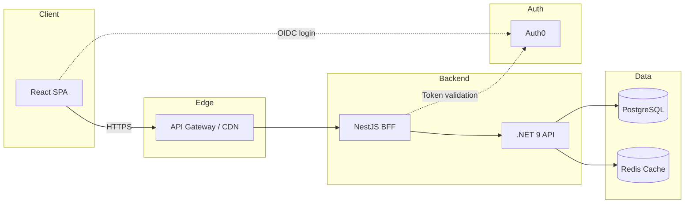

# Employee Budget Allocation Platform


---

## Business Overview

Large organizations lack a unified view of compensation spend across their org hierarchy. Budget owners cannot easily answer questions like *"What is the total cost of my engineering organization?"* or *"How much of my department's budget is allocated vs. remaining?"*

The **Employee Budget Allocation Platform** solves this by providing:

- **For Managers** — Real-time visibility into the total compensation cost of their direct and indirect reports, rolled up through the org tree.
- **For Finance** — Department-level budget allocation, utilization tracking, and variance analysis.
- **For HR** — Centralized compensation management covering base salary, bonuses, equity grants, and benefits.
- **For Executives** — An interactive org tree that aggregates compensation from individual contributors all the way up to the CEO.

All data is governed by role-based access controls — employees only see compensation data for the people in their reporting chain.

---

## Key Features

- **Interactive org tree** with salary aggregation rolling up through the full hierarchy to the CEO
- **Total compensation tracking** — base salary, bonus, equity, and benefits in a single view
- **Department budget allocation** — set budgets, track utilization, and flag overages
- **Role-based access control (RBAC)** — employees see only data for their direct and indirect reports
- **Single Sign-On (SSO)** via Auth0 with support for enterprise identity providers
- **CSV bulk import** for onboarding large employee datasets
- **Real-time updates** via an event-driven architecture (domain events, WebSockets)
- **Feature flags** via Split.io for progressive rollout and safe deployments

---

## Architecture Overview

The platform follows a **Backend-for-Frontend (BFF)** pattern. The React SPA communicates exclusively with a NestJS BFF, which orchestrates calls to the .NET core API. This separation enables independent scaling, security boundary enforcement, and frontend-optimized response shaping.

> Full architecture design spec: [`docs/superpowers/specs/`](docs/superpowers/specs/)



---

## Tech Stack

| Layer | Technology | Purpose |
|-------|-----------|---------|
| Frontend | React 19, TypeScript 5.7, Vite 6 | Single-page application |
| UI Components | Ant Design / Tailwind CSS | Component library and styling |
| BFF | NestJS 11, TypeScript | Backend-for-Frontend, API orchestration |
| API | .NET 9, C# 13 | Core business logic and domain services |
| Database | PostgreSQL 17 | Primary data store |
| Cache | Redis 7.4 (Valkey compatible) | Session cache, query caching |
| Auth | Auth0 | SSO, OIDC, RBAC |
| Feature Flags | Split.io | Progressive rollout |
| Infrastructure | Terraform, AWS (EKS) | Cloud provisioning |
| Orchestration | Kubernetes, Argo Rollouts | Container orchestration, canary deploys |
| Monorepo | Nx 20 | Build orchestration, dependency graph |
| CI/CD | GitHub Actions | Automated build, test, deploy |
| Contract Testing | Pact 5 (pact-js v13) | Consumer-driven contract tests |

---

## Project Structure

```
employee_budget_allocation/
├── apps/
│   ├── web/                  # React SPA (Vite + TypeScript)
│   ├── bff/                  # NestJS BFF
│   └── api/                  # .NET 9 API
├── libs/
│   ├── shared-types/         # Shared TypeScript types
│   └── contracts/            # Pact contract tests
├── infra/
│   └── terraform/            # AWS infrastructure
├── k8s/
│   ├── base/                 # Base Kubernetes manifests
│   └── overlays/             # Environment-specific overlays
├── docs/
│   ├── superpowers/specs/    # Architecture design spec
│   ├── phases/               # Implementation phase plans
│   ├── adr/                  # Architecture Decision Records
│   └── diagrams/             # Architecture diagrams
├── scripts/                  # Seed data, CLI tools
├── .github/workflows/        # CI/CD pipelines
├── docker-compose.yml
├── Makefile
└── nx.json
```

---

## Getting Started

### Prerequisites

| Tool | Version | Notes |
|------|---------|-------|
| Node.js | 22 LTS | JavaScript runtime |
| .NET SDK | 9.0 | C# API development |
| Docker & Docker Compose | Docker 27+ with Compose v2 | Local service orchestration |
| Auth0 Account | — | Free tier works for development |

### Quick Start

```bash
# 1. Clone the repository
git clone https://github.com/your-org/employee-budget-allocation.git
cd employee-budget-allocation

# 2. Install dependencies
make setup

# 3. Copy environment variables
cp .env.example .env
# Edit .env with your Auth0 credentials (see Environment Variables below)

# 4. Start all services locally
make dev

# 5. Seed the database with sample data
make seed          # Generates 5,000+ employees across a realistic org hierarchy

# 6. Open the app
# Web UI:  http://localhost:3000
# BFF:     http://localhost:3001
# API:     http://localhost:5000
```

### Other Commands

| Command | Description |
|---------|-------------|
| `make test` | Run all unit, integration, and contract tests |
| `make lint` | Run ESLint, Prettier, and dotnet format |
| `make build` | Production build of all apps |
| `make docker-build` | Build Docker images for all services |
| `make db-migrate` | Run database migrations |

---

## Environment Variables

| Variable | Description | Source | Required |
|----------|-------------|--------|----------|
| `AUTH0_DOMAIN` | Auth0 tenant domain | Auth0 Dashboard | Yes |
| `AUTH0_CLIENT_ID` | SPA application client ID | Auth0 Dashboard | Yes |
| `AUTH0_CLIENT_SECRET` | BFF client secret | Auth0 Dashboard | Yes |
| `AUTH0_AUDIENCE` | API identifier / audience | Auth0 Dashboard | Yes |
| `DATABASE_URL` | PostgreSQL connection string | Local or AWS RDS | Yes |
| `REDIS_URL` | Redis connection string | Local or AWS ElastiCache | Yes |
| `SPLIT_API_KEY` | Split.io SDK key for feature flags | Split.io Dashboard | No |
| `AWS_REGION` | AWS deployment region | AWS Console | No |
| `AWS_ACCESS_KEY_ID` | AWS credentials for Terraform | AWS IAM | No |
| `AWS_SECRET_ACCESS_KEY` | AWS credentials for Terraform | AWS IAM | No |
| `LOG_LEVEL` | Logging verbosity (`debug`, `info`, `warn`, `error`) | — | No |

---

## API Documentation

API documentation is auto-generated via **Swagger / OpenAPI** and available when running locally:

- **.NET API docs** — [http://localhost:5000/api/docs](http://localhost:5000/api/docs)
- **NestJS BFF docs** — [http://localhost:3001/bff/docs](http://localhost:3001/bff/docs)

---

## Environments

The platform uses a **3-environment promotion strategy** with isolated AWS accounts:

| Environment | Purpose | Branch Trigger | URL |
|-------------|---------|---------------|-----|
| **test** | Dev testing, integration testing, QA | PR merges to `develop` | `test.budgetalloc.example.com` |
| **beta** | Pre-production, UAT, canary validation | PR merges to `release/*` | `beta.budgetalloc.example.com` |
| **prod** | Production | PR merges to `main` (manual approval) | `app.budgetalloc.example.com` |

| Config | test | beta | prod |
|--------|------|------|------|
| EKS nodes | 2 (single AZ) | 3 (multi-AZ) | 6+ (multi-AZ, 3 AZs) |
| RDS | Single, db.t4g.medium | Multi-AZ, db.r6g.large | Multi-AZ, db.r6g.xlarge + read replica |
| Redis | 1 node, cache.t4g.small | 2-node cluster | 3-node cluster, Multi-AZ |
| Argo Rollouts | Disabled (direct deploy) | Canary 50%→100% | Canary 20%→40%→80%→100% with analysis |
| Log level | DEBUG | INFO | WARN |

## Deployment

The project follows an **8-phase implementation plan** documented in [`docs/phases/`](docs/phases/). Each phase is independently deployable.

**CI/CD** is managed via GitHub Actions with environment-specific workflows:

| Workflow | Trigger | What it does |
|----------|---------|-------------|
| `ci.yml` | Any PR | Lint, unit test, integration test, SonarCloud, Snyk |
| `deploy-test.yml` | Merge to `develop` | Build images → push ECR → deploy to test EKS (direct rollout) |
| `deploy-beta.yml` | Merge to `release/*` or manual dispatch | Build images → push ECR → deploy to beta EKS (canary 50→100) |
| `deploy-prod.yml` | Merge to `main` or manual dispatch | Build images → push ECR → deploy to prod EKS (canary 20→40→80→100) — requires manual approval |
| `infra-{env}.yml` | Changes to `infra/terraform/environments/{env}/` | Terraform plan on PR, apply on merge |
| `db-migrate.yml` | Manual dispatch (select environment) | Run EF Core migrations against selected environment's RDS |

---

## Contributing

### Git Branching Strategy

```
main          → deploys to prod (requires manual approval gate)
release/*     → deploys to beta automatically
develop       → deploys to test automatically
feature/*     → PR to develop (CI only, no deploy)
```

### Branch Naming

```
feature/EBA-123-add-budget-summary
fix/EBA-456-salary-rollup-calculation
chore/EBA-789-update-dependencies
```

### Commit Conventions

This project uses [Conventional Commits](https://www.conventionalcommits.org/):

```
feat(api): add department budget endpoints
fix(web): correct salary aggregation in org tree
docs: update architecture decision record for caching
```

### Pull Request Process

1. Create a feature branch from `develop`
2. Ensure all tests pass (`make test`)
3. Ensure linting passes (`make lint`)
4. Fill out the PR template with context and screenshots
5. Request review from at least one code owner
6. Squash-merge after approval
7. Changes flow: `develop` (test) → `release/*` (beta) → `main` (prod)

---

## License

This project is licensed under the [MIT License](LICENSE).
