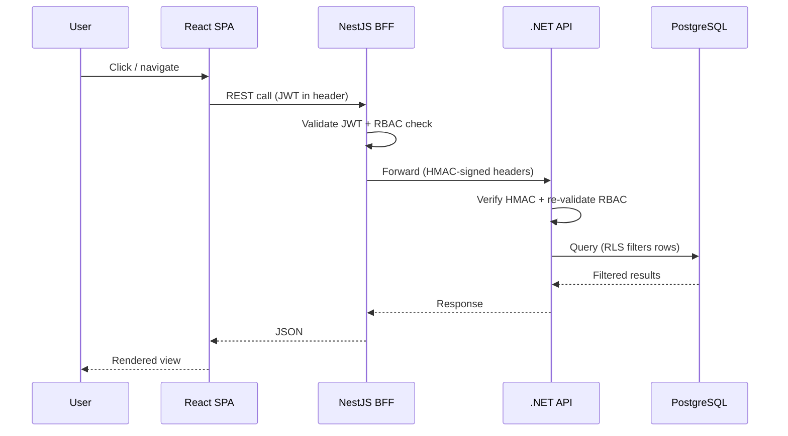
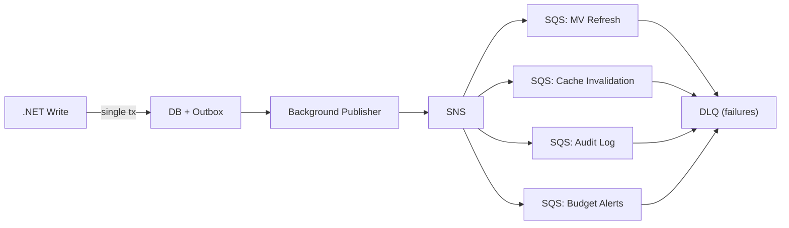

# Employee Budget Allocation Platform -- Cheat Sheet

## What Is This?

Workday-like app where managers see their team's total compensation as an org tree, with RBAC ensuring you only see your own reports.

---

## The Stack

| Layer | Tech | Role |
|-------|------|------|
| Frontend | React SPA (Vite + TS) | Tree visualization, dashboards |
| Gateway | NestJS BFF | Auth, RBAC filter, aggregation, CORS, rate limiting |
| Service | .NET 9 API | Domain logic, CQRS, hierarchy queries, compensation |
| Database | PostgreSQL 17 | Source of truth, `ltree` for hierarchy, RLS |
| Cache | Redis (ElastiCache) | Subtrees, RBAC visibility sets, sessions |
| Auth | Auth0 | SSO (OIDC/PKCE), role management |
| Flags | Split.io | Feature flags, kill switches |
| Orchestration | AWS EKS | Container orchestration |
| Delivery | Argo Rollouts | Canary deployments (20->40->80->100%) |
| CI/CD | GitHub Actions | Pipelines |
| IaC | Terraform | Infrastructure as Code |

---

## How Requests Flow



---

## The 3-Layer RBAC

| Layer | Where | What It Does | What It Catches |
|-------|-------|-------------|-----------------|
| NestJS Guard | Gateway | Validates JWT, checks target in user's subtree | Blocks unauthorized requests early |
| .NET Policy | Service | Re-validates via HMAC-signed headers | Catches if NestJS is compromised |
| PostgreSQL RLS | Database | Row-level security via `ltree` path containment | Last line of defense, catches everything |

---

## Role -> What You Can See

| Role | Visibility |
|------|-----------|
| CEO | Everyone |
| C-Suite / VP | Their division down |
| Director | Their department down |
| Manager | Direct + indirect reports |
| IC | Own data only |
| HR Admin | Everyone (read-only) |
| Finance Admin | Budget data only, no individual comp |

---

## Data Model

| Table | Purpose | Key Columns | Notes |
|-------|---------|-------------|-------|
| `employees` | Org hierarchy | `id`, `manager_id`, `path` (ltree) | Self-referencing, GiST index on path |
| `compensation` | Salary history | `employee_id`, `amount`, `effective_date` | **Append-only -- NEVER delete** |
| `departments` | Dept hierarchy + budget ownership | `id`, `parent_id`, `budget_owner_id` | |
| `budgets` | Fiscal year allocation per dept | `dept_id`, `fiscal_year`, `amount` | |
| `audit_log` | Every change | `entity`, `action`, `before`, `after` (JSONB) | Immutable |
| `employee_tree_view` | **Materialized view** | Pre-aggregated subtree totals | CQRS read model, <1ms queries |

---

## CQRS in 30 Seconds

- **WRITE:** Normalized `employees` + `compensation` tables via .NET command handlers
- **READ:** `employee_tree_view` materialized view with `ltree` + GiST index
- **SYNC:** Domain events -> outbox -> SNS -> SQS -> refresh materialized view
- **WHY:** Subtree query on MV = **<1ms**. Recursive CTE = **50ms+**

---

## Event Flow in 30 Seconds



---

## Caching Rules

| What | Key Pattern | TTL | Invalidated By |
|------|------------|-----|----------------|
| Hierarchy subtree | `hierarchy:subtree:{id}:{depth}:{scopeHash}` | 5 min | `OrgStructureChanged` event |
| RBAC visibility | `rbac:visibility:{userId}` | 10 min | `OrgStructureChanged` event |
| Compensation | `comp:aggregate:{nodeId}` | 5 min | `CompensationUpdated` event |
| Employee detail | `employee:detail:{id}` | 2 min | Any employee change |

> `scopeHash` = SHA256 of user's visibility scope (prevents cross-user cache leaks)

---

## Key API Endpoints

| Method | Endpoint | Who | What |
|--------|----------|-----|------|
| GET | `/bff/v1/hierarchy/subtree/:id` | Any (RBAC filtered) | Org tree with rollup |
| GET | `/bff/v1/employees/:id/compensation/history` | Manager+ | Comp history |
| POST | `/bff/v1/employees/:id/compensation` | HR Admin | Append comp record |
| GET | `/bff/v1/budgets/:deptId` | Finance / Manager | Budget with utilization |
| POST | `/bff/v1/imports/csv` | HR Admin | Bulk import |

---

## Secrets -- Where They Live

| Secret | Stored In | Accessed Via |
|--------|-----------|-------------|
| Auth0 credentials | AWS Secrets Manager | External Secrets Operator -> K8s Secret |
| DB credentials | AWS Secrets Manager | RDS Proxy IAM Auth (no password in app) |
| GitHub -> AWS auth | GitHub OIDC | Assume IAM role (no static keys) |

---

## CI/CD Pipeline

| Workflow | Trigger | Steps |
|----------|---------|-------|
| `ci.yml` | Any PR | Lint, test, SonarCloud, Snyk |
| `deploy-test.yml` | Merge to `develop` | Build Docker → push ECR → deploy to test EKS (direct rollout) |
| `deploy-beta.yml` | Merge to `release/*` or manual dispatch | Build Docker → push ECR → deploy to beta EKS (canary 50→100) |
| `deploy-prod.yml` | Merge to `main` or manual dispatch | Build Docker → push ECR → deploy to prod EKS (canary 20→40→80→100 + analysis) — requires approval |
| `infra-{env}.yml` | Changes to `infra/terraform/environments/{env}/` | Plan on PR, apply on merge |
| `db-migrate.yml` | Manual dispatch (select environment) | Run EF Core migrations |

---

## Environments

| Config | test | beta | prod |
|--------|------|------|------|
| Branch | `develop` | `release/*` | `main` |
| URL | test.budgetalloc.example.com | beta.budgetalloc.example.com | app.budgetalloc.example.com |
| EKS nodes | 2 (single AZ) | 3 (multi-AZ) | 6+ (3 AZs) |
| RDS | db.t4g.medium, single | db.r6g.large, multi-AZ | db.r6g.xlarge, multi-AZ + replica |
| Redis | 1 node | 2-node cluster | 3-node cluster, multi-AZ |
| Argo Rollouts | Disabled | Canary 50→100 | Canary 20→40→80→100 |
| Log level | DEBUG | INFO | WARN |
| Feature flags | All ON | Selective | Controlled rollout |
| Seed data | 5000+ employees | 1000 subset | Real data only |

**Git branching:** `feature/*` → PR to `develop` → test → `release/*` → beta → `main` → prod

---

## Resilience Patterns

- **Circuit breaker** (`opossum`): NestJS -> .NET, opens after 5 failures in 30s
- **When .NET is down:** Serve stale Redis cache
- **When Redis is down:** All requests fall through to API (cache miss)
- **When Auth0 is down:** JWKS cached locally for 24h, existing sessions work

---

## Implementation Phases (~204 hours)

| Phase | What | Est |
|-------|------|-----|
| 1 | Project setup, monorepo, Docker Compose | 6h |
| 2 | Database, domain models, CQRS, seed data | 27h |
| 3 | Auth0 + 3-layer RBAC | 22h |
| 4 | API endpoints + BFF | 22h |
| 5 | React frontend + tree visualization | 30h |
| 6 | Events + caching | 23h |
| 7 | Testing (unit, contract, E2E, load) | 32h |
| 8 | Infra, EKS, CI/CD, observability, DR | 42h |

---

## Common Commands

```bash
make dev            # start everything locally
make seed           # generate 5000+ employees
make test           # run all tests
make test-unit      # unit tests only
make test-integration # integration tests with test containers
make lint           # lint all projects
make migrate        # run DB migrations
make build          # build all projects
make docker-build   # build all Docker images
```

---

## Key Files to Know

| File | What |
|------|------|
| `CLAUDE.md` | AI instructions for implementation |
| `docs/BUSINESS.md` | Business requirements + personas |
| `docs/diagrams/ARCHITECTURE.md` | 10 Mermaid architecture diagrams |
| `docs/phases/PHASE-*.md` | Implementation plans |
| `docs/adr/ADR-*.md` | Architecture Decision Records |
| `docs/superpowers/specs/...design.md` | Full 16-section architecture spec |

---

## Interview Talking Points (Top 5)

1. **3-layer RBAC** -- Defense-in-depth, not redundancy. Each layer catches different failure modes.
2. **CQRS + ltree** -- Separating read/write models. Materialized view with `ltree` gives sub-ms reads vs 50ms+ recursive CTEs.
3. **Transactional outbox** -- Guarantees event delivery without distributed transactions. Outbox + domain write in single DB transaction.
4. **Argo Rollouts canary** -- Progressive delivery with automated analysis. Rollback if error rate >1% or p99 >500ms.
5. **HMAC header signing** -- Internal service auth. Even if someone bypasses NestJS, .NET verifies the caller's identity cryptographically.
