# Employee Budget Allocation Platform - Architecture Diagrams

## 1. System Context Diagram (C4 Level 1)

The platform sits at the center, serving four user roles and integrating with two external systems.

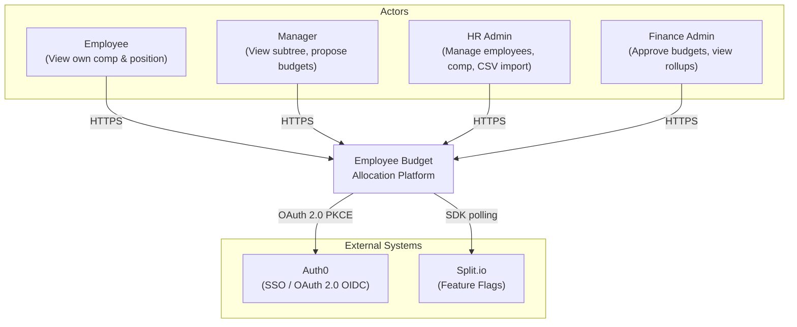

---

## 2. Container Diagram (C4 Level 2)

All external traffic enters through the NestJS BFF. The .NET API is never publicly exposed. Writes use normalized tables; reads use materialized views.

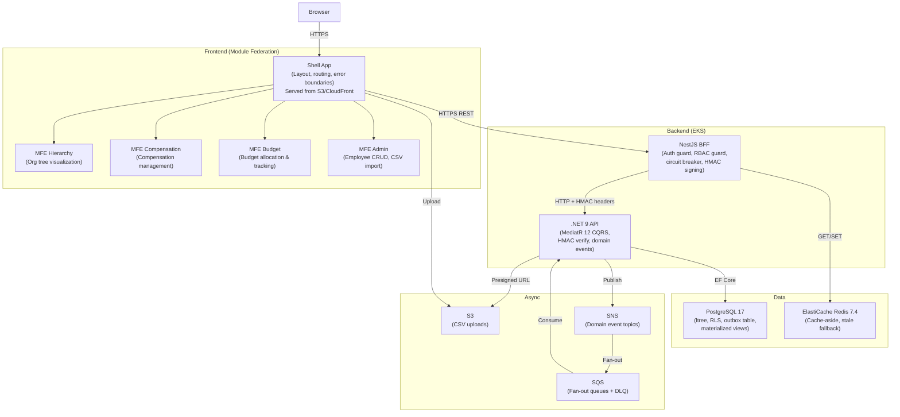

---

## 3. Infrastructure Diagram (AWS)

Multi-AZ deployment inside a VPC with public and private subnets. WAF protects the edge; all backend services live in private subnets.

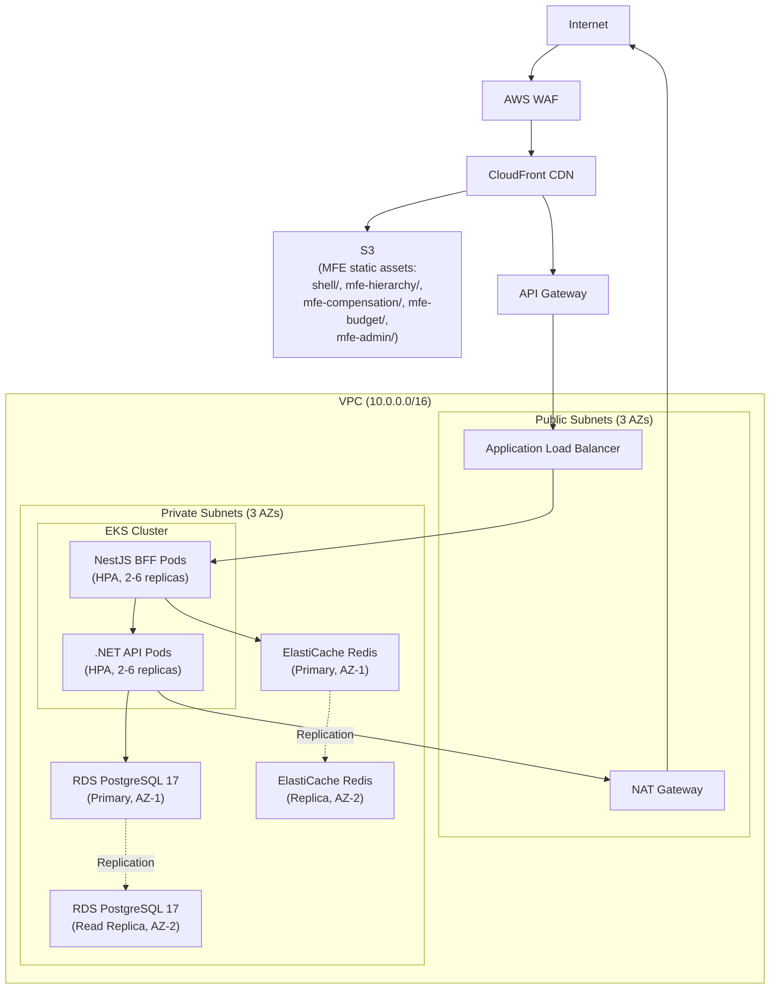

---

## 4. Data Flow Diagrams

### 4a. Authentication Flow

PKCE flow with Auth0, followed by JWT validation at BFF and HMAC-signed internal headers verified by the .NET API. PostgreSQL RLS provides the final enforcement layer.

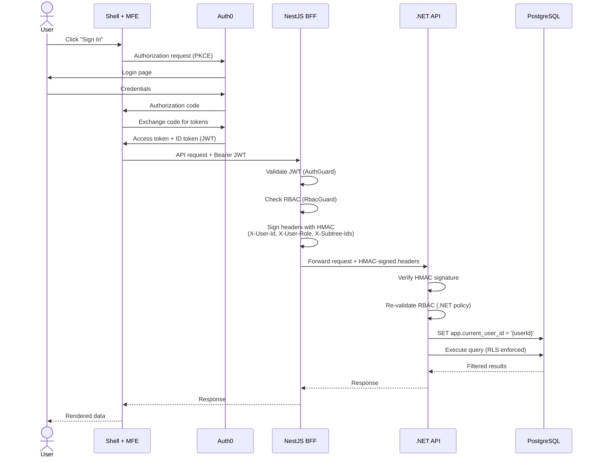

### 4b. Hierarchy Tree Query Flow

Cache-aside pattern: check Redis first, fall through to the .NET API on miss, populate cache after. Circuit breaker serves stale cache if the .NET API is unavailable.

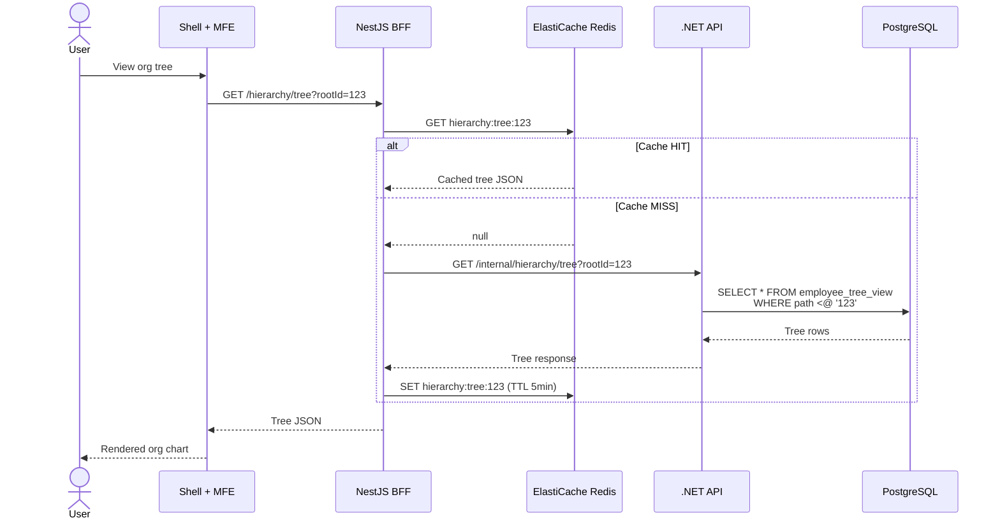

### 4c. Compensation Update Flow

Compensation records are append-only. After the write, a domain event is published via the transactional outbox. SNS fans out to multiple SQS consumers for async processing.

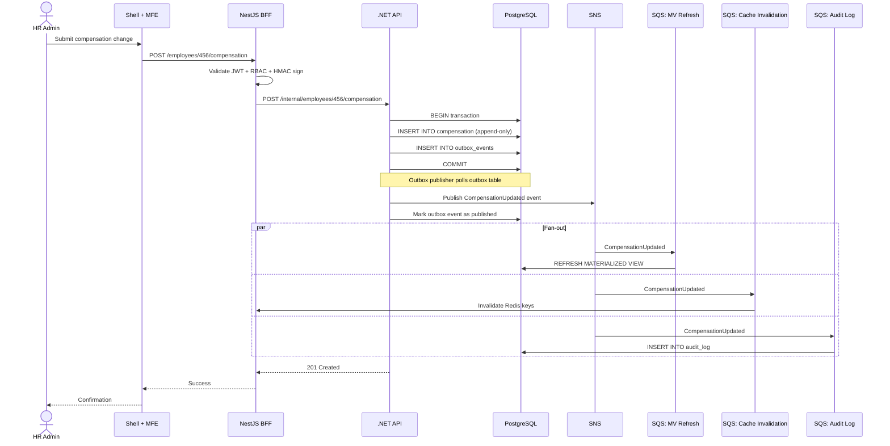

### 4d. CSV Import Flow

Large CSV imports use S3 presigned URLs to avoid BFF memory pressure. An S3 event triggers async processing.

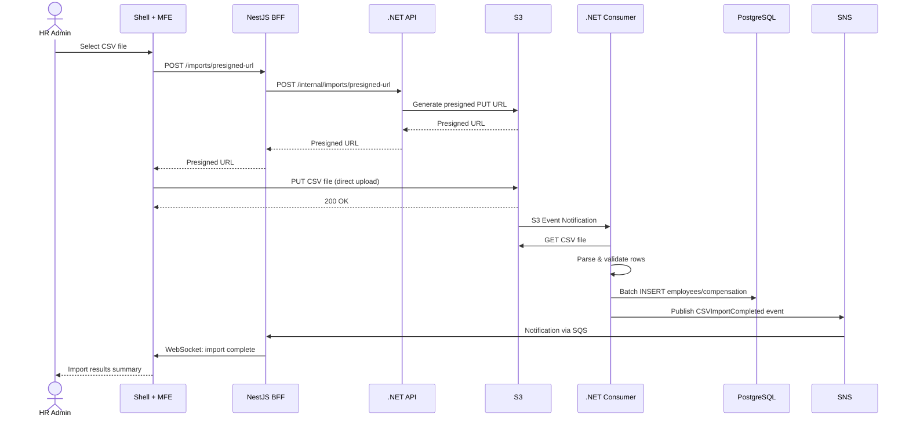

---

## 5. RBAC Visibility Diagram

Managers see only their subtree. In this example, "Manager B" (highlighted) can see their direct reports and all descendants, but cannot see peers, other subtrees, or upward in the hierarchy.

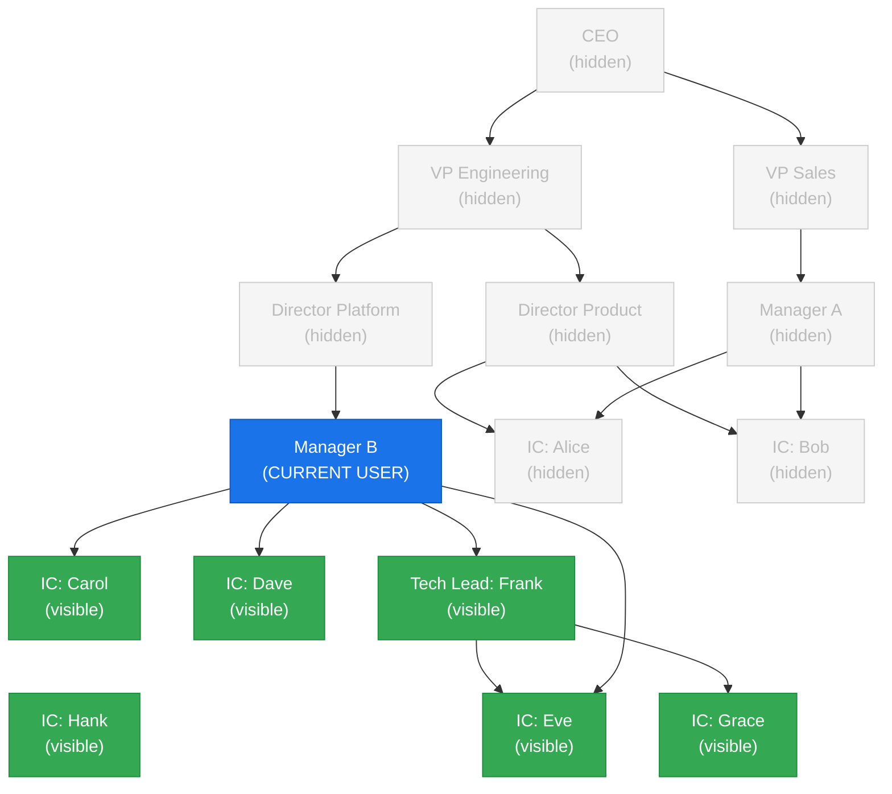

---

## 6. Event-Driven Architecture Diagram

All domain events flow through the transactional outbox to guarantee at-least-once delivery. SNS fans out to SQS queues with dedicated DLQs for each consumer.

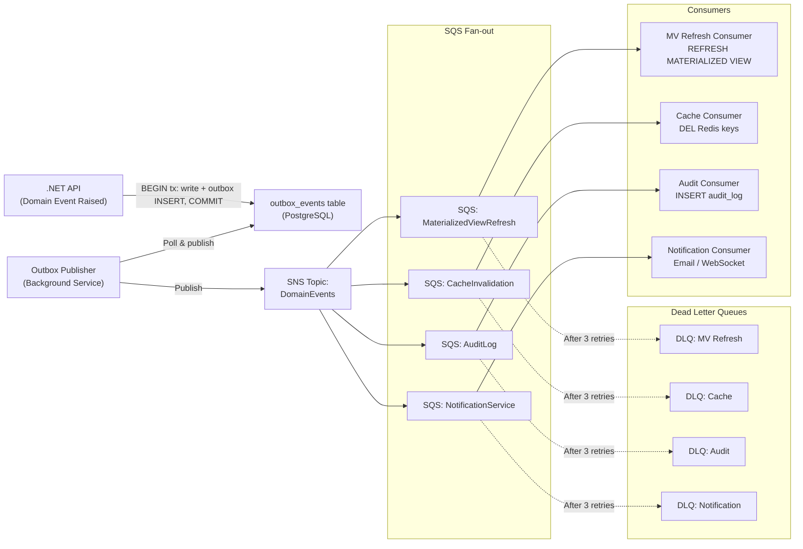

---

## 7. CI/CD Pipeline Diagram

PRs trigger CI checks. Merges to `develop`, `release/*`, or `main` trigger environment-specific CD pipelines with progressively stricter deployment strategies.

```mermaid
flowchart LR
    subgraph CI ["CI (GitHub Actions)"]
        PR["PR Created"]
        LINT["Lint\n(ESLint, dotnet format)"]
        TEST_UNIT["Unit Tests\n(Jest + xUnit)"]
        TEST_INT["Integration Tests\n(Testcontainers)"]
        TEST_CONTRACT["Contract Tests\n(Pact)"]
        SCAN["Security Scan\n(Snyk, Trivy)"]
        COV["Coverage Check\n(80% biz / 60% overall)"]
    end

    subgraph CD_TEST ["deploy-test.yml"]
        MERGE_DEV["Merge to develop"]
        BUILD_T["Build Docker images"]
        PUSH_T["Push to ECR\n(test-{sha})"]
        DEPLOY_T["Deploy to test EKS\n(direct rollout)"]
    end

    subgraph CD_BETA ["deploy-beta.yml"]
        MERGE_REL["Merge to release/*"]
        BUILD_B["Build Docker images"]
        PUSH_B["Push to ECR\n(beta-{sha})"]
        CANARY_B["Argo Canary\n50%→100%"]
    end

    subgraph CD_PROD ["deploy-prod.yml"]
        MERGE_MAIN["Merge to main"]
        APPROVE["Manual Approval\n(2 reviewers)"]
        BUILD_P["Build Docker images"]
        PUSH_P["Push to ECR\n(prod-{sha})"]
        CANARY_P["Argo Canary\n20%→40%→80%→100%\n+ analysis gates"]
        ROLLBACK["Auto-rollback"]
    end

    PR --> LINT --> TEST_UNIT --> TEST_INT --> TEST_CONTRACT --> SCAN --> COV

    MERGE_DEV --> BUILD_T --> PUSH_T --> DEPLOY_T
    MERGE_REL --> BUILD_B --> PUSH_B --> CANARY_B
    MERGE_MAIN --> APPROVE --> BUILD_P --> PUSH_P --> CANARY_P
    CANARY_P -->|Fail| ROLLBACK
```

---

## 8. Deployment Topology

Sizing varies by environment. The diagram below shows the **prod** topology (3 AZs, read replica, multi-AZ Redis). **test** uses a single AZ with 2 EKS nodes; **beta** uses 2 AZs with 3 nodes. See CLAUDE.md for the full per-environment config comparison.

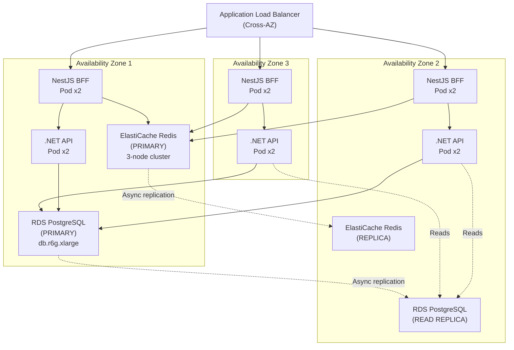

---

## 8b. Environment Promotion Flow

Code flows from feature branches through three environments with progressively stricter gates before reaching production.

```mermaid
flowchart LR
    FB["Feature Branch"]
    DEV_BR["develop branch"]
    REL_BR["release/* branch"]
    MAIN_BR["main branch"]

    TEST_ENV["test env\n(direct deploy)"]
    BETA_ENV["beta env\n(canary 50%→100%)"]
    PROD_ENV["prod env\n(canary 20%→40%→80%→100%\n+ analysis gates)"]

    FB -->|PR + CI checks| DEV_BR
    DEV_BR -->|auto-deploy| TEST_ENV
    DEV_BR -->|cut release branch| REL_BR
    REL_BR -->|auto-deploy| BETA_ENV
    REL_BR -->|PR to main| MAIN_BR
    MAIN_BR -->|manual approval\n(2 reviewers)| PROD_ENV
```

---

## 9. Caching Architecture

Three cache layers with distinct TTLs. Invalidation flows from domain events through SQS to clear Redis, which in turn causes fresh reads from the materialized view.

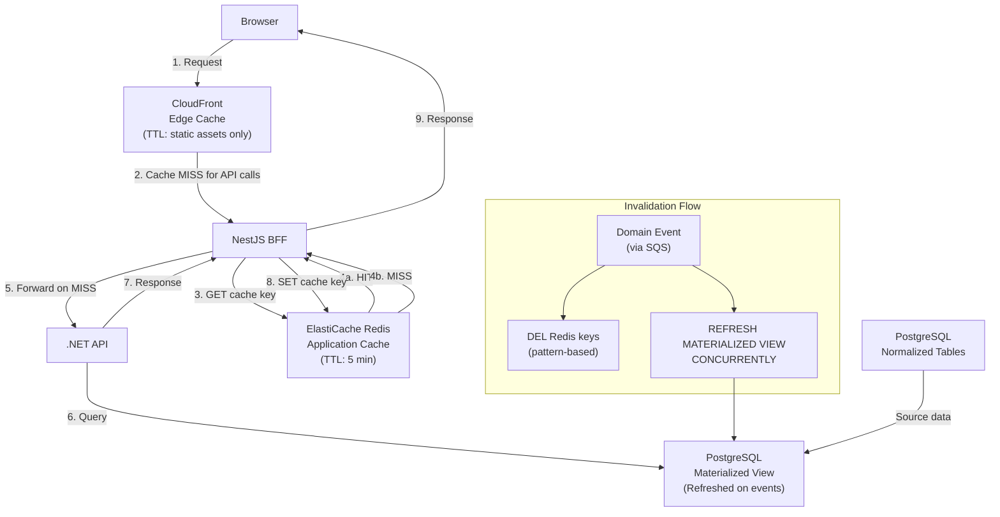

---

## 10. Database Schema Diagram (ER)

Core tables with `ltree` for hierarchy. Compensation is append-only (no UPDATEs or DELETEs). The `employee_tree_view` materialized view denormalizes hierarchy + compensation for fast reads.

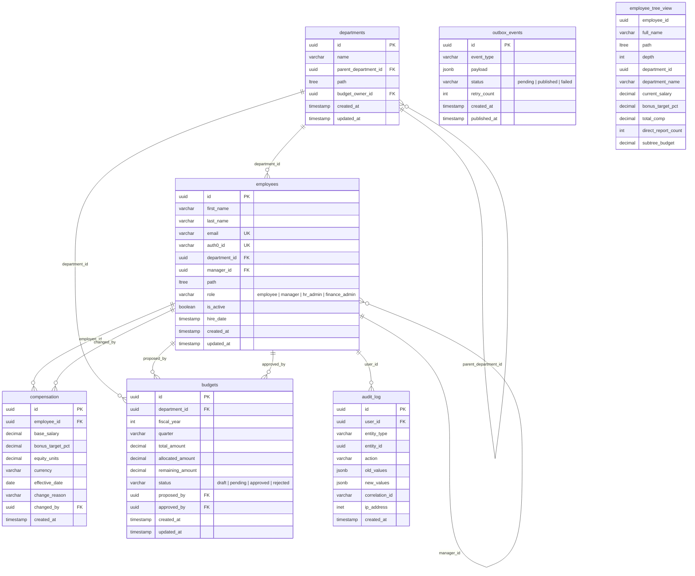
