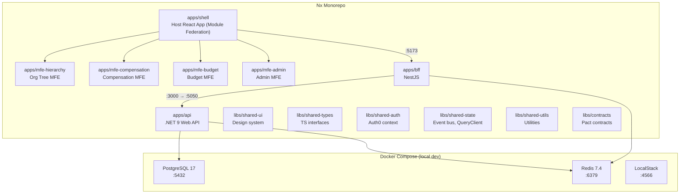

# Phase 1: Project Setup & Scaffolding

## Goal

Establish a fully functional monorepo with all three services scaffolded, local development environment running via Docker Compose, and consistent tooling (linting, formatting, git hooks) across the entire codebase.

## Success Criteria

- [ ] `make up` starts all services with hot-reload
- [ ] `make lint` runs ESLint/Prettier across TS projects and `dotnet format` on .NET
- [ ] `make test` runs placeholder tests in all 3 services
- [ ] PostgreSQL 17 and Redis 7.4 accessible from all services locally
- [ ] Pre-commit hooks block commits with lint errors
- [ ] CI smoke job passes on a fresh clone

## Prerequisites

None — this is the foundation phase.

## Architecture Overview



## Task Breakdown

### 1.1 — Initialize Nx Monorepo

```bash
npx create-nx-workspace@latest employee-budget-allocation \
  --preset=ts \
  --nxCloud=skip \
  --packageManager=pnpm
```

**Final folder structure:**

```
employee_budget_allocation/
├── apps/
│   ├── shell/                   # Host React app (Module Federation host)
│   ├── mfe-hierarchy/           # Org tree visualization MFE
│   ├── mfe-compensation/        # Compensation management MFE
│   ├── mfe-budget/              # Budget allocation MFE
│   ├── mfe-admin/               # HR admin MFE (employee CRUD, CSV import)
│   ├── bff/                    # NestJS BFF
│   └── api/                    # .NET 9 Web API
├── libs/
│   ├── shared-ui/              # Shared UI components (design system)
│   ├── shared-types/           # Shared TS interfaces (DTOs, enums)
│   ├── shared-auth/            # Auth0 context provider, hooks, guards
│   ├── shared-state/           # Event bus, shared TanStack Query client
│   ├── shared-utils/           # Common utilities (formatting, validation)
│   └── contracts/              # Pact contract files
├── infra/
│   └── terraform/              # Phase 8
│       ├── modules/            # Reusable modules (vpc, eks, rds, redis, etc.)
│       └── environments/
│           ├── test/           # develop → test.budgetalloc.example.com
│           ├── beta/           # release/* → beta.budgetalloc.example.com
│           └── prod/           # main → app.budgetalloc.example.com
├── k8s/
│   ├── base/
│   └── overlays/
│       ├── test/               # Direct deploy, reduced replicas
│       ├── beta/               # Canary 50%→100%
│       └── prod/               # Canary 20%→40%→80%→100% + analysis
├── docker/
│   ├── docker-compose.yml
│   ├── docker-compose.override.yml
│   ├── Dockerfile.shell
│   ├── Dockerfile.bff
│   └── Dockerfile.api
├── scripts/
│   ├── seed.ts
│   └── wait-for-it.sh
├── .github/
│   └── workflows/
│       ├── ci.yml              # PR checks (lint, test, build)
│       ├── deploy-test.yml     # develop → test (direct deploy)
│       ├── deploy-beta.yml     # release/* → beta (canary 50%→100%)
│       ├── deploy-prod.yml     # main → prod (canary + approval gate)
│       ├── deploy-mfe.yml     # Independent MFE deploy to S3
│       └── db-migrate.yml     # Manual migration (test/beta/prod)
├── .husky/
│   ├── pre-commit
│   └── commit-msg
├── nx.json
├── pnpm-workspace.yaml
├── tsconfig.base.json
├── .editorconfig
├── .prettierrc
├── .eslintrc.json
├── Makefile
└── README.md
```

### 1.2 — Scaffold Shell + Micro Frontends

```bash
cd apps/
npx create-vite shell --template react-ts
npx create-vite mfe-hierarchy --template react-ts
npx create-vite mfe-compensation --template react-ts
npx create-vite mfe-budget --template react-ts
npx create-vite mfe-admin --template react-ts
```

Each MFE uses `@module-federation/vite` to expose a `remoteEntry.js`. The shell app is the Module Federation host that dynamically loads MFEs at runtime.

**Key files to create/modify:**

| File | Purpose |
|------|---------|
| `apps/shell/vite.config.ts` | Module Federation host config, dev server proxy to BFF `:3000` |
| `apps/shell/tsconfig.json` | Extend `tsconfig.base.json`, path aliases |
| `apps/shell/src/main.tsx` | Entry point with Auth0Provider (from `libs/shared-auth`) |
| `apps/shell/src/app/App.tsx` | Router shell with lazy MFE loading + error boundaries |
| `apps/shell/.env.example` | `VITE_AUTH0_DOMAIN`, `VITE_AUTH0_CLIENT_ID`, `VITE_API_BASE_URL`, `VITE_SPLIT_KEY` |
| `apps/mfe-*/vite.config.ts` | Module Federation remote config, exposes `./Module` entry |
| `apps/mfe-*/src/bootstrap.tsx` | Async bootstrap for Module Federation |

`apps/shell/vite.config.ts`:
```typescript
import { defineConfig } from 'vite';
import react from '@vitejs/plugin-react';
import { federation } from '@module-federation/vite';
import path from 'path';

export default defineConfig({
  plugins: [
    react(),
    federation({
      name: 'shell',
      remotes: {
        mfeHierarchy: 'mfeHierarchy@http://localhost:5174/remoteEntry.js',
        mfeCompensation: 'mfeCompensation@http://localhost:5175/remoteEntry.js',
        mfeBudget: 'mfeBudget@http://localhost:5176/remoteEntry.js',
        mfeAdmin: 'mfeAdmin@http://localhost:5177/remoteEntry.js',
      },
      shared: {
        react: { singleton: true, requiredVersion: '^19.0.0' },
        'react-dom': { singleton: true, requiredVersion: '^19.0.0' },
        'react-router-dom': { singleton: true },
        '@tanstack/react-query': { singleton: true },
        '@auth0/auth0-react': { singleton: true },
      },
    }),
  ],
  server: {
    port: 5173,
    proxy: {
      '/api': {
        target: 'http://localhost:3000',
        changeOrigin: true,
      },
    },
  },
  resolve: {
    alias: {
      '@': path.resolve(__dirname, './src'),
      '@shared-types': path.resolve(__dirname, '../../libs/shared-types/src'),
    },
  },
});
```

### 1.3 — Scaffold NestJS BFF

```bash
cd apps/
npx @nestjs/cli new bff --package-manager pnpm --skip-git
```

**Key files:**

| File | Purpose |
|------|---------|
| `apps/bff/src/main.ts` | Bootstrap with CORS, helmet, versioning |
| `apps/bff/src/app.module.ts` | Root module |
| `apps/bff/src/config/configuration.ts` | Config factory (env-based) |
| `apps/bff/src/health/health.controller.ts` | Health check endpoint |
| `apps/bff/.env.example` | `AUTH0_DOMAIN`, `AUTH0_AUDIENCE`, `API_BASE_URL`, `REDIS_URL`, `HMAC_SECRET` |

`apps/bff/src/main.ts`:
```typescript
import { NestFactory } from '@nestjs/core';
import { AppModule } from './app.module';
import { ValidationPipe, VersioningType } from '@nestjs/common';
import helmet from 'helmet';

async function bootstrap() {
  const app = await NestFactory.create(AppModule);
  app.use(helmet());
  app.enableCors({ origin: process.env.CORS_ORIGIN ?? 'http://localhost:5173' });
  app.enableVersioning({ type: VersioningType.URI, defaultVersion: '1' });
  app.useGlobalPipes(new ValidationPipe({ whitelist: true, transform: true }));
  await app.listen(3000);
}
bootstrap();
```

### 1.4 — Scaffold .NET 9 API

```bash
cd apps/
dotnet new webapi -n Api -o api --framework net9.0
dotnet new sln -n EmployeeBudgetAllocation -o api
```

**Project structure inside `apps/api/`:**

```
apps/api/
├── src/
│   ├── Api/                         # Web host, controllers, middleware
│   │   ├── Api.csproj
│   │   ├── Program.cs
│   │   ├── Controllers/
│   │   ├── Middleware/
│   │   └── appsettings.json
│   ├── Application/                 # CQRS handlers, DTOs, interfaces
│   │   ├── Application.csproj
│   │   ├── Commands/
│   │   ├── Queries/
│   │   └── Interfaces/
│   ├── Domain/                      # Entities, value objects, domain events
│   │   ├── Domain.csproj
│   │   ├── Entities/
│   │   ├── ValueObjects/
│   │   └── Events/
│   └── Infrastructure/             # EF Core, Redis, SNS/SQS
│       ├── Infrastructure.csproj
│       ├── Persistence/
│       ├── Caching/
│       └── Messaging/
├── tests/
│   ├── Api.UnitTests/
│   ├── Api.IntegrationTests/
│   └── Api.ArchitectureTests/
└── EmployeeBudgetAllocation.sln
```

`apps/api/src/Api/Program.cs`:
```csharp
var builder = WebApplication.CreateBuilder(args);

builder.Services.AddControllers();
builder.Services.AddHealthChecks();
builder.Services.AddEndpointsApiExplorer();
builder.Services.AddSwaggerGen();

var app = builder.Build();

if (app.Environment.IsDevelopment())
{
    app.UseSwagger();
    app.UseSwaggerUI();
}

app.UseHealthChecks("/healthz");
app.MapControllers();
app.Run();
```

### 1.5 — Docker Compose

`docker/docker-compose.yml`:
```yaml
version: "3.9"

services:
  postgres:
    image: postgres:17-alpine
    ports:
      - "5432:5432"
    environment:
      POSTGRES_DB: eba_dev
      POSTGRES_USER: eba_user
      POSTGRES_PASSWORD: eba_local_password
    volumes:
      - pgdata:/var/lib/postgresql/data
      - ./init-scripts:/docker-entrypoint-initdb.d
    healthcheck:
      test: ["CMD-SHELL", "pg_isready -U eba_user -d eba_dev"]
      interval: 5s
      timeout: 3s
      retries: 5

  redis:
    image: redis:7.4-alpine
    ports:
      - "6379:6379"
    command: redis-server --maxmemory 256mb --maxmemory-policy allkeys-lru
    healthcheck:
      test: ["CMD", "redis-cli", "ping"]
      interval: 5s
      timeout: 3s
      retries: 5

  localstack:
    image: localstack/localstack:3
    ports:
      - "4566:4566"
    environment:
      SERVICES: sns,sqs,secretsmanager,s3
      DEFAULT_REGION: us-east-1
    volumes:
      - localstack_data:/var/lib/localstack

volumes:
  pgdata:
  localstack_data:
```

`docker/init-scripts/01-extensions.sql`:
```sql
CREATE EXTENSION IF NOT EXISTS ltree;
CREATE EXTENSION IF NOT EXISTS pgcrypto;
CREATE EXTENSION IF NOT EXISTS pg_trgm;
```

### 1.6 — Makefile

`Makefile`:
```makefile
.PHONY: up down lint test build clean seed

# ── Local Dev ─────────────────────────────
up:
	docker compose -f docker/docker-compose.yml up -d
	@echo "Waiting for services..."
	@./scripts/wait-for-it.sh localhost:5432 -- echo "PostgreSQL ready"
	@./scripts/wait-for-it.sh localhost:6379 -- echo "Redis ready"

down:
	docker compose -f docker/docker-compose.yml down

logs:
	docker compose -f docker/docker-compose.yml logs -f

# ── Dev Servers ───────────────────────────
dev-shell:
	cd apps/shell && pnpm dev

dev-mfe-hierarchy:
	cd apps/mfe-hierarchy && pnpm dev --port 5174

dev-mfe-compensation:
	cd apps/mfe-compensation && pnpm dev --port 5175

dev-mfe-budget:
	cd apps/mfe-budget && pnpm dev --port 5176

dev-mfe-admin:
	cd apps/mfe-admin && pnpm dev --port 5177

dev-bff:
	cd apps/bff && pnpm start:dev

dev-api:
	cd apps/api/src/Api && dotnet watch run

dev: up
	@$(MAKE) -j7 dev-shell dev-mfe-hierarchy dev-mfe-compensation dev-mfe-budget dev-mfe-admin dev-bff dev-api

# ── Quality ───────────────────────────────
lint:
	pnpm nx run-many -t lint
	cd apps/api && dotnet format --verify-no-changes

format:
	pnpm nx run-many -t format
	cd apps/api && dotnet format

test:
	pnpm nx run-many -t test
	cd apps/api && dotnet test

# ── Build ─────────────────────────────────
build:
	pnpm nx run-many -t build
	cd apps/api && dotnet publish -c Release -o dist

# ── Data ──────────────────────────────────
seed:
	pnpm tsx scripts/seed.ts

migrate:
	cd apps/api/src/Infrastructure && dotnet ef database update \
		--startup-project ../Api

clean:
	docker compose -f docker/docker-compose.yml down -v
	rm -rf node_modules apps/*/node_modules apps/api/dist
```

### 1.7 — Linting & Formatting

`.editorconfig`:
```ini
root = true

[*]
indent_style = space
indent_size = 2
end_of_line = lf
charset = utf-8
trim_trailing_whitespace = true
insert_final_newline = true

[*.cs]
indent_size = 4

[Makefile]
indent_style = tab
```

`.prettierrc`:
```json
{
  "semi": true,
  "singleQuote": true,
  "trailingComma": "all",
  "printWidth": 100,
  "tabWidth": 2
}
```

`.eslintrc.json`:
```json
{
  "root": true,
  "extends": [
    "eslint:recommended",
    "plugin:@typescript-eslint/recommended",
    "prettier"
  ],
  "parser": "@typescript-eslint/parser",
  "plugins": ["@typescript-eslint"],
  "ignorePatterns": ["dist", "node_modules", "coverage"],
  "rules": {
    "@typescript-eslint/no-unused-vars": ["error", { "argsIgnorePattern": "^_" }],
    "@typescript-eslint/explicit-function-return-type": "off"
  }
}
```

### 1.8 — Git Hooks

```bash
pnpm add -Dw husky lint-staged @commitlint/cli @commitlint/config-conventional
npx husky init
```

`.husky/pre-commit`:
```bash
#!/usr/bin/env sh
. "$(dirname -- "$0")/_/husky.sh"
pnpm lint-staged
```

`.husky/commit-msg`:
```bash
#!/usr/bin/env sh
. "$(dirname -- "$0")/_/husky.sh"
npx --no -- commitlint --edit "$1"
```

`package.json` (root — relevant sections):
```json
{
  "lint-staged": {
    "*.{ts,tsx}": ["eslint --fix", "prettier --write"],
    "*.{json,md,yml,yaml}": ["prettier --write"]
  }
}
```

`commitlint.config.js`:
```javascript
module.exports = {
  extends: ['@commitlint/config-conventional'],
  rules: {
    'scope-enum': [2, 'always', ['shell', 'mfe-hierarchy', 'mfe-compensation', 'mfe-budget', 'mfe-admin', 'bff', 'api', 'shared-ui', 'shared-types', 'shared-auth', 'shared-state', 'shared-utils', 'contracts', 'infra', 'ci', 'deps', 'docs']],
  },
};
```

### 1.9 — Shared Libraries

**`libs/shared-types/`** — Shared TypeScript interfaces and DTOs:

`libs/shared-types/src/index.ts`:
```typescript
export * from './dto';
export * from './enums';
```

`libs/shared-types/src/enums/role.enum.ts`:
```typescript
export enum Role {
  SUPER_ADMIN = 'super_admin',
  HR_ADMIN = 'hr_admin',
  DEPT_HEAD = 'dept_head',
  MANAGER = 'manager',
  VIEWER = 'viewer',
}
```

`libs/shared-types/src/dto/employee.dto.ts`:
```typescript
export interface EmployeeDto {
  id: string;
  employeeNumber: string;
  firstName: string;
  lastName: string;
  email: string;
  title: string;
  departmentId: string;
  managerId: string | null;
  orgPath: string; // ltree materialized path
  level: number;
  isActive: boolean;
}
```

**`libs/shared-auth/`** — Auth0 context provider shared across all MFEs:
- Exports `Auth0ProviderWithConfig`, `useAuth`, `AuthGuard` components
- Singleton via Module Federation — never bundled per MFE

**`libs/shared-state/`** — Cross-MFE communication:
- Exports shared TanStack Query client (singleton)
- Exports custom event bus for MFE-to-MFE communication
- No direct imports between MFEs — all communication via this lib

**`libs/shared-ui/`** — Design system components:
- Shared UI primitives (buttons, tables, modals, form fields)
- Consistent theming across all MFEs

**`libs/shared-utils/`** — Common utilities:
- Currency/number formatting, date helpers, validation utilities

## Acceptance Tests

| # | Test | Verification |
|---|------|-------------|
| 1 | Fresh clone builds | `git clone && pnpm install && make build` succeeds |
| 2 | Docker infra starts | `make up` → `pg_isready` and `redis-cli ping` return OK |
| 3 | All services start | `make dev` → shell on `:5173`, MFEs on `:5174-5177`, bff on `:3000`, api on `:5050` |
| 4 | Health checks pass | `curl localhost:3000/health` and `curl localhost:5050/healthz` return 200 |
| 5 | Lint blocks bad code | Introduce lint error → `make lint` fails |
| 6 | Commit msg validated | `git commit -m "bad"` is rejected by commitlint |
| 7 | Tests run | `make test` executes placeholder tests in all 3 projects |

## Estimated Effort

| Task | Time |
|------|------|
| Nx + scaffolding | 2h |
| Docker Compose | 1h |
| Linting/formatting/hooks | 1h |
| Makefile + scripts | 1h |
| Shared types lib | 30m |
| Verification | 30m |
| **Total** | **~6h** |
