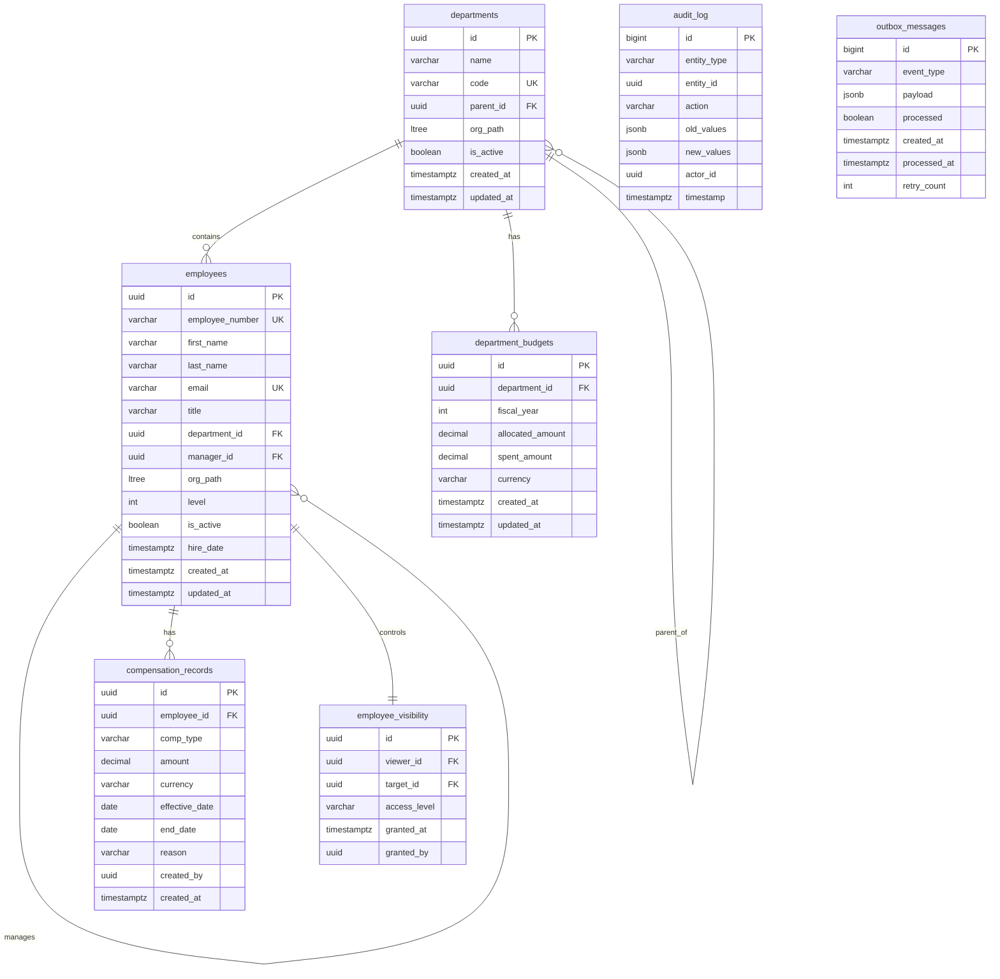

# Phase 2: Database & Domain Layer

## Goal

Implement the full PostgreSQL schema with ltree hierarchies, EF Core persistence layer with CQRS, seed data for 5000+ employees, and materialized views for read-optimized queries.

## Success Criteria

- [ ] All tables created via EF Core migrations
- [ ] ltree paths computed correctly for full org hierarchy
- [ ] 5000+ employee seed data loads in < 30 seconds
- [ ] CSV import creates/updates employees with conflict resolution
- [ ] Materialized views return correct budget rollups
- [ ] All CQRS command/query handlers have unit tests
- [ ] `make migrate && make seed` works from zero state

## Prerequisites

- **Phase 1** — Monorepo, Docker Compose (PostgreSQL running)

## Schema Diagram



## Task Breakdown

### 2.1 — PostgreSQL Schema & EF Core Setup

**Install packages in `Infrastructure.csproj`:**
```xml
<PackageReference Include="Npgsql.EntityFrameworkCore.PostgreSQL" Version="8.*" />
<PackageReference Include="Npgsql.EntityFrameworkCore.PostgreSQL.Ltree" Version="8.*" />
<PackageReference Include="EFCore.NamingConventions" Version="8.*" />
<PackageReference Include="Microsoft.EntityFrameworkCore.Design" Version="8.*" />
```

**`apps/api/src/Infrastructure/Persistence/AppDbContext.cs`:**
```csharp
public class AppDbContext : DbContext
{
    public DbSet<Department> Departments => Set<Department>();
    public DbSet<Employee> Employees => Set<Employee>();
    public DbSet<CompensationRecord> CompensationRecords => Set<CompensationRecord>();
    public DbSet<DepartmentBudget> DepartmentBudgets => Set<DepartmentBudget>();
    public DbSet<EmployeeVisibility> EmployeeVisibilities => Set<EmployeeVisibility>();
    public DbSet<AuditLog> AuditLogs => Set<AuditLog>();
    public DbSet<OutboxMessage> OutboxMessages => Set<OutboxMessage>();

    protected override void OnConfiguring(DbContextOptionsBuilder options)
    {
        options.UseNpgsql(/* connection string */, o => o.UseLTree())
               .UseSnakeCaseNamingConvention();
    }

    protected override void OnModelCreating(ModelBuilder modelBuilder)
    {
        modelBuilder.HasPostgresExtension("ltree");
        modelBuilder.HasPostgresExtension("pgcrypto");
        modelBuilder.HasPostgresExtension("pg_trgm");

        modelBuilder.ApplyConfigurationsFromAssembly(typeof(AppDbContext).Assembly);
    }
}
```

### 2.2 — Domain Entities

**`apps/api/src/Domain/Entities/Employee.cs`:**
```csharp
public class Employee
{
    public Guid Id { get; private set; } = Guid.NewGuid();
    public string EmployeeNumber { get; private set; } = default!;
    public string FirstName { get; private set; } = default!;
    public string LastName { get; private set; } = default!;
    public string Email { get; private set; } = default!;
    public string Title { get; private set; } = default!;
    public Guid DepartmentId { get; private set; }
    public Guid? ManagerId { get; private set; }
    public LTree OrgPath { get; private set; } = default!;
    public int Level { get; private set; }
    public bool IsActive { get; private set; } = true;
    public DateTime HireDate { get; private set; }
    public DateTime CreatedAt { get; private set; } = DateTime.UtcNow;
    public DateTime UpdatedAt { get; private set; } = DateTime.UtcNow;

    // Navigation
    public Department Department { get; private set; } = default!;
    public Employee? Manager { get; private set; }
    public ICollection<Employee> DirectReports { get; private set; } = new List<Employee>();
    public ICollection<CompensationRecord> CompensationHistory { get; private set; } = new List<CompensationRecord>();

    // Domain methods
    public void UpdateTitle(string title) { Title = title; UpdatedAt = DateTime.UtcNow; }
    public void Transfer(Guid departmentId, Guid? managerId) { /* recompute path */ }
    public void Deactivate() { IsActive = false; UpdatedAt = DateTime.UtcNow; }
}
```

**`apps/api/src/Domain/Entities/CompensationRecord.cs`:**
```csharp
public class CompensationRecord
{
    public Guid Id { get; private set; } = Guid.NewGuid();
    public Guid EmployeeId { get; private set; }
    public CompensationType CompType { get; private set; }
    public decimal Amount { get; private set; }
    public string Currency { get; private set; } = "USD";
    public DateOnly EffectiveDate { get; private set; }
    public DateOnly? EndDate { get; private set; }
    public string? Reason { get; private set; }
    public Guid CreatedBy { get; private set; }
    public DateTime CreatedAt { get; private set; } = DateTime.UtcNow;

    // Append-only: no update methods
}
```

**`apps/api/src/Domain/Entities/Department.cs`:**
```csharp
public class Department
{
    public Guid Id { get; private set; } = Guid.NewGuid();
    public string Name { get; private set; } = default!;
    public string Code { get; private set; } = default!;
    public Guid? ParentId { get; private set; }
    public LTree OrgPath { get; private set; } = default!;
    public bool IsActive { get; private set; } = true;
    public DateTime CreatedAt { get; private set; } = DateTime.UtcNow;
    public DateTime UpdatedAt { get; private set; } = DateTime.UtcNow;

    public Department? Parent { get; private set; }
    public ICollection<Department> Children { get; private set; } = new List<Department>();
    public ICollection<Employee> Employees { get; private set; } = new List<Employee>();
    public ICollection<DepartmentBudget> Budgets { get; private set; } = new List<DepartmentBudget>();
}
```

### 2.3 — EF Core Configurations

**`apps/api/src/Infrastructure/Persistence/Configurations/EmployeeConfiguration.cs`:**
```csharp
public class EmployeeConfiguration : IEntityTypeConfiguration<Employee>
{
    public void Configure(EntityTypeBuilder<Employee> builder)
    {
        builder.ToTable("employees");
        builder.HasKey(e => e.Id);
        builder.HasIndex(e => e.EmployeeNumber).IsUnique();
        builder.HasIndex(e => e.Email).IsUnique();
        builder.HasIndex(e => e.OrgPath).HasMethod("gist");
        builder.HasIndex(e => e.DepartmentId);
        builder.HasIndex(e => e.ManagerId);

        builder.Property(e => e.EmployeeNumber).HasMaxLength(20);
        builder.Property(e => e.FirstName).HasMaxLength(100);
        builder.Property(e => e.LastName).HasMaxLength(100);
        builder.Property(e => e.Email).HasMaxLength(255);
        builder.Property(e => e.Title).HasMaxLength(200);
        builder.Property(e => e.OrgPath).HasColumnType("ltree");

        // Full-text search index
        builder.HasIndex(e => new { e.FirstName, e.LastName })
               .HasMethod("gin")
               .HasOperators("gin_trgm_ops", "gin_trgm_ops");

        builder.HasOne(e => e.Manager)
               .WithMany(e => e.DirectReports)
               .HasForeignKey(e => e.ManagerId)
               .OnDelete(DeleteBehavior.SetNull);

        builder.HasOne(e => e.Department)
               .WithMany(d => d.Employees)
               .HasForeignKey(e => e.DepartmentId);
    }
}
```

**`apps/api/src/Infrastructure/Persistence/Configurations/CompensationRecordConfiguration.cs`:**
```csharp
public class CompensationRecordConfiguration : IEntityTypeConfiguration<CompensationRecord>
{
    public void Configure(EntityTypeBuilder<CompensationRecord> builder)
    {
        builder.ToTable("compensation_records", t =>
        {
            // Append-only: no updates/deletes at DB level
            t.HasCheckConstraint("ck_compensation_amount_positive", "amount > 0");
        });

        builder.HasKey(c => c.Id);
        builder.HasIndex(c => new { c.EmployeeId, c.EffectiveDate });
        builder.Property(c => c.Amount).HasPrecision(18, 2);
        builder.Property(c => c.Currency).HasMaxLength(3);
        builder.Property(c => c.CompType).HasConversion<string>().HasMaxLength(50);
    }
}
```

### 2.4 — ltree Path Computation

**`apps/api/src/Infrastructure/Persistence/Services/OrgPathService.cs`:**
```csharp
public class OrgPathService : IOrgPathService
{
    private readonly AppDbContext _db;

    public async Task RecomputeAllPathsAsync(CancellationToken ct)
    {
        // Use recursive CTE for bulk update
        await _db.Database.ExecuteSqlRawAsync("""
            WITH RECURSIVE tree AS (
                SELECT id, employee_number, manager_id,
                       employee_number::ltree AS org_path,
                       0 AS level
                FROM employees
                WHERE manager_id IS NULL

                UNION ALL

                SELECT e.id, e.employee_number, e.manager_id,
                       t.org_path || e.employee_number::ltree,
                       t.level + 1
                FROM employees e
                JOIN tree t ON e.manager_id = t.id
            )
            UPDATE employees
            SET org_path = tree.org_path,
                level = tree.level,
                updated_at = now()
            FROM tree
            WHERE employees.id = tree.id;
        """, ct);
    }

    public async Task RecomputeSubtreeAsync(Guid rootEmployeeId, CancellationToken ct)
    {
        // Recompute only the subtree under the given root
        // Used after a transfer/re-org
    }
}
```

### 2.5 — Materialized Views

**`apps/api/src/Infrastructure/Persistence/Migrations/sql/create_materialized_views.sql`:**
```sql
-- Department budget rollup (includes all descendant departments)
CREATE MATERIALIZED VIEW mv_department_budget_rollup AS
WITH RECURSIVE dept_tree AS (
    SELECT id, name, code, parent_id, org_path, 0 AS depth
    FROM departments
    WHERE parent_id IS NULL

    UNION ALL

    SELECT d.id, d.name, d.code, d.parent_id, d.org_path, dt.depth + 1
    FROM departments d
    JOIN dept_tree dt ON d.parent_id = dt.id
),
emp_comp AS (
    SELECT
        e.department_id,
        SUM(cr.amount) FILTER (WHERE cr.comp_type = 'BASE_SALARY') AS total_base,
        SUM(cr.amount) FILTER (WHERE cr.comp_type = 'BONUS') AS total_bonus,
        SUM(cr.amount) FILTER (WHERE cr.comp_type = 'EQUITY') AS total_equity,
        SUM(cr.amount) AS total_compensation,
        COUNT(DISTINCT e.id) AS headcount
    FROM employees e
    JOIN compensation_records cr ON cr.employee_id = e.id
        AND cr.effective_date <= CURRENT_DATE
        AND (cr.end_date IS NULL OR cr.end_date > CURRENT_DATE)
    WHERE e.is_active = true
    GROUP BY e.department_id
)
SELECT
    d.id AS department_id,
    d.name AS department_name,
    d.code AS department_code,
    d.org_path,
    COALESCE(ec.total_base, 0) AS direct_base_salary,
    COALESCE(ec.total_bonus, 0) AS direct_bonus,
    COALESCE(ec.total_equity, 0) AS direct_equity,
    COALESCE(ec.total_compensation, 0) AS direct_total,
    COALESCE(ec.headcount, 0) AS direct_headcount,
    -- Rollup: sum of self + all descendants
    COALESCE(SUM(sub_ec.total_compensation), 0) + COALESCE(ec.total_compensation, 0) AS rolled_up_total,
    COALESCE(SUM(sub_ec.headcount), 0) + COALESCE(ec.headcount, 0) AS rolled_up_headcount
FROM departments d
LEFT JOIN emp_comp ec ON ec.department_id = d.id
LEFT JOIN departments sub ON sub.org_path <@ d.org_path AND sub.id != d.id
LEFT JOIN emp_comp sub_ec ON sub_ec.department_id = sub.id
GROUP BY d.id, d.name, d.code, d.org_path,
         ec.total_base, ec.total_bonus, ec.total_equity,
         ec.total_compensation, ec.headcount;

CREATE UNIQUE INDEX ON mv_department_budget_rollup (department_id);
CREATE INDEX ON mv_department_budget_rollup USING gist (org_path);

-- Manager span-of-control view
CREATE MATERIALIZED VIEW mv_manager_span AS
SELECT
    m.id AS manager_id,
    m.employee_number,
    m.first_name || ' ' || m.last_name AS manager_name,
    m.department_id,
    COUNT(DISTINCT dr.id) AS direct_reports,
    (SELECT COUNT(*) FROM employees sub WHERE sub.org_path <@ m.org_path AND sub.id != m.id) AS total_reports,
    COALESCE(SUM(cr.amount) FILTER (WHERE cr.comp_type = 'BASE_SALARY'), 0) AS team_base_salary
FROM employees m
LEFT JOIN employees dr ON dr.manager_id = m.id AND dr.is_active = true
LEFT JOIN compensation_records cr ON cr.employee_id = dr.id
    AND cr.effective_date <= CURRENT_DATE
    AND (cr.end_date IS NULL OR cr.end_date > CURRENT_DATE)
WHERE m.is_active = true
GROUP BY m.id, m.employee_number, m.first_name, m.last_name, m.department_id;

CREATE UNIQUE INDEX ON mv_manager_span (manager_id);
```

**Refresh service — `apps/api/src/Infrastructure/Persistence/Services/MaterializedViewRefreshService.cs`:**
```csharp
public class MaterializedViewRefreshService : IMaterializedViewRefreshService
{
    private readonly AppDbContext _db;
    private readonly ILogger<MaterializedViewRefreshService> _logger;

    public async Task RefreshAllAsync(CancellationToken ct)
    {
        var views = new[] { "mv_department_budget_rollup", "mv_manager_span" };
        foreach (var view in views)
        {
            _logger.LogInformation("Refreshing {View} CONCURRENTLY", view);
            await _db.Database.ExecuteSqlRawAsync(
                $"REFRESH MATERIALIZED VIEW CONCURRENTLY {view}", ct);
        }
    }

    public async Task RefreshBudgetRollupAsync(CancellationToken ct)
    {
        await _db.Database.ExecuteSqlRawAsync(
            "REFRESH MATERIALIZED VIEW CONCURRENTLY mv_department_budget_rollup", ct);
    }
}
```

### 2.6 — CQRS Handlers

**Commands:**

| Handler | File | Purpose |
|---------|------|---------|
| `CreateEmployeeHandler` | `apps/api/src/Application/Commands/CreateEmployee/` | Create employee + initial comp record |
| `UpdateEmployeeHandler` | `apps/api/src/Application/Commands/UpdateEmployee/` | Update non-comp fields |
| `TransferEmployeeHandler` | `apps/api/src/Application/Commands/TransferEmployee/` | Change dept/manager, recompute paths |
| `AddCompensationHandler` | `apps/api/src/Application/Commands/AddCompensation/` | Append compensation record |
| `CreateDepartmentHandler` | `apps/api/src/Application/Commands/CreateDepartment/` | Create department node |
| `SetBudgetHandler` | `apps/api/src/Application/Commands/SetBudget/` | Set department fiscal year budget |
| `ImportEmployeesHandler` | `apps/api/src/Application/Commands/ImportEmployees/` | Bulk CSV import |

**Queries:**

| Handler | File | Purpose |
|---------|------|---------|
| `GetEmployeeByIdQuery` | `apps/api/src/Application/Queries/GetEmployeeById/` | Single employee + current comp |
| `SearchEmployeesQuery` | `apps/api/src/Application/Queries/SearchEmployees/` | Trigram search with cursor pagination |
| `GetOrgTreeQuery` | `apps/api/src/Application/Queries/GetOrgTree/` | Subtree from ltree root |
| `GetDepartmentBudgetQuery` | `apps/api/src/Application/Queries/GetDepartmentBudget/` | From materialized view |
| `GetManagerSpanQuery` | `apps/api/src/Application/Queries/GetManagerSpan/` | From materialized view |
| `GetDirectReportsQuery` | `apps/api/src/Application/Queries/GetDirectReports/` | Immediate reports for a manager |
| `GetCompensationHistoryQuery` | `apps/api/src/Application/Queries/GetCompHistory/` | All comp records for an employee |

**Example — `apps/api/src/Application/Queries/GetOrgTree/GetOrgTreeHandler.cs`:**
```csharp
public class GetOrgTreeHandler : IRequestHandler<GetOrgTreeQuery, OrgTreeDto>
{
    private readonly AppDbContext _db;

    public async Task<OrgTreeDto> Handle(GetOrgTreeQuery request, CancellationToken ct)
    {
        var rootPath = await _db.Employees
            .Where(e => e.Id == request.RootEmployeeId)
            .Select(e => e.OrgPath)
            .FirstOrDefaultAsync(ct)
            ?? throw new NotFoundException("Employee", request.RootEmployeeId);

        var descendants = await _db.Employees
            .Where(e => EF.Functions.LTreeIsDescendant(e.OrgPath, rootPath))
            .Where(e => e.IsActive)
            .OrderBy(e => e.Level)
            .ThenBy(e => e.LastName)
            .Select(e => new OrgNodeDto
            {
                Id = e.Id,
                EmployeeNumber = e.EmployeeNumber,
                FullName = e.FirstName + " " + e.LastName,
                Title = e.Title,
                DepartmentCode = e.Department.Code,
                ManagerId = e.ManagerId,
                Level = e.Level,
                DirectReportCount = e.DirectReports.Count(dr => dr.IsActive),
            })
            .ToListAsync(ct);

        return BuildTree(descendants, request.MaxDepth);
    }
}
```

### 2.7 — Seed Data Generator

**`scripts/seed.ts`:**
```typescript
import { faker } from '@faker-js/faker';
import { Pool } from 'pg';

const TOTAL_EMPLOYEES = 5200;
const DEPARTMENTS = [
  { code: 'CEO', name: 'Executive Office', parent: null },
  { code: 'ENG', name: 'Engineering', parent: 'CEO' },
  { code: 'ENG-BE', name: 'Backend Engineering', parent: 'ENG' },
  { code: 'ENG-FE', name: 'Frontend Engineering', parent: 'ENG' },
  { code: 'ENG-INFRA', name: 'Infrastructure', parent: 'ENG' },
  { code: 'ENG-DATA', name: 'Data Engineering', parent: 'ENG' },
  { code: 'PROD', name: 'Product', parent: 'CEO' },
  { code: 'DESIGN', name: 'Design', parent: 'CEO' },
  { code: 'HR', name: 'Human Resources', parent: 'CEO' },
  { code: 'FIN', name: 'Finance', parent: 'CEO' },
  { code: 'SALES', name: 'Sales', parent: 'CEO' },
  { code: 'SALES-NA', name: 'Sales North America', parent: 'SALES' },
  { code: 'SALES-EU', name: 'Sales Europe', parent: 'SALES' },
  { code: 'MKT', name: 'Marketing', parent: 'CEO' },
  { code: 'LEGAL', name: 'Legal', parent: 'CEO' },
  { code: 'OPS', name: 'Operations', parent: 'CEO' },
];

async function seed() {
  const pool = new Pool({
    host: 'localhost', port: 5432,
    database: 'eba_dev', user: 'eba_user', password: 'eba_local_password',
  });

  // 1. Insert departments
  // 2. Create CEO → VPs → Directors → Managers → ICs hierarchy
  // 3. Generate realistic compensation records (base, bonus, equity)
  // 4. Compute ltree paths via recursive CTE
  // 5. Refresh materialized views

  console.log(`Seeded ${TOTAL_EMPLOYEES} employees across ${DEPARTMENTS.length} departments`);
  await pool.end();
}

seed().catch(console.error);
```

### 2.8 — CSV Import Service

**`apps/api/src/Application/Commands/ImportEmployees/ImportEmployeesHandler.cs`:**
```csharp
public class ImportEmployeesHandler : IRequestHandler<ImportEmployeesCommand, ImportResult>
{
    public async Task<ImportResult> Handle(ImportEmployeesCommand request, CancellationToken ct)
    {
        using var reader = new StreamReader(request.CsvStream);
        using var csv = new CsvReader(reader, CultureInfo.InvariantCulture);

        var records = csv.GetRecords<EmployeeCsvRow>().ToList();
        var result = new ImportResult();

        foreach (var batch in records.Chunk(500))
        {
            await using var tx = await _db.Database.BeginTransactionAsync(ct);
            try
            {
                // Upsert logic using ON CONFLICT (employee_number) DO UPDATE
                var sql = BuildUpsertSql(batch);
                var affected = await _db.Database.ExecuteSqlRawAsync(sql, ct);
                result.Upserted += affected;
                await tx.CommitAsync(ct);
            }
            catch (Exception ex)
            {
                await tx.RollbackAsync(ct);
                result.Errors.Add($"Batch failed: {ex.Message}");
            }
        }

        // Recompute paths after import
        await _orgPathService.RecomputeAllPathsAsync(ct);
        await _mvRefresh.RefreshAllAsync(ct);

        return result;
    }
}
```

## Acceptance Tests

| # | Test | Verification |
|---|------|-------------|
| 1 | Migration runs cleanly | `make migrate` on empty DB creates all tables, indices, and extensions |
| 2 | ltree extension active | `SELECT 'a.b.c'::ltree;` succeeds |
| 3 | Seed data loads | `make seed` → employees table has 5000+ rows |
| 4 | Org paths correct | `SELECT * FROM employees WHERE org_path <@ 'CEO';` returns all employees |
| 5 | Compensation append-only | `UPDATE compensation_records SET amount = 0` blocked by policy/application |
| 6 | Materialized views populated | `SELECT * FROM mv_department_budget_rollup LIMIT 5;` returns data |
| 7 | CSV import works | Upload test CSV → new employees created, duplicates updated |
| 8 | CQRS handlers tested | `dotnet test` passes all handler unit tests |
| 9 | Search works | Search query for partial name returns trigram matches |

## Estimated Effort

| Task | Time |
|------|------|
| Domain entities & value objects | 3h |
| EF Core config & migrations | 4h |
| ltree path computation | 2h |
| Materialized views | 3h |
| CQRS handlers (commands) | 4h |
| CQRS handlers (queries) | 3h |
| Seed data generator | 2h |
| CSV import | 2h |
| Unit tests | 4h |
| **Total** | **~27h** |
