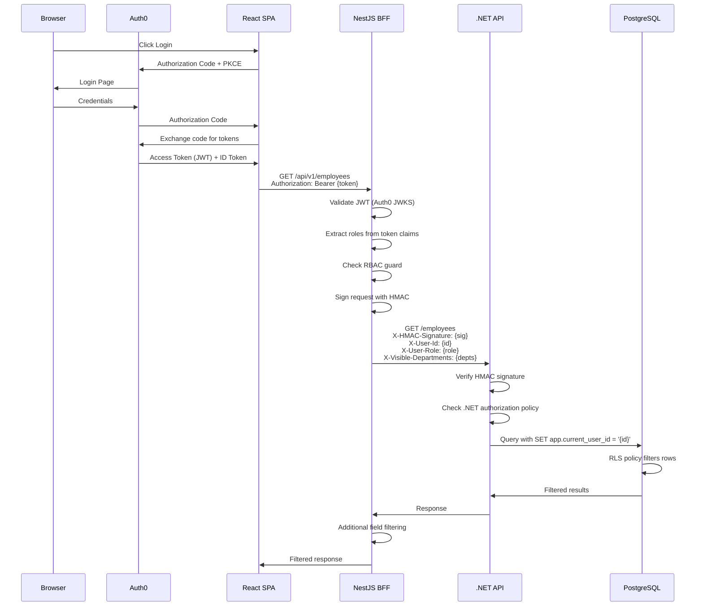
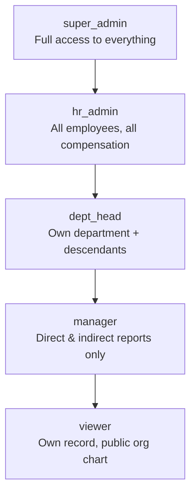

# Phase 3: Authentication & RBAC

## Goal

Implement end-to-end authentication with Auth0 and a 3-layer RBAC system enforced at the BFF (NestJS guards), API (.NET authorization policies), and database (PostgreSQL RLS), with HMAC signing securing the BFF→API boundary.

## Success Criteria

- [ ] Auth0 login/logout works in React SPA via PKCE
- [ ] Unauthenticated requests receive 401
- [ ] Role-based access enforced: viewer < manager < dept_head < hr_admin < super_admin
- [ ] Department-scoped access limits data visibility
- [ ] HMAC signature prevents direct .NET API access without BFF
- [ ] PostgreSQL RLS filters rows based on session role context
- [ ] Redis caches visibility sets with TTL-based invalidation
- [ ] All 3 layers independently testable

## Prerequisites

- **Phase 1** — Services running
- **Phase 2** — Employees, departments, visibility tables exist

## Auth Flow



## Role Hierarchy



## Task Breakdown

### 3.1 — Auth0 Tenant Configuration

**Auth0 Dashboard Setup:**

| Setting | Value |
|---------|-------|
| Application Type | Single Page Application |
| Allowed Callback URLs | `http://localhost:5173/callback, https://app.example.com/callback` |
| Allowed Logout URLs | `http://localhost:5173, https://app.example.com` |
| Allowed Web Origins | `http://localhost:5173, https://app.example.com` |
| API Identifier (Audience) | `https://api.employee-budget.example.com` |
| Token Expiration | Access: 3600s, Refresh: 86400s |

**Custom Claims via Auth0 Action (Login/Post-Login):**
```javascript
exports.onExecutePostLogin = async (event, api) => {
  const namespace = 'https://eba.example.com';
  const roles = event.authorization?.roles || [];
  const metadata = event.user.app_metadata || {};

  api.accessToken.setCustomClaim(`${namespace}/roles`, roles);
  api.accessToken.setCustomClaim(`${namespace}/department_id`, metadata.department_id);
  api.accessToken.setCustomClaim(`${namespace}/employee_id`, metadata.employee_id);
};
```

**Auth0 Roles to create:**
- `super_admin`
- `hr_admin`
- `dept_head`
- `manager`
- `viewer`

### 3.2 — React Auth0 Integration

**`apps/web/src/auth/Auth0ProviderWithNavigate.tsx`:**
```typescript
import { Auth0Provider } from '@auth0/auth0-react';
import { useNavigate } from 'react-router-dom';

export function Auth0ProviderWithNavigate({ children }: { children: React.ReactNode }) {
  const navigate = useNavigate();

  return (
    <Auth0Provider
      domain={import.meta.env.VITE_AUTH0_DOMAIN}
      clientId={import.meta.env.VITE_AUTH0_CLIENT_ID}
      authorizationParams={{
        redirect_uri: window.location.origin + '/callback',
        audience: import.meta.env.VITE_AUTH0_AUDIENCE,
        scope: 'openid profile email',
      }}
      onRedirectCallback={(appState) => navigate(appState?.returnTo || '/')}
      cacheLocation="localstorage"
      useRefreshTokens={true}
    >
      {children}
    </Auth0Provider>
  );
}
```

**`apps/web/src/auth/usePermissions.ts`:**
```typescript
import { useAuth0 } from '@auth0/auth0-react';
import { Role } from '@shared-types';

const NAMESPACE = 'https://eba.example.com';
const ROLE_HIERARCHY: Role[] = ['viewer', 'manager', 'dept_head', 'hr_admin', 'super_admin'];

export function usePermissions() {
  const { user } = useAuth0();
  const roles: Role[] = user?.[`${NAMESPACE}/roles`] ?? [];
  const departmentId: string | undefined = user?.[`${NAMESPACE}/department_id`];
  const highestRole = roles.reduce((max, r) =>
    ROLE_HIERARCHY.indexOf(r) > ROLE_HIERARCHY.indexOf(max) ? r : max, 'viewer' as Role);

  return {
    roles,
    highestRole,
    departmentId,
    hasRole: (role: Role) => ROLE_HIERARCHY.indexOf(highestRole) >= ROLE_HIERARCHY.indexOf(role),
    canViewCompensation: highestRole !== 'viewer',
    canEditCompensation: ['hr_admin', 'super_admin'].includes(highestRole),
    canManageDepartment: (deptId: string) =>
      highestRole === 'super_admin' || highestRole === 'hr_admin' ||
      (highestRole === 'dept_head' && departmentId === deptId),
  };
}
```

### 3.3 — NestJS Auth0 Guard + RBAC Guard

**`apps/bff/src/auth/jwt.strategy.ts`:**
```typescript
import { Injectable } from '@nestjs/common';
import { PassportStrategy } from '@nestjs/passport';
import { ExtractJwt, Strategy } from 'passport-jwt';
import { passportJwtSecret } from 'jwks-rsa';
import { ConfigService } from '@nestjs/config';

@Injectable()
export class JwtStrategy extends PassportStrategy(Strategy) {
  constructor(config: ConfigService) {
    super({
      secretOrKeyProvider: passportJwtSecret({
        cache: true,
        rateLimit: true,
        jwksRequestsPerMinute: 5,
        jwksUri: `https://${config.get('AUTH0_DOMAIN')}/.well-known/jwks.json`,
      }),
      jwtFromRequest: ExtractJwt.fromAuthHeaderAsBearerToken(),
      audience: config.get('AUTH0_AUDIENCE'),
      issuer: `https://${config.get('AUTH0_DOMAIN')}/`,
      algorithms: ['RS256'],
    });
  }

  validate(payload: any) {
    return {
      sub: payload.sub,
      roles: payload['https://eba.example.com/roles'] ?? [],
      departmentId: payload['https://eba.example.com/department_id'],
      employeeId: payload['https://eba.example.com/employee_id'],
    };
  }
}
```

**`apps/bff/src/auth/rbac.guard.ts`:**
```typescript
import { CanActivate, ExecutionContext, Injectable, SetMetadata } from '@nestjs/common';
import { Reflector } from '@nestjs/core';
import { Role } from '@shared-types';

export const ROLES_KEY = 'roles';
export const Roles = (...roles: Role[]) => SetMetadata(ROLES_KEY, roles);

const ROLE_HIERARCHY: Record<Role, number> = {
  viewer: 0, manager: 1, dept_head: 2, hr_admin: 3, super_admin: 4,
};

@Injectable()
export class RbacGuard implements CanActivate {
  constructor(private reflector: Reflector) {}

  canActivate(context: ExecutionContext): boolean {
    const requiredRoles = this.reflector.getAllAndOverride<Role[]>(ROLES_KEY, [
      context.getHandler(), context.getClass(),
    ]);
    if (!requiredRoles?.length) return true;

    const { user } = context.switchToHttp().getRequest();
    const userRoles: Role[] = user.roles ?? [];
    const userMax = Math.max(...userRoles.map(r => ROLE_HIERARCHY[r] ?? 0));
    const requiredMin = Math.min(...requiredRoles.map(r => ROLE_HIERARCHY[r] ?? 99));

    return userMax >= requiredMin;
  }
}
```

**Usage in controller:**
```typescript
@Controller('employees')
@UseGuards(AuthGuard('jwt'), RbacGuard)
export class EmployeesController {
  @Get()
  @Roles('viewer')
  findAll(@Req() req) { /* ... */ }

  @Get(':id/compensation')
  @Roles('manager')
  getCompensation(@Param('id') id: string, @Req() req) { /* ... */ }

  @Post(':id/compensation')
  @Roles('hr_admin')
  addCompensation(@Param('id') id: string, @Body() dto: AddCompensationDto) { /* ... */ }
}
```

### 3.4 — HMAC Header Signing (BFF → API)

**`apps/bff/src/auth/hmac.service.ts`:**
```typescript
import { Injectable } from '@nestjs/common';
import { ConfigService } from '@nestjs/config';
import { createHmac } from 'crypto';

@Injectable()
export class HmacService {
  private readonly secret: string;

  constructor(config: ConfigService) {
    this.secret = config.getOrThrow('HMAC_SECRET');
  }

  sign(payload: { userId: string; role: string; timestamp: number; path: string }): string {
    const message = `${payload.userId}:${payload.role}:${payload.timestamp}:${payload.path}`;
    return createHmac('sha256', this.secret).update(message).digest('hex');
  }
}
```

**`apps/bff/src/proxy/api-proxy.service.ts`:**
```typescript
@Injectable()
export class ApiProxyService {
  constructor(
    private http: HttpService,
    private hmac: HmacService,
  ) {}

  async forward(user: AuthUser, method: string, path: string, body?: any) {
    const timestamp = Date.now();
    const signature = this.hmac.sign({
      userId: user.sub, role: user.roles[0], timestamp, path,
    });

    return this.http.request({
      method, url: `${this.apiBaseUrl}${path}`, data: body,
      headers: {
        'X-User-Id': user.sub,
        'X-User-Role': user.roles.join(','),
        'X-User-Department': user.departmentId ?? '',
        'X-Employee-Id': user.employeeId ?? '',
        'X-HMAC-Timestamp': timestamp.toString(),
        'X-HMAC-Signature': signature,
      },
    });
  }
}
```

### 3.5 — .NET HMAC Verification & Authorization Policies

**`src/Api/Middleware/HmacVerificationMiddleware.cs`** *(employee_budget_allocation_api repo)*:
```csharp
public class HmacVerificationMiddleware
{
    private readonly RequestDelegate _next;
    private readonly string _secret;
    private const int MaxTimestampDriftMs = 30_000; // 30 seconds

    public async Task InvokeAsync(HttpContext context)
    {
        if (context.Request.Path.StartsWithSegments("/healthz")) { await _next(context); return; }

        var signature = context.Request.Headers["X-HMAC-Signature"].FirstOrDefault();
        var timestamp = context.Request.Headers["X-HMAC-Timestamp"].FirstOrDefault();
        var userId = context.Request.Headers["X-User-Id"].FirstOrDefault();
        var role = context.Request.Headers["X-User-Role"].FirstOrDefault();

        if (string.IsNullOrEmpty(signature) || string.IsNullOrEmpty(timestamp))
        {
            context.Response.StatusCode = 401;
            return;
        }

        // Verify timestamp freshness
        if (!long.TryParse(timestamp, out var ts) ||
            Math.Abs(DateTimeOffset.UtcNow.ToUnixTimeMilliseconds() - ts) > MaxTimestampDriftMs)
        {
            context.Response.StatusCode = 401;
            return;
        }

        // Verify HMAC
        var expected = ComputeHmac($"{userId}:{role}:{timestamp}:{context.Request.Path}");
        if (!CryptographicOperations.FixedTimeEquals(
            Encoding.UTF8.GetBytes(signature), Encoding.UTF8.GetBytes(expected)))
        {
            context.Response.StatusCode = 401;
            return;
        }

        // Set claims principal from headers
        var claims = new List<Claim>
        {
            new(ClaimTypes.NameIdentifier, userId!),
            new("department_id", context.Request.Headers["X-User-Department"].FirstOrDefault() ?? ""),
            new("employee_id", context.Request.Headers["X-Employee-Id"].FirstOrDefault() ?? ""),
        };
        foreach (var r in role!.Split(','))
            claims.Add(new(ClaimTypes.Role, r));

        context.User = new ClaimsPrincipal(new ClaimsIdentity(claims, "HMAC"));
        await _next(context);
    }
}
```

**`src/Api/Authorization/Policies.cs`** *(employee_budget_allocation_api repo)*:
```csharp
public static class AuthorizationPolicies
{
    public static void Configure(AuthorizationOptions options)
    {
        options.AddPolicy("ViewEmployees", p => p.RequireRole(
            "viewer", "manager", "dept_head", "hr_admin", "super_admin"));

        options.AddPolicy("ViewCompensation", p => p.RequireRole(
            "manager", "dept_head", "hr_admin", "super_admin"));

        options.AddPolicy("EditCompensation", p => p.RequireRole(
            "hr_admin", "super_admin"));

        options.AddPolicy("ManageDepartment", p => p.RequireRole(
            "dept_head", "hr_admin", "super_admin"));

        options.AddPolicy("AdminOnly", p => p.RequireRole("super_admin"));
    }
}
```

### 3.6 — PostgreSQL RLS Policies

**Migration SQL — `src/Infrastructure/Persistence/Migrations/sql/rls_policies.sql`** *(employee_budget_allocation_api repo)*:
```sql
-- Enable RLS on sensitive tables
ALTER TABLE employees ENABLE ROW LEVEL SECURITY;
ALTER TABLE compensation_records ENABLE ROW LEVEL SECURITY;

-- Helper function: get current user context from session variables
CREATE OR REPLACE FUNCTION current_app_user_id() RETURNS uuid AS $$
  SELECT NULLIF(current_setting('app.current_user_id', true), '')::uuid;
$$ LANGUAGE sql STABLE;

CREATE OR REPLACE FUNCTION current_app_role() RETURNS text AS $$
  SELECT COALESCE(current_setting('app.current_user_role', true), 'viewer');
$$ LANGUAGE sql STABLE;

CREATE OR REPLACE FUNCTION current_app_department_id() RETURNS uuid AS $$
  SELECT NULLIF(current_setting('app.current_user_department_id', true), '')::uuid;
$$ LANGUAGE sql STABLE;

-- Employee visibility policy
CREATE POLICY employee_visibility ON employees
  FOR SELECT
  USING (
    current_app_role() IN ('super_admin', 'hr_admin')
    OR (
      current_app_role() = 'dept_head'
      AND department_id IN (
        SELECT id FROM departments
        WHERE org_path <@ (SELECT org_path FROM departments WHERE id = current_app_department_id())
      )
    )
    OR (
      current_app_role() = 'manager'
      AND org_path <@ (
        SELECT org_path FROM employees WHERE id = current_app_user_id()
      )
    )
    OR id = current_app_user_id()
  );

-- Compensation visibility policy
CREATE POLICY compensation_visibility ON compensation_records
  FOR SELECT
  USING (
    current_app_role() IN ('super_admin', 'hr_admin')
    OR (
      current_app_role() IN ('manager', 'dept_head')
      AND employee_id IN (
        SELECT id FROM employees  -- already filtered by employee_visibility
      )
    )
  );

-- Compensation insert policy (append-only)
CREATE POLICY compensation_insert ON compensation_records
  FOR INSERT
  WITH CHECK (
    current_app_role() IN ('hr_admin', 'super_admin')
  );

-- Application role (used by EF Core connection)
CREATE ROLE eba_app LOGIN PASSWORD 'eba_local_password';
GRANT SELECT, INSERT, UPDATE ON ALL TABLES IN SCHEMA public TO eba_app;
ALTER DEFAULT PRIVILEGES IN SCHEMA public GRANT SELECT, INSERT, UPDATE ON TABLES TO eba_app;

-- Set session variables before each query from .NET
-- Done in DbContext interceptor
```

**`src/Infrastructure/Persistence/Interceptors/RlsInterceptor.cs`** *(employee_budget_allocation_api repo)*:
```csharp
public class RlsConnectionInterceptor : DbConnectionInterceptor
{
    private readonly IHttpContextAccessor _httpContext;

    public override async Task ConnectionOpenedAsync(
        DbConnection connection, ConnectionEndEventData data, CancellationToken ct)
    {
        var user = _httpContext.HttpContext?.User;
        if (user?.Identity?.IsAuthenticated != true) return;

        var userId = user.FindFirstValue(ClaimTypes.NameIdentifier);
        var role = user.FindFirstValue(ClaimTypes.Role);
        var deptId = user.FindFirstValue("department_id");

        await using var cmd = connection.CreateCommand();
        cmd.CommandText = $"""
            SET LOCAL app.current_user_id = '{userId}';
            SET LOCAL app.current_user_role = '{role}';
            SET LOCAL app.current_user_department_id = '{deptId}';
        """;
        await cmd.ExecuteNonQueryAsync(ct);
    }
}
```

### 3.7 — Redis Visibility Set Caching

**`apps/bff/src/auth/visibility-cache.service.ts`:**
```typescript
import { Injectable } from '@nestjs/common';
import { Redis } from 'ioredis';

@Injectable()
export class VisibilityCacheService {
  constructor(private redis: Redis) {}

  private key(userId: string) { return `visibility:${userId}`; }

  async getVisibleEmployeeIds(userId: string): Promise<string[] | null> {
    const cached = await this.redis.smembers(this.key(userId));
    return cached.length > 0 ? cached : null;
  }

  async setVisibleEmployeeIds(userId: string, ids: string[]): Promise<void> {
    const key = this.key(userId);
    const pipeline = this.redis.pipeline();
    pipeline.del(key);
    if (ids.length > 0) pipeline.sadd(key, ...ids);
    pipeline.expire(key, 300); // 5 minute TTL
    await pipeline.exec();
  }

  async invalidate(userId: string): Promise<void> {
    await this.redis.del(this.key(userId));
  }

  async invalidateAll(): Promise<void> {
    const keys = await this.redis.keys('visibility:*');
    if (keys.length > 0) await this.redis.del(...keys);
  }
}
```

## Acceptance Tests

| # | Test | Verification |
|---|------|-------------|
| 1 | Login flow works | User clicks login → Auth0 → redirected back with token |
| 2 | 401 without token | `curl localhost:3000/api/v1/employees` → 401 |
| 3 | Viewer sees own record | Login as viewer → can only see own employee data |
| 4 | Manager sees reports | Login as manager → sees direct/indirect reports |
| 5 | Dept head sees department | Login as dept_head → sees all in department subtree |
| 6 | HR admin sees all | Login as hr_admin → sees all employees and compensation |
| 7 | HMAC prevents bypass | Direct call to .NET API without HMAC → 401 |
| 8 | RLS filters at DB | Query as manager → only subtree rows returned |
| 9 | Compensation restricted | Viewer cannot see compensation endpoint → 403 |
| 10 | Cache populated | After first request, Redis has visibility set |

## Estimated Effort

| Task | Time |
|------|------|
| Auth0 tenant + action | 2h |
| React Auth0 integration | 2h |
| NestJS JWT + RBAC guards | 3h |
| HMAC signing/verification | 2h |
| .NET auth policies | 2h |
| PostgreSQL RLS policies | 3h |
| RLS interceptor | 2h |
| Redis visibility cache | 2h |
| Integration tests | 4h |
| **Total** | **~22h** |
