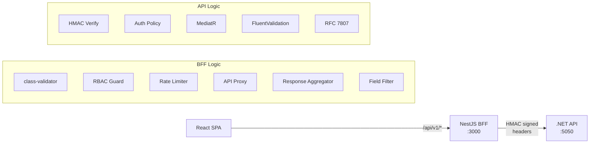

# Phase 4: API & BFF Layer

## Goal

Expose all CQRS handlers through versioned .NET API endpoints, build the NestJS BFF layer with proxy, aggregation, and RBAC filtering, and implement cross-cutting concerns (pagination, error handling, validation, rate limiting, health checks).

## Success Criteria

- [ ] All CQRS handlers reachable via REST endpoints
- [ ] BFF proxies and aggregates responses with field-level RBAC filtering
- [ ] Cursor-based pagination works on all list endpoints
- [ ] RFC 7807 error responses from both services
- [ ] Rate limiting blocks excessive requests (100 req/min default)
- [ ] Swagger/OpenAPI docs generated for .NET API
- [ ] Health checks report dependency status

## Prerequisites

- **Phase 2** — CQRS handlers and database
- **Phase 3** — Auth guards and HMAC signing

## Request Flow



## Task Breakdown

### 4.1 — .NET API Endpoints

**`src/Api/Controllers/EmployeesController.cs`** *(employee_budget_allocation_api repo)*:
```csharp
[ApiController]
[Route("v1/employees")]
public class EmployeesController : ControllerBase
{
    private readonly IMediator _mediator;

    [HttpGet]
    [Authorize(Policy = "ViewEmployees")]
    public async Task<ActionResult<CursorPage<EmployeeDto>>> Search(
        [FromQuery] SearchEmployeesQuery query, CancellationToken ct)
    {
        return Ok(await _mediator.Send(query, ct));
    }

    [HttpGet("{id:guid}")]
    [Authorize(Policy = "ViewEmployees")]
    public async Task<ActionResult<EmployeeDetailDto>> GetById(
        Guid id, CancellationToken ct)
    {
        return Ok(await _mediator.Send(new GetEmployeeByIdQuery(id), ct));
    }

    [HttpGet("{id:guid}/compensation")]
    [Authorize(Policy = "ViewCompensation")]
    public async Task<ActionResult<List<CompensationDto>>> GetCompensation(
        Guid id, CancellationToken ct)
    {
        return Ok(await _mediator.Send(new GetCompensationHistoryQuery(id), ct));
    }

    [HttpPost("{id:guid}/compensation")]
    [Authorize(Policy = "EditCompensation")]
    public async Task<ActionResult<CompensationDto>> AddCompensation(
        Guid id, [FromBody] AddCompensationCommand command, CancellationToken ct)
    {
        command = command with { EmployeeId = id };
        var result = await _mediator.Send(command, ct);
        return CreatedAtAction(nameof(GetCompensation), new { id }, result);
    }

    [HttpGet("{id:guid}/direct-reports")]
    [Authorize(Policy = "ViewEmployees")]
    public async Task<ActionResult<List<EmployeeDto>>> GetDirectReports(
        Guid id, CancellationToken ct)
    {
        return Ok(await _mediator.Send(new GetDirectReportsQuery(id), ct));
    }

    [HttpGet("{id:guid}/org-tree")]
    [Authorize(Policy = "ViewEmployees")]
    public async Task<ActionResult<OrgTreeDto>> GetOrgTree(
        Guid id, [FromQuery] int maxDepth = 3, CancellationToken ct = default)
    {
        return Ok(await _mediator.Send(new GetOrgTreeQuery(id, maxDepth), ct));
    }

    [HttpPost]
    [Authorize(Policy = "EditCompensation")]
    public async Task<ActionResult<EmployeeDto>> Create(
        [FromBody] CreateEmployeeCommand command, CancellationToken ct)
    {
        var result = await _mediator.Send(command, ct);
        return CreatedAtAction(nameof(GetById), new { id = result.Id }, result);
    }

    [HttpPut("{id:guid}")]
    [Authorize(Policy = "ManageDepartment")]
    public async Task<ActionResult> Update(
        Guid id, [FromBody] UpdateEmployeeCommand command, CancellationToken ct)
    {
        command = command with { Id = id };
        await _mediator.Send(command, ct);
        return NoContent();
    }

    [HttpPost("{id:guid}/transfer")]
    [Authorize(Policy = "ManageDepartment")]
    public async Task<ActionResult> Transfer(
        Guid id, [FromBody] TransferEmployeeCommand command, CancellationToken ct)
    {
        command = command with { EmployeeId = id };
        await _mediator.Send(command, ct);
        return NoContent();
    }

    [HttpPost("import")]
    [Authorize(Policy = "AdminOnly")]
    public async Task<ActionResult<ImportResult>> Import(
        IFormFile file, CancellationToken ct)
    {
        var result = await _mediator.Send(
            new ImportEmployeesCommand(file.OpenReadStream()), ct);
        return Ok(result);
    }
}
```

**`src/Api/Controllers/DepartmentsController.cs`** *(employee_budget_allocation_api repo)*:
```csharp
[ApiController]
[Route("v1/departments")]
public class DepartmentsController : ControllerBase
{
    [HttpGet]
    [Authorize(Policy = "ViewEmployees")]
    public async Task<ActionResult<List<DepartmentDto>>> GetAll(CancellationToken ct)
        => Ok(await _mediator.Send(new GetAllDepartmentsQuery(), ct));

    [HttpGet("{id:guid}")]
    [Authorize(Policy = "ViewEmployees")]
    public async Task<ActionResult<DepartmentDetailDto>> GetById(Guid id, CancellationToken ct)
        => Ok(await _mediator.Send(new GetDepartmentByIdQuery(id), ct));

    [HttpGet("{id:guid}/budget")]
    [Authorize(Policy = "ManageDepartment")]
    public async Task<ActionResult<DepartmentBudgetDto>> GetBudget(
        Guid id, [FromQuery] int? fiscalYear, CancellationToken ct)
        => Ok(await _mediator.Send(new GetDepartmentBudgetQuery(id, fiscalYear), ct));

    [HttpPost]
    [Authorize(Policy = "AdminOnly")]
    public async Task<ActionResult<DepartmentDto>> Create(
        [FromBody] CreateDepartmentCommand cmd, CancellationToken ct)
    {
        var result = await _mediator.Send(cmd, ct);
        return CreatedAtAction(nameof(GetById), new { id = result.Id }, result);
    }

    [HttpPut("{id:guid}/budget")]
    [Authorize(Policy = "ManageDepartment")]
    public async Task<ActionResult> SetBudget(
        Guid id, [FromBody] SetBudgetCommand cmd, CancellationToken ct)
    {
        cmd = cmd with { DepartmentId = id };
        await _mediator.Send(cmd, ct);
        return NoContent();
    }
}
```

**`src/Api/Controllers/ReportsController.cs`** *(employee_budget_allocation_api repo)*:
```csharp
[ApiController]
[Route("v1/reports")]
[Authorize(Policy = "ManageDepartment")]
public class ReportsController : ControllerBase
{
    [HttpGet("manager-span")]
    public async Task<ActionResult<List<ManagerSpanDto>>> GetManagerSpan(CancellationToken ct)
        => Ok(await _mediator.Send(new GetManagerSpanQuery(), ct));

    [HttpGet("budget-rollup")]
    public async Task<ActionResult<List<BudgetRollupDto>>> GetBudgetRollup(
        [FromQuery] Guid? departmentId, CancellationToken ct)
        => Ok(await _mediator.Send(new GetBudgetRollupQuery(departmentId), ct));
}
```

### 4.2 — Cursor-Based Pagination

**`src/Application/Common/CursorPage.cs`** *(employee_budget_allocation_api repo)*:
```csharp
public record CursorPage<T>(
    List<T> Items,
    string? NextCursor,
    string? PrevCursor,
    int TotalCount,
    bool HasMore
);

public record CursorPaginationParams(
    string? Cursor = null,
    int Limit = 25,
    string SortBy = "last_name",
    string SortDir = "asc"
)
{
    public int Limit { get; init; } = Math.Clamp(Limit, 1, 100);
}
```

**Cursor encoding:** Base64 of `{sortValue}|{id}` — decoded in query handlers for keyset pagination:
```csharp
// WHERE (last_name, id) > (@cursorName, @cursorId) ORDER BY last_name, id LIMIT @limit+1
```

### 4.3 — RFC 7807 Error Responses

**`src/Api/Middleware/ExceptionHandlingMiddleware.cs`** *(employee_budget_allocation_api repo)*:
```csharp
public class ExceptionHandlingMiddleware
{
    public async Task InvokeAsync(HttpContext context)
    {
        try { await _next(context); }
        catch (Exception ex)
        {
            var problem = ex switch
            {
                NotFoundException nf => new ProblemDetails
                {
                    Status = 404, Title = "Not Found",
                    Detail = nf.Message, Type = "https://tools.ietf.org/html/rfc7231#section-6.5.4",
                },
                ValidationException ve => new ProblemDetails
                {
                    Status = 422, Title = "Validation Failed",
                    Detail = "One or more validation errors occurred.",
                    Type = "https://tools.ietf.org/html/rfc4918#section-11.2",
                    Extensions = { ["errors"] = ve.Errors },
                },
                UnauthorizedAccessException => new ProblemDetails
                {
                    Status = 403, Title = "Forbidden",
                    Type = "https://tools.ietf.org/html/rfc7231#section-6.5.3",
                },
                _ => new ProblemDetails
                {
                    Status = 500, Title = "Internal Server Error",
                    Type = "https://tools.ietf.org/html/rfc7231#section-6.6.1",
                },
            };

            context.Response.StatusCode = problem.Status!.Value;
            context.Response.ContentType = "application/problem+json";
            await context.Response.WriteAsJsonAsync(problem);
        }
    }
}
```

**NestJS equivalent — `apps/bff/src/filters/http-exception.filter.ts`:**
```typescript
@Catch()
export class ProblemDetailsFilter implements ExceptionFilter {
  catch(exception: unknown, host: ArgumentsHost) {
    const ctx = host.switchToHttp();
    const response = ctx.getResponse<Response>();

    let status = 500;
    let detail = 'Internal server error';

    if (exception instanceof HttpException) {
      status = exception.getStatus();
      detail = exception.message;
    }

    response.status(status).json({
      type: `https://httpstatuses.com/${status}`,
      title: HttpStatus[status],
      status,
      detail,
      timestamp: new Date().toISOString(),
    });
  }
}
```

### 4.4 — FluentValidation (.NET)

**Install:** `dotnet add package FluentValidation.DependencyInjectionExtensions`

**`src/Application/Commands/CreateEmployee/CreateEmployeeValidator.cs`** *(employee_budget_allocation_api repo)*:
```csharp
public class CreateEmployeeValidator : AbstractValidator<CreateEmployeeCommand>
{
    public CreateEmployeeValidator()
    {
        RuleFor(x => x.FirstName).NotEmpty().MaximumLength(100);
        RuleFor(x => x.LastName).NotEmpty().MaximumLength(100);
        RuleFor(x => x.Email).NotEmpty().EmailAddress();
        RuleFor(x => x.EmployeeNumber).NotEmpty().MaximumLength(20)
            .Matches(@"^EMP-\d{5,}$").WithMessage("Must match EMP-XXXXX format");
        RuleFor(x => x.DepartmentId).NotEmpty();
        RuleFor(x => x.HireDate).LessThanOrEqualTo(DateOnly.FromDateTime(DateTime.Today));
        RuleFor(x => x.InitialSalary).GreaterThan(0).When(x => x.InitialSalary.HasValue);
    }
}
```

**MediatR pipeline behavior for validation:**
```csharp
public class ValidationBehavior<TRequest, TResponse> : IPipelineBehavior<TRequest, TResponse>
    where TRequest : IRequest<TResponse>
{
    private readonly IEnumerable<IValidator<TRequest>> _validators;

    public async Task<TResponse> Handle(TRequest request,
        RequestHandlerDelegate<TResponse> next, CancellationToken ct)
    {
        var failures = _validators
            .Select(v => v.Validate(request))
            .SelectMany(r => r.Errors)
            .Where(f => f != null)
            .ToList();

        if (failures.Count > 0)
            throw new ValidationException(failures);

        return await next();
    }
}
```

### 4.5 — NestJS BFF Routes

**`apps/bff/src/employees/employees.controller.ts`:**
```typescript
@Controller({ path: 'employees', version: '1' })
@UseGuards(AuthGuard('jwt'), RbacGuard)
export class EmployeesController {
  constructor(
    private readonly proxy: ApiProxyService,
    private readonly fieldFilter: FieldFilterService,
  ) {}

  @Get()
  @Roles('viewer')
  async search(@Req() req: AuthRequest, @Query() query: SearchEmployeesDto) {
    const data = await this.proxy.forward(req.user, 'GET', '/v1/employees', { params: query });
    return this.fieldFilter.filterList(data, req.user);
  }

  @Get(':id')
  @Roles('viewer')
  async getById(@Req() req: AuthRequest, @Param('id', ParseUUIDPipe) id: string) {
    const employee = await this.proxy.forward(req.user, 'GET', `/v1/employees/${id}`);
    return this.fieldFilter.filterOne(employee, req.user);
  }

  @Get(':id/compensation')
  @Roles('manager')
  async getCompensation(@Req() req: AuthRequest, @Param('id', ParseUUIDPipe) id: string) {
    return this.proxy.forward(req.user, 'GET', `/v1/employees/${id}/compensation`);
  }

  // Aggregation example: employee + compensation + org tree in one call
  @Get(':id/full-profile')
  @Roles('manager')
  async getFullProfile(@Req() req: AuthRequest, @Param('id', ParseUUIDPipe) id: string) {
    const [employee, compensation, orgTree] = await Promise.all([
      this.proxy.forward(req.user, 'GET', `/v1/employees/${id}`),
      this.proxy.forward(req.user, 'GET', `/v1/employees/${id}/compensation`),
      this.proxy.forward(req.user, 'GET', `/v1/employees/${id}/org-tree?maxDepth=1`),
    ]);
    return { ...employee, compensation, orgTree };
  }
}
```

**Field filtering — `apps/bff/src/filters/field-filter.service.ts`:**
```typescript
@Injectable()
export class FieldFilterService {
  private readonly sensitiveFields: Record<string, Role> = {
    compensation: 'manager',
    salary: 'manager',
    email: 'manager',
    hireDate: 'viewer',
  };

  filterOne(data: any, user: AuthUser): any {
    const filtered = { ...data };
    for (const [field, minRole] of Object.entries(this.sensitiveFields)) {
      if (!hasMinRole(user.roles, minRole)) {
        delete filtered[field];
      }
    }
    return filtered;
  }

  filterList(data: CursorPage<any>, user: AuthUser): CursorPage<any> {
    return { ...data, items: data.items.map(item => this.filterOne(item, user)) };
  }
}
```

### 4.6 — Rate Limiting

**`apps/bff/src/app.module.ts`:**
```typescript
import { ThrottlerModule, ThrottlerGuard } from '@nestjs/throttler';

@Module({
  imports: [
    ThrottlerModule.forRoot([
      { name: 'short', ttl: 1000, limit: 10 },    // 10 req/sec
      { name: 'medium', ttl: 60000, limit: 100 },  // 100 req/min
      { name: 'long', ttl: 3600000, limit: 1000 }, // 1000 req/hr
    ]),
  ],
  providers: [{ provide: APP_GUARD, useClass: ThrottlerGuard }],
})
export class AppModule {}
```

### 4.7 — Request Validation (NestJS)

**`apps/bff/src/employees/dto/search-employees.dto.ts`:**
```typescript
import { IsOptional, IsString, IsInt, Min, Max, IsUUID, IsEnum } from 'class-validator';
import { Transform } from 'class-transformer';

export class SearchEmployeesDto {
  @IsOptional() @IsString()
  search?: string;

  @IsOptional() @IsUUID()
  departmentId?: string;

  @IsOptional() @IsString()
  cursor?: string;

  @IsOptional() @Transform(({ value }) => parseInt(value))
  @IsInt() @Min(1) @Max(100)
  limit?: number = 25;

  @IsOptional() @IsEnum(['last_name', 'hire_date', 'employee_number'])
  sortBy?: string = 'last_name';

  @IsOptional() @IsEnum(['asc', 'desc'])
  sortDir?: string = 'asc';
}
```

### 4.8 — Health Checks

**`apps/bff/src/health/health.controller.ts`:**
```typescript
@Controller('health')
export class HealthController {
  constructor(
    private health: HealthCheckService,
    private http: HttpHealthIndicator,
    private redis: RedisHealthIndicator,
  ) {}

  @Get()
  @HealthCheck()
  check() {
    return this.health.check([
      () => this.http.pingCheck('api', 'http://localhost:5050/healthz'),
      () => this.redis.checkHealth('redis', { type: 'redis' }),
    ]);
  }
}
```

**.NET health checks in `Program.cs`:**
```csharp
builder.Services.AddHealthChecks()
    .AddNpgSql(connectionString, name: "postgresql")
    .AddRedis(redisConnectionString, name: "redis");
```

## Full Endpoint Summary

| Method | BFF Route | .NET Route | Min Role | Description |
|--------|-----------|------------|----------|-------------|
| GET | `/api/v1/employees` | `/v1/employees` | viewer | Search/list employees |
| GET | `/api/v1/employees/:id` | `/v1/employees/:id` | viewer | Get employee detail |
| POST | `/api/v1/employees` | `/v1/employees` | hr_admin | Create employee |
| PUT | `/api/v1/employees/:id` | `/v1/employees/:id` | dept_head | Update employee |
| GET | `/api/v1/employees/:id/compensation` | `/v1/employees/:id/compensation` | manager | Compensation history |
| POST | `/api/v1/employees/:id/compensation` | `/v1/employees/:id/compensation` | hr_admin | Add compensation |
| GET | `/api/v1/employees/:id/direct-reports` | `/v1/employees/:id/direct-reports` | viewer | Direct reports |
| GET | `/api/v1/employees/:id/org-tree` | `/v1/employees/:id/org-tree` | viewer | Org subtree |
| POST | `/api/v1/employees/:id/transfer` | `/v1/employees/:id/transfer` | dept_head | Transfer employee |
| POST | `/api/v1/employees/import` | `/v1/employees/import` | super_admin | CSV import |
| GET | `/api/v1/employees/:id/full-profile` | _(aggregated)_ | manager | BFF aggregation |
| GET | `/api/v1/departments` | `/v1/departments` | viewer | List departments |
| GET | `/api/v1/departments/:id` | `/v1/departments/:id` | viewer | Department detail |
| GET | `/api/v1/departments/:id/budget` | `/v1/departments/:id/budget` | dept_head | Budget info |
| POST | `/api/v1/departments` | `/v1/departments` | super_admin | Create department |
| PUT | `/api/v1/departments/:id/budget` | `/v1/departments/:id/budget` | dept_head | Set budget |
| GET | `/api/v1/reports/manager-span` | `/v1/reports/manager-span` | dept_head | Manager span report |
| GET | `/api/v1/reports/budget-rollup` | `/v1/reports/budget-rollup` | dept_head | Budget rollup report |
| GET | `/health` | `/healthz` | _(none)_ | Health check |

## Acceptance Tests

| # | Test | Verification |
|---|------|-------------|
| 1 | All endpoints return data | Swagger UI exercises each endpoint |
| 2 | Pagination works | Cursor returns correct next page |
| 3 | Invalid input → 422 | Bad email, missing fields return RFC 7807 |
| 4 | Unknown resource → 404 | Random UUID returns 404 ProblemDetails |
| 5 | Rate limit triggers | 101 requests in 1 min → 429 |
| 6 | Field filtering works | Viewer gets no compensation fields |
| 7 | Aggregation works | `/full-profile` returns combined data |
| 8 | Health check green | `/health` returns all UP |

## Estimated Effort

| Task | Time |
|------|------|
| .NET controllers | 4h |
| Cursor pagination | 2h |
| RFC 7807 middleware | 1h |
| FluentValidation | 2h |
| NestJS BFF routes | 4h |
| Field filtering | 2h |
| Rate limiting | 1h |
| Health checks | 1h |
| class-validator DTOs | 2h |
| Integration tests | 3h |
| **Total** | **~22h** |
