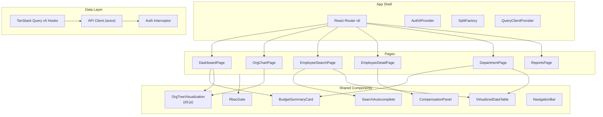

# Phase 5: Frontend

## Goal

Build the React SPA with org tree visualization, employee search/detail views, budget dashboards, RBAC-aware UI, and feature flag integration.

## Success Criteria

- [ ] Interactive org tree renders 5000+ node hierarchy (virtualized)
- [ ] Employee search with autocomplete returns results in < 200ms
- [ ] Dashboard shows department budget overview with drill-down
- [ ] Compensation detail panel shows history with charts
- [ ] UI elements hidden/disabled based on user role
- [ ] Feature flags control new feature rollout
- [ ] WCAG 2.1 AA compliance on core flows
- [ ] Responsive layout works on tablet+

## Prerequisites

- **Phase 3** — Auth0 React SDK configured
- **Phase 4** — BFF endpoints available

## Component Architecture



## Project Structure

```
apps/web/src/
├── main.tsx
├── app/
│   ├── App.tsx
│   ├── routes.tsx
│   └── providers.tsx
├── auth/
│   ├── Auth0ProviderWithNavigate.tsx
│   ├── AuthGuard.tsx
│   ├── usePermissions.ts
│   └── CallbackPage.tsx
├── api/
│   ├── client.ts                    # Axios instance + interceptors
│   ├── employees.api.ts             # Employee API functions
│   ├── departments.api.ts
│   └── reports.api.ts
├── hooks/
│   ├── useEmployees.ts              # TanStack Query v5 hooks
│   ├── useEmployee.ts
│   ├── useDepartments.ts
│   ├── useBudgetRollup.ts
│   ├── useOrgTree.ts
│   └── useDebounce.ts
├── features/
│   ├── dashboard/
│   │   ├── DashboardPage.tsx
│   │   ├── BudgetOverview.tsx
│   │   ├── HeadcountCard.tsx
│   │   └── RecentChanges.tsx
│   ├── org-chart/
│   │   ├── OrgChartPage.tsx
│   │   ├── OrgTreeVisualization.tsx  # d3.js tree
│   │   ├── OrgNodeCard.tsx
│   │   ├── TreeControls.tsx
│   │   └── useTreeLayout.ts
│   ├── employees/
│   │   ├── EmployeeSearchPage.tsx
│   │   ├── EmployeeDetailPage.tsx
│   │   ├── EmployeeCard.tsx
│   │   └── EmployeeForm.tsx
│   ├── compensation/
│   │   ├── CompensationPanel.tsx
│   │   ├── CompensationChart.tsx
│   │   ├── CompensationHistory.tsx
│   │   └── AddCompensationModal.tsx
│   ├── departments/
│   │   ├── DepartmentPage.tsx
│   │   ├── DepartmentTree.tsx
│   │   └── BudgetDetailCard.tsx
│   └── reports/
│       ├── ReportsPage.tsx
│       ├── ManagerSpanReport.tsx
│       └── BudgetRollupReport.tsx
├── components/
│   ├── ui/
│   │   ├── Button.tsx
│   │   ├── Card.tsx
│   │   ├── Modal.tsx
│   │   ├── Skeleton.tsx
│   │   ├── Badge.tsx
│   │   └── Tooltip.tsx
│   ├── layout/
│   │   ├── AppLayout.tsx
│   │   ├── NavigationBar.tsx
│   │   ├── Sidebar.tsx
│   │   └── PageHeader.tsx
│   ├── data/
│   │   ├── DataTable.tsx             # TanStack Table + virtualization
│   │   ├── SearchAutocomplete.tsx
│   │   ├── CursorPagination.tsx
│   │   └── EmptyState.tsx
│   └── rbac/
│       ├── RbacGate.tsx              # Renders children only if role matches
│       └── RbacButton.tsx
├── lib/
│   ├── format.ts                     # Currency, date formatters
│   ├── tree.ts                       # Tree data manipulation
│   └── constants.ts
├── types/
│   └── index.ts                      # Re-export from shared-types
└── styles/
    ├── globals.css
    └── variables.css
```

## Task Breakdown

### 5.1 — API Client & Auth Interceptor

**`apps/web/src/api/client.ts`:**
```typescript
import axios from 'axios';

export const apiClient = axios.create({
  baseURL: '/api/v1',
  headers: { 'Content-Type': 'application/json' },
});

// Auth interceptor added in providers.tsx after Auth0 is initialized
export function setupAuthInterceptor(getAccessTokenSilently: () => Promise<string>) {
  apiClient.interceptors.request.use(async (config) => {
    const token = await getAccessTokenSilently();
    config.headers.Authorization = `Bearer ${token}`;
    return config;
  });

  apiClient.interceptors.response.use(
    (response) => response,
    (error) => {
      if (error.response?.status === 401) {
        window.location.href = '/login';
      }
      return Promise.reject(error);
    },
  );
}
```

### 5.2 — TanStack Query v5 Hooks

**`apps/web/src/hooks/useEmployees.ts`:**
```typescript
import { useInfiniteQuery, useQuery, useMutation, useQueryClient } from '@tanstack/react-query';
import { apiClient } from '@/api/client';

export function useEmployeeSearch(params: { search?: string; departmentId?: string }) {
  return useInfiniteQuery({
    queryKey: ['employees', params],
    queryFn: ({ pageParam }) =>
      apiClient.get('/employees', {
        params: { ...params, cursor: pageParam, limit: 25 },
      }).then(r => r.data),
    getNextPageParam: (lastPage) => lastPage.hasMore ? lastPage.nextCursor : undefined,
    enabled: true,
    staleTime: 30_000,
  });
}

export function useEmployee(id: string) {
  return useQuery({
    queryKey: ['employees', id],
    queryFn: () => apiClient.get(`/employees/${id}/full-profile`).then(r => r.data),
    staleTime: 60_000,
  });
}

export function useAddCompensation(employeeId: string) {
  const qc = useQueryClient();
  return useMutation({
    mutationFn: (data: AddCompensationInput) =>
      apiClient.post(`/employees/${employeeId}/compensation`, data).then(r => r.data),
    onSuccess: () => {
      qc.invalidateQueries({ queryKey: ['employees', employeeId] });
    },
  });
}
```

### 5.3 — Org Tree Visualization

**`apps/web/src/features/org-chart/OrgTreeVisualization.tsx`:**
```typescript
import { useRef, useEffect, useCallback } from 'react';
import * as d3 from 'd3';

interface OrgNode {
  id: string;
  name: string;
  title: string;
  departmentCode: string;
  children?: OrgNode[];
  directReportCount: number;
}

export function OrgTreeVisualization({ data, onNodeClick }: {
  data: OrgNode;
  onNodeClick: (node: OrgNode) => void;
}) {
  const svgRef = useRef<SVGSVGElement>(null);
  const containerRef = useRef<HTMLDivElement>(null);

  useEffect(() => {
    if (!svgRef.current || !data) return;

    const width = containerRef.current?.clientWidth ?? 1200;
    const height = containerRef.current?.clientHeight ?? 800;
    const margin = { top: 40, right: 120, bottom: 40, left: 120 };

    const svg = d3.select(svgRef.current);
    svg.selectAll('*').remove();

    const root = d3.hierarchy(data);
    const treeLayout = d3.tree<OrgNode>().nodeSize([80, 280]);
    treeLayout(root);

    const g = svg.append('g')
      .attr('transform', `translate(${width / 2},${margin.top})`);

    // Zoom behavior
    const zoom = d3.zoom<SVGSVGElement, unknown>()
      .scaleExtent([0.1, 3])
      .on('zoom', (event) => g.attr('transform', event.transform));
    svg.call(zoom);

    // Links
    g.selectAll('.link')
      .data(root.links())
      .join('path')
      .attr('class', 'link')
      .attr('d', d3.linkVertical<any, any>()
        .x(d => d.x).y(d => d.y))
      .attr('fill', 'none')
      .attr('stroke', '#94a3b8')
      .attr('stroke-width', 1.5);

    // Nodes
    const nodes = g.selectAll('.node')
      .data(root.descendants())
      .join('g')
      .attr('class', 'node')
      .attr('transform', d => `translate(${d.x},${d.y})`)
      .style('cursor', 'pointer')
      .on('click', (_, d) => onNodeClick(d.data));

    // Node cards
    nodes.append('rect')
      .attr('x', -80).attr('y', -25)
      .attr('width', 160).attr('height', 50)
      .attr('rx', 8)
      .attr('fill', 'white')
      .attr('stroke', '#e2e8f0')
      .attr('stroke-width', 1);

    nodes.append('text')
      .attr('text-anchor', 'middle').attr('y', -5)
      .attr('font-weight', 600).attr('font-size', 12)
      .text(d => d.data.name);

    nodes.append('text')
      .attr('text-anchor', 'middle').attr('y', 12)
      .attr('font-size', 10).attr('fill', '#64748b')
      .text(d => d.data.title);

  }, [data, onNodeClick]);

  return (
    <div ref={containerRef} className="w-full h-[600px] border rounded-lg overflow-hidden">
      <svg ref={svgRef} width="100%" height="100%" />
    </div>
  );
}
```

### 5.4 — RBAC-Aware UI Components

**`apps/web/src/components/rbac/RbacGate.tsx`:**
```typescript
import { usePermissions } from '@/auth/usePermissions';
import { Role } from '@shared-types';

interface RbacGateProps {
  minRole: Role;
  children: React.ReactNode;
  fallback?: React.ReactNode;
}

export function RbacGate({ minRole, children, fallback = null }: RbacGateProps) {
  const { hasRole } = usePermissions();
  return hasRole(minRole) ? <>{children}</> : <>{fallback}</>;
}
```

**`apps/web/src/components/rbac/RbacButton.tsx`:**
```typescript
export function RbacButton({ minRole, ...props }: RbacGateProps & ButtonProps) {
  const { hasRole } = usePermissions();
  if (!hasRole(minRole)) return null;
  return <Button {...props} />;
}
```

### 5.5 — Dashboard Page

**`apps/web/src/features/dashboard/DashboardPage.tsx`:**
```typescript
export function DashboardPage() {
  const { data: rollup } = useBudgetRollup();
  const { hasRole } = usePermissions();

  return (
    <AppLayout>
      <PageHeader title="Dashboard" />
      <div className="grid grid-cols-1 md:grid-cols-2 lg:grid-cols-4 gap-4 mb-8">
        <HeadcountCard />
        <RbacGate minRole="dept_head">
          <BudgetOverview data={rollup} />
        </RbacGate>
      </div>

      <div className="grid grid-cols-1 lg:grid-cols-2 gap-6">
        <Card title="Organization Overview">
          <OrgTreeVisualization data={miniTree} onNodeClick={navigateToEmployee} />
        </Card>
        <RbacGate minRole="manager">
          <Card title="Recent Compensation Changes">
            <RecentChanges />
          </Card>
        </RbacGate>
      </div>
    </AppLayout>
  );
}
```

### 5.6 — Employee Search with Autocomplete

**`apps/web/src/components/data/SearchAutocomplete.tsx`:**
```typescript
export function SearchAutocomplete({ onSelect }: { onSelect: (emp: EmployeeDto) => void }) {
  const [query, setQuery] = useState('');
  const debouncedQuery = useDebounce(query, 300);
  const { data, isLoading } = useEmployeeSearch({ search: debouncedQuery });

  return (
    <Combobox onChange={onSelect}>
      <div className="relative">
        <Combobox.Input
          className="w-full rounded-lg border p-3"
          placeholder="Search employees by name..."
          onChange={(e) => setQuery(e.target.value)}
          aria-label="Search employees"
        />
        {isLoading && <Spinner className="absolute right-3 top-3" />}
        <Combobox.Options className="absolute mt-1 max-h-60 w-full overflow-auto rounded-lg bg-white shadow-lg z-10">
          {data?.pages.flatMap(p => p.items).map(emp => (
            <Combobox.Option key={emp.id} value={emp}
              className="cursor-pointer p-3 hover:bg-blue-50">
              <span className="font-medium">{emp.firstName} {emp.lastName}</span>
              <span className="text-sm text-gray-500 ml-2">{emp.title}</span>
            </Combobox.Option>
          ))}
        </Combobox.Options>
      </div>
    </Combobox>
  );
}
```

### 5.7 — Compensation Detail Panel

**`apps/web/src/features/compensation/CompensationPanel.tsx`:**
```typescript
export function CompensationPanel({ employeeId }: { employeeId: string }) {
  const { data: employee } = useEmployee(employeeId);
  const { hasRole } = usePermissions();
  const compensation = employee?.compensation ?? [];

  const currentBase = compensation.find(
    c => c.compType === 'BASE_SALARY' && !c.endDate
  );

  return (
    <div className="space-y-6">
      <div className="grid grid-cols-3 gap-4">
        <StatCard label="Base Salary" value={formatCurrency(currentBase?.amount)} />
        <StatCard label="Total Compensation" value={formatCurrency(totalComp(compensation))} />
        <StatCard label="Records" value={compensation.length} />
      </div>

      <CompensationChart data={compensation} />

      <RbacGate minRole="hr_admin">
        <AddCompensationModal employeeId={employeeId} />
      </RbacGate>

      <CompensationHistory records={compensation} />
    </div>
  );
}
```

### 5.8 — Split.io Feature Flags

**`apps/web/src/app/providers.tsx`:**
```typescript
import { SplitFactory } from '@splitsoftware/splitio-react';

export function Providers({ children }: { children: React.ReactNode }) {
  const { user } = useAuth0();

  const splitConfig: SplitIO.IBrowserSettings = {
    core: {
      authorizationKey: import.meta.env.VITE_SPLIT_KEY,
      key: user?.sub ?? 'anonymous',
    },
  };

  return (
    <SplitFactory config={splitConfig}>
      <QueryClientProvider client={queryClient}>
        {children}
      </QueryClientProvider>
    </SplitFactory>
  );
}
```

**Usage:**
```typescript
import { useTreatments } from '@splitsoftware/splitio-react';

function EmployeeDetailPage() {
  const treatments = useTreatments(['new_compensation_chart', 'budget_forecasting']);
  const showNewChart = treatments.new_compensation_chart.treatment === 'on';

  return showNewChart ? <CompensationChartV2 /> : <CompensationChart />;
}
```

### 5.9 — Accessibility

Key requirements applied across all components:

- All interactive elements focusable and keyboard-navigable
- `aria-label` on icon-only buttons
- `aria-live="polite"` on search results
- Color contrast ratio ≥ 4.5:1
- Focus trap in modals
- Skip-to-content link
- Screen reader announcements for data loading states

### 5.10 — Responsive Design

Breakpoints (Tailwind defaults):
- `sm` (640px): Stack cards vertically
- `md` (768px): 2-column grid
- `lg` (1024px): Sidebar + main content
- `xl` (1280px): Full dashboard layout

Org tree: horizontal scroll on mobile, pinch-to-zoom enabled.

## Acceptance Tests

| # | Test | Verification |
|---|------|-------------|
| 1 | Login redirects to Auth0 | Click Login → Auth0 hosted page |
| 2 | Dashboard loads | After login, dashboard renders with cards |
| 3 | Org tree renders | Navigate to org chart → tree visible, zoom/pan works |
| 4 | Search works | Type partial name → autocomplete shows matches |
| 5 | Employee detail loads | Click employee → detail page with info |
| 6 | Compensation visible for manager | Login as manager → comp panel shows data |
| 7 | Compensation hidden for viewer | Login as viewer → no comp section visible |
| 8 | Feature flag toggles UI | Enable `new_compensation_chart` → V2 chart renders |
| 9 | Keyboard navigation | Tab through all interactive elements |
| 10 | Responsive layout | Resize to 768px → layout adapts |

## Estimated Effort

| Task | Time |
|------|------|
| Project structure + routing | 2h |
| API client + TanStack Query v5 hooks | 3h |
| Org tree d3.js visualization | 6h |
| Dashboard page | 3h |
| Employee search + autocomplete | 3h |
| Employee detail + compensation | 4h |
| Department views | 3h |
| RBAC gate components | 1h |
| Split.io integration | 1h |
| Responsive + accessibility | 4h |
| **Total** | **~30h** |
