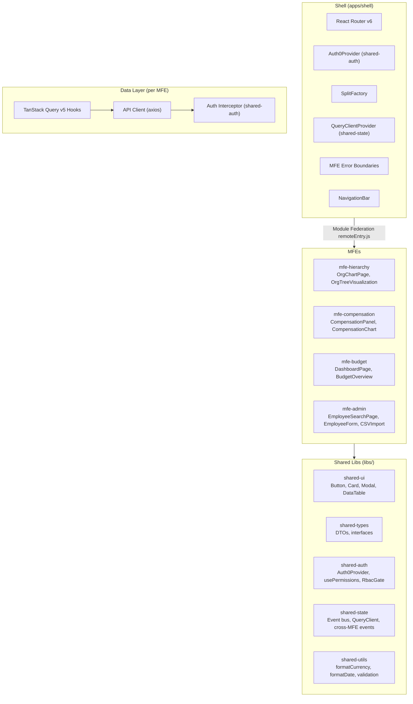

# Phase 5: Frontend (Micro Frontend Architecture)

## Goal

Build the Shell host app and four domain MFEs using Nx 20 Module Federation: org tree visualization (mfe-hierarchy), compensation management (mfe-compensation), budget dashboards (mfe-budget), and HR admin (mfe-admin). Set up shared libs for UI components, auth, state, types, and utilities.

## Success Criteria

- [ ] Shell app loads, provides layout/nav/auth, and dynamically loads all 4 MFEs
- [ ] MFE load failure triggers error boundary fallback — never crashes the shell
- [ ] Interactive org tree renders 5000+ node hierarchy (virtualized) in mfe-hierarchy
- [ ] Employee search with autocomplete returns results in < 200ms
- [ ] Dashboard shows department budget overview with drill-down in mfe-budget
- [ ] Compensation detail panel shows history with charts in mfe-compensation
- [ ] mfe-admin supports employee CRUD and CSV import
- [ ] UI elements hidden/disabled based on user role (shared-auth RBAC)
- [ ] Feature flags control new feature rollout
- [ ] Shared singletons (react, react-dom, react-router-dom, @tanstack/react-query, @auth0/auth0-react) are not duplicated across MFEs
- [ ] Each MFE builds and deploys independently
- [ ] WCAG 2.1 AA compliance on core flows
- [ ] Responsive layout works on tablet+

## Prerequisites

- **Phase 3** — Auth0 React SDK configured
- **Phase 4** — BFF endpoints available
- **Nx 20** workspace initialized with Module Federation plugin

## Micro Frontend Architecture



## Project Structure

```
apps/shell/src/
├── main.tsx
├── app/
│   ├── App.tsx
│   ├── routes.tsx              # Lazy-loads MFEs via React.lazy + Module Federation
│   └── providers.tsx           # Auth0, QueryClient, SplitFactory
├── components/
│   ├── layout/
│   │   ├── AppLayout.tsx
│   │   ├── NavigationBar.tsx
│   │   ├── Sidebar.tsx
│   │   └── PageHeader.tsx
│   └── error/
│       ├── MfeErrorBoundary.tsx # Catches MFE load failures, renders fallback
│       └── GlobalErrorBoundary.tsx
├── config/
│   └── module-federation.ts    # Remote MFE URLs per environment
└── bootstrap.tsx               # Async bootstrap for Module Federation

apps/mfe-hierarchy/src/
├── components/
│   ├── OrgChartPage.tsx
│   ├── OrgTreeVisualization.tsx # d3.js tree
│   ├── OrgNodeCard.tsx
│   └── TreeControls.tsx
├── hooks/
│   ├── useOrgTree.ts
│   └── useTreeLayout.ts
└── services/
    └── hierarchy.api.ts        # BFF API client for hierarchy endpoints

apps/mfe-compensation/src/
├── components/
│   ├── CompensationPanel.tsx
│   ├── CompensationChart.tsx
│   ├── CompensationHistory.tsx
│   └── AddCompensationModal.tsx
├── hooks/
│   └── useCompensation.ts
└── services/
    └── compensation.api.ts

apps/mfe-budget/src/
├── components/
│   ├── DashboardPage.tsx
│   ├── BudgetOverview.tsx
│   ├── BudgetDetailCard.tsx
│   ├── HeadcountCard.tsx
│   └── RecentChanges.tsx
├── hooks/
│   └── useBudgetRollup.ts
└── services/
    └── budget.api.ts

apps/mfe-admin/src/
├── components/
│   ├── EmployeeSearchPage.tsx
│   ├── EmployeeDetailPage.tsx
│   ├── EmployeeCard.tsx
│   ├── EmployeeForm.tsx
│   ├── CSVImportPage.tsx
│   └── ImportStatusPanel.tsx
├── hooks/
│   ├── useEmployees.ts
│   └── useImportJob.ts
└── services/
    └── admin.api.ts

libs/shared-ui/src/
├── Button.tsx
├── Card.tsx
├── Modal.tsx
├── Skeleton.tsx
├── Badge.tsx
├── Tooltip.tsx
├── DataTable.tsx               # TanStack Table + virtualization
├── SearchAutocomplete.tsx
├── CursorPagination.tsx
└── EmptyState.tsx

libs/shared-auth/src/
├── Auth0ProviderWithNavigate.tsx
├── AuthGuard.tsx
├── usePermissions.ts
├── RbacGate.tsx
├── RbacButton.tsx
└── CallbackPage.tsx

libs/shared-state/src/
├── query-client.ts             # Shared TanStack Query v5 client
├── event-bus.ts                # Cross-MFE event bus (pub/sub)
└── events.ts                   # Event type definitions

libs/shared-types/src/
└── index.ts                    # DTOs, interfaces, enums

libs/shared-utils/src/
├── format.ts                   # Currency, date formatters
├── tree.ts                     # Tree data manipulation
└── constants.ts
```

## Task Breakdown

### 5.1 — Shell App Setup + Module Federation Config

Set up the Shell as the Module Federation host. Configure remotes for all 4 MFEs.

**`apps/shell/src/config/module-federation.ts`:**
```typescript
const remotes = {
  'mfe-hierarchy': process.env.NX_MFE_HIERARCHY_URL || 'http://localhost:4201/remoteEntry.js',
  'mfe-compensation': process.env.NX_MFE_COMPENSATION_URL || 'http://localhost:4202/remoteEntry.js',
  'mfe-budget': process.env.NX_MFE_BUDGET_URL || 'http://localhost:4203/remoteEntry.js',
  'mfe-admin': process.env.NX_MFE_ADMIN_URL || 'http://localhost:4204/remoteEntry.js',
};

export default remotes;
```

**Module Federation shared singletons (in each app's webpack config):**
```typescript
shared: {
  react: { singleton: true, requiredVersion: '^19.0.0' },
  'react-dom': { singleton: true, requiredVersion: '^19.0.0' },
  'react-router-dom': { singleton: true, requiredVersion: '^6.0.0' },
  '@tanstack/react-query': { singleton: true, requiredVersion: '^5.0.0' },
  '@auth0/auth0-react': { singleton: true, requiredVersion: '^2.0.0' },
}
```

### 5.2 — MFE Error Boundaries

**`apps/shell/src/components/error/MfeErrorBoundary.tsx`:**
```typescript
import { Component, ReactNode } from 'react';

interface Props {
  mfeName: string;
  children: ReactNode;
  fallback?: ReactNode;
}

interface State { hasError: boolean; error?: Error }

export class MfeErrorBoundary extends Component<Props, State> {
  state: State = { hasError: false };

  static getDerivedStateFromError(error: Error): State {
    return { hasError: true, error };
  }

  componentDidCatch(error: Error) {
    console.error(`[MFE:${this.props.mfeName}] Failed to load:`, error);
    // Emit event to shared-state event bus for observability
  }

  render() {
    if (this.state.hasError) {
      return this.props.fallback ?? (
        <div className="p-8 text-center">
          <h3 className="text-lg font-semibold">Unable to load {this.props.mfeName}</h3>
          <p className="text-gray-500 mt-2">Please try refreshing the page.</p>
          <button onClick={() => this.setState({ hasError: false })}
            className="mt-4 px-4 py-2 bg-blue-600 text-white rounded">
            Retry
          </button>
        </div>
      );
    }
    return this.props.children;
  }
}
```

### 5.3 — Shell Routing with Lazy MFE Loading

**`apps/shell/src/app/routes.tsx`:**
```typescript
import { lazy, Suspense } from 'react';
import { Routes, Route } from 'react-router-dom';
import { MfeErrorBoundary } from '../components/error/MfeErrorBoundary';
import { Skeleton } from '@shared-ui';

const MfeHierarchy = lazy(() => import('mfe-hierarchy/Module'));
const MfeCompensation = lazy(() => import('mfe-compensation/Module'));
const MfeBudget = lazy(() => import('mfe-budget/Module'));
const MfeAdmin = lazy(() => import('mfe-admin/Module'));

export function AppRoutes() {
  return (
    <Routes>
      <Route path="/hierarchy/*" element={
        <MfeErrorBoundary mfeName="Hierarchy">
          <Suspense fallback={<Skeleton />}>
            <MfeHierarchy />
          </Suspense>
        </MfeErrorBoundary>
      } />
      <Route path="/compensation/*" element={
        <MfeErrorBoundary mfeName="Compensation">
          <Suspense fallback={<Skeleton />}>
            <MfeCompensation />
          </Suspense>
        </MfeErrorBoundary>
      } />
      <Route path="/budget/*" element={
        <MfeErrorBoundary mfeName="Budget">
          <Suspense fallback={<Skeleton />}>
            <MfeBudget />
          </Suspense>
        </MfeErrorBoundary>
      } />
      <Route path="/admin/*" element={
        <MfeErrorBoundary mfeName="Admin">
          <Suspense fallback={<Skeleton />}>
            <MfeAdmin />
          </Suspense>
        </MfeErrorBoundary>
      } />
    </Routes>
  );
}
```

### 5.4 — Shared Auth & RBAC Components (libs/shared-auth)

**`libs/shared-auth/src/RbacGate.tsx`:**
```typescript
import { usePermissions } from './usePermissions';
import { Role } from '@shared-types';

interface RbacGateProps {
  minRole: Role;
  children: React.ReactNode;
  fallback?: React.ReactNode;
}

export function RbacGate({ minRole, children, fallback = null }: RbacGateProps) {
  const { hasRole } = usePermissions();
  return hasRole(minRole) ? <>{children}</> : <>{fallback}</>;
}
```

### 5.5 — Cross-MFE Event Bus (libs/shared-state)

**`libs/shared-state/src/event-bus.ts`:**
```typescript
type EventHandler<T = unknown> = (payload: T) => void;

class EventBus {
  private handlers = new Map<string, Set<EventHandler>>();

  on<T>(event: string, handler: EventHandler<T>): () => void {
    if (!this.handlers.has(event)) this.handlers.set(event, new Set());
    this.handlers.get(event)!.add(handler as EventHandler);
    return () => this.handlers.get(event)?.delete(handler as EventHandler);
  }

  emit<T>(event: string, payload: T): void {
    this.handlers.get(event)?.forEach(handler => handler(payload));
  }
}

// Singleton — shared across all MFEs via Module Federation
export const eventBus = new EventBus();
```

**Example cross-MFE events:**
```typescript
// libs/shared-state/src/events.ts
export const MFE_EVENTS = {
  EMPLOYEE_SELECTED: 'employee:selected',       // mfe-admin → mfe-compensation
  COMPENSATION_UPDATED: 'compensation:updated',  // mfe-compensation → mfe-budget
  BUDGET_ALLOCATED: 'budget:allocated',           // mfe-budget → mfe-hierarchy
  NAVIGATE_TO: 'shell:navigate',                  // any MFE → shell
} as const;
```

### 5.6 — API Client & Auth Interceptor

**`libs/shared-auth/src/api-client.ts`:**
```typescript
import axios from 'axios';

export const apiClient = axios.create({
  baseURL: '/bff/v1',
  headers: { 'Content-Type': 'application/json' },
});

export function setupAuthInterceptor(getAccessTokenSilently: () => Promise<string>) {
  apiClient.interceptors.request.use(async (config) => {
    const token = await getAccessTokenSilently();
    config.headers.Authorization = `Bearer ${token}`;
    return config;
  });

  apiClient.interceptors.response.use(
    (response) => response,
    (error) => {
      if (error.response?.status === 401) {
        window.location.href = '/login';
      }
      return Promise.reject(error);
    },
  );
}
```

### 5.7 — mfe-hierarchy: Org Tree Visualization

**`apps/mfe-hierarchy/src/components/OrgTreeVisualization.tsx`:**
```typescript
import { useRef, useEffect } from 'react';
import * as d3 from 'd3';

interface OrgNode {
  id: string;
  name: string;
  title: string;
  departmentCode: string;
  children?: OrgNode[];
  directReportCount: number;
}

export function OrgTreeVisualization({ data, onNodeClick }: {
  data: OrgNode;
  onNodeClick: (node: OrgNode) => void;
}) {
  const svgRef = useRef<SVGSVGElement>(null);
  const containerRef = useRef<HTMLDivElement>(null);

  useEffect(() => {
    if (!svgRef.current || !data) return;

    const width = containerRef.current?.clientWidth ?? 1200;
    const margin = { top: 40, right: 120, bottom: 40, left: 120 };

    const svg = d3.select(svgRef.current);
    svg.selectAll('*').remove();

    const root = d3.hierarchy(data);
    const treeLayout = d3.tree<OrgNode>().nodeSize([80, 280]);
    treeLayout(root);

    const g = svg.append('g')
      .attr('transform', `translate(${width / 2},${margin.top})`);

    // Zoom behavior
    const zoom = d3.zoom<SVGSVGElement, unknown>()
      .scaleExtent([0.1, 3])
      .on('zoom', (event) => g.attr('transform', event.transform));
    svg.call(zoom);

    // Links
    g.selectAll('.link')
      .data(root.links())
      .join('path')
      .attr('class', 'link')
      .attr('d', d3.linkVertical<any, any>()
        .x(d => d.x).y(d => d.y))
      .attr('fill', 'none')
      .attr('stroke', '#94a3b8')
      .attr('stroke-width', 1.5);

    // Nodes
    const nodes = g.selectAll('.node')
      .data(root.descendants())
      .join('g')
      .attr('class', 'node')
      .attr('transform', d => `translate(${d.x},${d.y})`)
      .style('cursor', 'pointer')
      .on('click', (_, d) => onNodeClick(d.data));

    nodes.append('rect')
      .attr('x', -80).attr('y', -25)
      .attr('width', 160).attr('height', 50)
      .attr('rx', 8)
      .attr('fill', 'white')
      .attr('stroke', '#e2e8f0')
      .attr('stroke-width', 1);

    nodes.append('text')
      .attr('text-anchor', 'middle').attr('y', -5)
      .attr('font-weight', 600).attr('font-size', 12)
      .text(d => d.data.name);

    nodes.append('text')
      .attr('text-anchor', 'middle').attr('y', 12)
      .attr('font-size', 10).attr('fill', '#64748b')
      .text(d => d.data.title);

  }, [data, onNodeClick]);

  return (
    <div ref={containerRef} className="w-full h-[600px] border rounded-lg overflow-hidden">
      <svg ref={svgRef} width="100%" height="100%" />
    </div>
  );
}
```

### 5.8 — mfe-compensation: Compensation Panel

**`apps/mfe-compensation/src/components/CompensationPanel.tsx`:**
```typescript
import { useEmployee } from '../hooks/useCompensation';
import { RbacGate } from '@shared-auth';
import { formatCurrency } from '@shared-utils';

export function CompensationPanel({ employeeId }: { employeeId: string }) {
  const { data: employee } = useEmployee(employeeId);
  const compensation = employee?.compensation ?? [];

  return (
    <div className="space-y-6">
      <div className="grid grid-cols-3 gap-4">
        <StatCard label="Base Salary" value={formatCurrency(compensation[0]?.baseSalary)} />
        <StatCard label="Total Compensation" value={formatCurrency(compensation[0]?.totalCompensation)} />
        <StatCard label="Records" value={compensation.length} />
      </div>

      <CompensationChart data={compensation} />

      <RbacGate minRole="hr_admin">
        <AddCompensationModal employeeId={employeeId} />
      </RbacGate>

      <CompensationHistory records={compensation} />
    </div>
  );
}
```

### 5.9 — mfe-budget: Dashboard Page

**`apps/mfe-budget/src/components/DashboardPage.tsx`:**
```typescript
import { useBudgetRollup } from '../hooks/useBudgetRollup';
import { RbacGate } from '@shared-auth';

export function DashboardPage() {
  const { data: rollup } = useBudgetRollup();

  return (
    <div>
      <div className="grid grid-cols-1 md:grid-cols-2 lg:grid-cols-4 gap-4 mb-8">
        <HeadcountCard />
        <RbacGate minRole="dept_head">
          <BudgetOverview data={rollup} />
        </RbacGate>
      </div>
      <BudgetDetailCard />
    </div>
  );
}
```

### 5.10 — mfe-admin: Employee Management + CSV Import

**`apps/mfe-admin/src/components/EmployeeSearchPage.tsx`:**
```typescript
import { useEmployeeSearch } from '../hooks/useEmployees';
import { SearchAutocomplete, DataTable } from '@shared-ui';
import { eventBus, MFE_EVENTS } from '@shared-state';

export function EmployeeSearchPage() {
  const handleSelect = (emp: EmployeeDto) => {
    eventBus.emit(MFE_EVENTS.EMPLOYEE_SELECTED, { employeeId: emp.id });
  };

  return (
    <div>
      <SearchAutocomplete onSelect={handleSelect} />
      <DataTable columns={employeeColumns} useData={useEmployeeSearch} />
    </div>
  );
}
```

### 5.11 — Split.io Feature Flags

**`apps/shell/src/app/providers.tsx`:**
```typescript
import { SplitFactory } from '@splitsoftware/splitio-react';
import { QueryClientProvider } from '@tanstack/react-query';
import { queryClient } from '@shared-state';
import { Auth0ProviderWithNavigate } from '@shared-auth';

export function Providers({ children }: { children: React.ReactNode }) {
  return (
    <Auth0ProviderWithNavigate>
      <SplitFactory config={splitConfig}>
        <QueryClientProvider client={queryClient}>
          {children}
        </QueryClientProvider>
      </SplitFactory>
    </Auth0ProviderWithNavigate>
  );
}
```

### 5.12 — Accessibility

Key requirements applied across shell and all MFEs:

- All interactive elements focusable and keyboard-navigable
- `aria-label` on icon-only buttons
- `aria-live="polite"` on search results
- Color contrast ratio >= 4.5:1
- Focus trap in modals
- Skip-to-content link in shell
- Screen reader announcements for data loading states and MFE loading

### 5.13 — Responsive Design

Breakpoints (Tailwind defaults):
- `sm` (640px): Stack cards vertically
- `md` (768px): 2-column grid
- `lg` (1024px): Sidebar + main content
- `xl` (1280px): Full dashboard layout

Org tree: horizontal scroll on mobile, pinch-to-zoom enabled.

## Acceptance Tests

| # | Test | Verification |
|---|------|-------------|
| 1 | Shell loads | Shell renders layout, navigation, auth |
| 2 | MFEs load dynamically | Navigate to /hierarchy, /compensation, /budget, /admin — each MFE loads |
| 3 | MFE failure isolation | Kill mfe-hierarchy dev server → error boundary renders fallback, other MFEs work |
| 4 | Login redirects to Auth0 | Click Login → Auth0 hosted page |
| 5 | Dashboard loads | After login, budget dashboard renders with cards |
| 6 | Org tree renders | Navigate to org chart → tree visible, zoom/pan works |
| 7 | Search works | Type partial name → autocomplete shows matches |
| 8 | Employee detail loads | Click employee → detail page with info |
| 9 | Compensation visible for manager | Login as manager → comp panel shows data |
| 10 | Compensation hidden for viewer | Login as viewer → no comp section visible |
| 11 | Cross-MFE event bus | Select employee in mfe-admin → mfe-compensation receives event |
| 12 | Feature flag toggles UI | Enable `new_compensation_chart` → V2 chart renders |
| 13 | No duplicate singletons | Check bundle — react loaded once, not per MFE |
| 14 | Keyboard navigation | Tab through all interactive elements |
| 15 | Responsive layout | Resize to 768px → layout adapts |

## Estimated Effort

| Task | Time |
|------|------|
| Shell setup + Module Federation config | 4h |
| MFE error boundaries + fallbacks | 2h |
| Shell routing with lazy MFE loading | 2h |
| shared-auth (Auth0, RBAC components) | 3h |
| shared-state (event bus, QueryClient) | 2h |
| shared-ui (design system components) | 4h |
| shared-types + shared-utils | 2h |
| API client + auth interceptor | 2h |
| mfe-hierarchy (org tree d3.js) | 6h |
| mfe-compensation (panel, chart, history) | 4h |
| mfe-budget (dashboard, budget views) | 4h |
| mfe-admin (employee CRUD, CSV import) | 5h |
| Split.io integration | 1h |
| Responsive + accessibility | 4h |
| Cross-MFE integration testing | 3h |
| **Total** | **~48h** |
