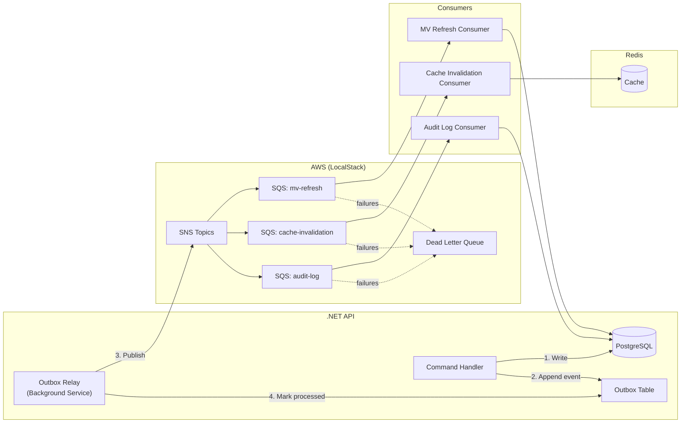

# Phase 6: Events & Caching

## Goal

Implement Redis caching with cache-aside pattern, domain event publishing via transactional outbox, SNS/SQS event bus, and event consumers for materialized view refresh and cache invalidation.

## Success Criteria

- [ ] Redis cache-aside reduces DB queries by 70%+ on repeated reads
- [ ] Domain events published reliably via transactional outbox
- [ ] SNS/SQS topics and queues created (LocalStack for dev)
- [ ] Event consumers refresh materialized views on data changes
- [ ] Cache invalidated on writes within 2 seconds
- [ ] Dead letter queue captures failed messages
- [ ] Zero event loss during normal operation

## Prerequisites

- **Phase 2** — Database, materialized views
- **Phase 4** — API endpoints to cache

## Event Architecture



## Task Breakdown

### 6.1 — Redis Caching Layer

**Install packages:**
```xml
<!-- .NET -->
<PackageReference Include="StackExchange.Redis" Version="2.*" />
<PackageReference Include="Microsoft.Extensions.Caching.StackExchangeRedis" Version="9.*" />
```

**`apps/api/src/Infrastructure/Caching/RedisCacheService.cs`:**
```csharp
public class RedisCacheService : ICacheService
{
    private readonly IDistributedCache _cache;
    private readonly IConnectionMultiplexer _redis;
    private static readonly TimeSpan DefaultTtl = TimeSpan.FromMinutes(5);

    public async Task<T?> GetOrSetAsync<T>(
        string key, Func<Task<T>> factory, TimeSpan? ttl = null, CancellationToken ct = default)
    {
        var cached = await _cache.GetStringAsync(key, ct);
        if (cached is not null)
            return JsonSerializer.Deserialize<T>(cached);

        var value = await factory();
        await _cache.SetStringAsync(key, JsonSerializer.Serialize(value),
            new DistributedCacheEntryOptions { AbsoluteExpirationRelativeToNow = ttl ?? DefaultTtl }, ct);
        return value;
    }

    public async Task InvalidateAsync(string key, CancellationToken ct = default)
    {
        await _cache.RemoveAsync(key, ct);
    }

    public async Task InvalidateByPatternAsync(string pattern, CancellationToken ct = default)
    {
        var server = _redis.GetServer(_redis.GetEndPoints().First());
        var keys = server.Keys(pattern: pattern).ToArray();
        if (keys.Length > 0)
        {
            var db = _redis.GetDatabase();
            await db.KeyDeleteAsync(keys);
        }
    }
}
```

**Cache key conventions:**

| Resource | Key Pattern | TTL |
|----------|-------------|-----|
| Employee by ID | `employee:{id}` | 5 min |
| Employee search | `employee:search:{hash}` | 2 min |
| Org tree | `orgtree:{rootId}:{depth}` | 5 min |
| Department budget | `budget:{deptId}:{year}` | 10 min |
| Manager span | `managerspan:{managerId}` | 10 min |
| Budget rollup | `rollup:{deptId}` | 10 min |
| Visibility set | `visibility:{userId}` | 5 min |

**Cache-aside in query handlers — example:**
```csharp
public class GetEmployeeByIdHandler : IRequestHandler<GetEmployeeByIdQuery, EmployeeDetailDto>
{
    private readonly ICacheService _cache;
    private readonly AppDbContext _db;

    public async Task<EmployeeDetailDto> Handle(GetEmployeeByIdQuery req, CancellationToken ct)
    {
        return await _cache.GetOrSetAsync(
            $"employee:{req.Id}",
            async () =>
            {
                var emp = await _db.Employees
                    .Include(e => e.Department)
                    .Include(e => e.CompensationHistory.Where(c => c.EndDate == null))
                    .FirstOrDefaultAsync(e => e.Id == req.Id, ct)
                    ?? throw new NotFoundException("Employee", req.Id);

                return MapToDto(emp);
            },
            ct: ct);
    }
}
```

### 6.2 — Domain Events

**`apps/api/src/Domain/Events/DomainEvent.cs`:**
```csharp
public abstract record DomainEvent
{
    public Guid EventId { get; init; } = Guid.NewGuid();
    public DateTime OccurredAt { get; init; } = DateTime.UtcNow;
    public string EventType => GetType().Name;
}

public record EmployeeCreated(Guid EmployeeId, string EmployeeNumber, Guid DepartmentId) : DomainEvent;
public record EmployeeUpdated(Guid EmployeeId, string[] ChangedFields) : DomainEvent;
public record EmployeeTransferred(Guid EmployeeId, Guid OldDeptId, Guid NewDeptId, Guid? NewManagerId) : DomainEvent;
public record EmployeeDeactivated(Guid EmployeeId) : DomainEvent;
public record CompensationAdded(Guid EmployeeId, Guid RecordId, string CompType, decimal Amount) : DomainEvent;
public record DepartmentCreated(Guid DepartmentId, string Code) : DomainEvent;
public record BudgetUpdated(Guid DepartmentId, int FiscalYear, decimal Amount) : DomainEvent;
public record OrgStructureChanged(Guid RootEmployeeId) : DomainEvent;
```

### 6.3 — Transactional Outbox Pattern

**`apps/api/src/Domain/Entities/OutboxMessage.cs`:**
```csharp
public class OutboxMessage
{
    public long Id { get; set; }
    public string EventType { get; set; } = default!;
    public string Payload { get; set; } = default!;  // JSON
    public bool Processed { get; set; }
    public DateTime CreatedAt { get; set; } = DateTime.UtcNow;
    public DateTime? ProcessedAt { get; set; }
    public int RetryCount { get; set; }
    public string? Error { get; set; }
}
```

**Publishing events within command handlers:**
```csharp
public class AddCompensationHandler : IRequestHandler<AddCompensationCommand, CompensationDto>
{
    public async Task<CompensationDto> Handle(AddCompensationCommand req, CancellationToken ct)
    {
        await using var tx = await _db.Database.BeginTransactionAsync(ct);

        var record = new CompensationRecord(req.EmployeeId, req.CompType, req.Amount, req.Currency,
            req.EffectiveDate, req.Reason, req.CreatedBy);
        _db.CompensationRecords.Add(record);

        // Write to outbox in same transaction
        _db.OutboxMessages.Add(new OutboxMessage
        {
            EventType = nameof(CompensationAdded),
            Payload = JsonSerializer.Serialize(new CompensationAdded(
                req.EmployeeId, record.Id, req.CompType.ToString(), req.Amount)),
        });

        await _db.SaveChangesAsync(ct);
        await tx.CommitAsync(ct);

        return MapToDto(record);
    }
}
```

**Outbox relay — `apps/api/src/Infrastructure/Messaging/OutboxRelayService.cs`:**
```csharp
public class OutboxRelayService : BackgroundService
{
    private readonly IServiceScopeFactory _scopeFactory;
    private readonly IAmazonSimpleNotificationService _sns;
    private readonly string _topicArn;

    protected override async Task ExecuteAsync(CancellationToken ct)
    {
        while (!ct.IsCancellationRequested)
        {
            using var scope = _scopeFactory.CreateScope();
            var db = scope.ServiceProvider.GetRequiredService<AppDbContext>();

            var messages = await db.OutboxMessages
                .Where(m => !m.Processed && m.RetryCount < 5)
                .OrderBy(m => m.CreatedAt)
                .Take(50)
                .ToListAsync(ct);

            foreach (var msg in messages)
            {
                try
                {
                    await _sns.PublishAsync(new PublishRequest
                    {
                        TopicArn = _topicArn,
                        Message = msg.Payload,
                        MessageAttributes = new Dictionary<string, MessageAttributeValue>
                        {
                            ["EventType"] = new() { DataType = "String", StringValue = msg.EventType },
                        },
                    }, ct);

                    msg.Processed = true;
                    msg.ProcessedAt = DateTime.UtcNow;
                }
                catch (Exception ex)
                {
                    msg.RetryCount++;
                    msg.Error = ex.Message;
                }
            }

            await db.SaveChangesAsync(ct);
            await Task.Delay(TimeSpan.FromSeconds(1), ct);
        }
    }
}
```

### 6.4 — SNS/SQS Setup

**LocalStack init script — `docker/init-scripts/setup-aws.sh`:**
```bash
#!/bin/bash
awslocal sns create-topic --name eba-domain-events
TOPIC_ARN=$(awslocal sns list-topics --query 'Topics[0].TopicArn' --output text)

awslocal sqs create-queue --queue-name eba-mv-refresh
awslocal sqs create-queue --queue-name eba-cache-invalidation
awslocal sqs create-queue --queue-name eba-audit-log
awslocal sqs create-queue --queue-name eba-dlq

# Subscribe queues to topic with filter policies
awslocal sns subscribe --topic-arn $TOPIC_ARN \
  --protocol sqs \
  --notification-endpoint arn:aws:sqs:us-east-1:000000000000:eba-mv-refresh \
  --attributes '{
    "FilterPolicy": "{\"EventType\": [\"CompensationAdded\", \"EmployeeTransferred\", \"EmployeeCreated\", \"EmployeeDeactivated\", \"BudgetUpdated\", \"OrgStructureChanged\"]}"
  }'

awslocal sns subscribe --topic-arn $TOPIC_ARN \
  --protocol sqs \
  --notification-endpoint arn:aws:sqs:us-east-1:000000000000:eba-cache-invalidation \
  --attributes '{
    "FilterPolicy": "{\"EventType\": [\"EmployeeCreated\", \"EmployeeUpdated\", \"EmployeeTransferred\", \"EmployeeDeactivated\", \"CompensationAdded\", \"BudgetUpdated\"]}"
  }'

awslocal sns subscribe --topic-arn $TOPIC_ARN \
  --protocol sqs \
  --notification-endpoint arn:aws:sqs:us-east-1:000000000000:eba-audit-log

# Configure DLQ redrive policy on all queues
for q in eba-mv-refresh eba-cache-invalidation eba-audit-log; do
  QUEUE_URL=$(awslocal sqs get-queue-url --queue-name $q --output text)
  awslocal sqs set-queue-attributes --queue-url $QUEUE_URL \
    --attributes '{"RedrivePolicy": "{\"deadLetterTargetArn\":\"arn:aws:sqs:us-east-1:000000000000:eba-dlq\",\"maxReceiveCount\":3}"}'
done
```

### 6.5 — Event Consumers

**Materialized View Refresh Consumer — `apps/api/src/Infrastructure/Messaging/Consumers/MvRefreshConsumer.cs`:**
```csharp
public class MvRefreshConsumer : BackgroundService
{
    private readonly IAmazonSQS _sqs;
    private readonly IServiceScopeFactory _scopeFactory;
    private readonly string _queueUrl;

    protected override async Task ExecuteAsync(CancellationToken ct)
    {
        while (!ct.IsCancellationRequested)
        {
            var response = await _sqs.ReceiveMessageAsync(new ReceiveMessageRequest
            {
                QueueUrl = _queueUrl,
                MaxNumberOfMessages = 10,
                WaitTimeSeconds = 20,
                MessageAttributeNames = new List<string> { "EventType" },
            }, ct);

            foreach (var msg in response.Messages)
            {
                try
                {
                    using var scope = _scopeFactory.CreateScope();
                    var refreshService = scope.ServiceProvider
                        .GetRequiredService<IMaterializedViewRefreshService>();

                    var eventType = GetEventType(msg);

                    switch (eventType)
                    {
                        case "CompensationAdded":
                        case "BudgetUpdated":
                            await refreshService.RefreshBudgetRollupAsync(ct);
                            break;
                        case "EmployeeTransferred":
                        case "OrgStructureChanged":
                            await refreshService.RefreshAllAsync(ct);
                            break;
                        default:
                            await refreshService.RefreshAllAsync(ct);
                            break;
                    }

                    await _sqs.DeleteMessageAsync(_queueUrl, msg.ReceiptHandle, ct);
                }
                catch (Exception ex)
                {
                    _logger.LogError(ex, "Failed to process message {MessageId}", msg.MessageId);
                    // Message returns to queue, eventually goes to DLQ
                }
            }
        }
    }
}
```

**Cache Invalidation Consumer — `apps/api/src/Infrastructure/Messaging/Consumers/CacheInvalidationConsumer.cs`:**
```csharp
public class CacheInvalidationConsumer : BackgroundService
{
    protected override async Task ExecuteAsync(CancellationToken ct)
    {
        while (!ct.IsCancellationRequested)
        {
            var response = await _sqs.ReceiveMessageAsync(/* ... */);

            foreach (var msg in response.Messages)
            {
                var (eventType, payload) = ParseMessage(msg);

                switch (eventType)
                {
                    case "EmployeeUpdated":
                    case "EmployeeCreated":
                    case "EmployeeDeactivated":
                        var empEvent = JsonSerializer.Deserialize<EmployeeEventBase>(payload)!;
                        await _cache.InvalidateAsync($"employee:{empEvent.EmployeeId}", ct);
                        await _cache.InvalidateByPatternAsync("employee:search:*", ct);
                        await _cache.InvalidateByPatternAsync("orgtree:*", ct);
                        break;

                    case "EmployeeTransferred":
                        var transfer = JsonSerializer.Deserialize<EmployeeTransferred>(payload)!;
                        await _cache.InvalidateAsync($"employee:{transfer.EmployeeId}", ct);
                        await _cache.InvalidateByPatternAsync("orgtree:*", ct);
                        await _cache.InvalidateByPatternAsync("rollup:*", ct);
                        await _cache.InvalidateByPatternAsync("visibility:*", ct);
                        break;

                    case "CompensationAdded":
                        var comp = JsonSerializer.Deserialize<CompensationAdded>(payload)!;
                        await _cache.InvalidateAsync($"employee:{comp.EmployeeId}", ct);
                        await _cache.InvalidateByPatternAsync("rollup:*", ct);
                        break;

                    case "BudgetUpdated":
                        var budget = JsonSerializer.Deserialize<BudgetUpdated>(payload)!;
                        await _cache.InvalidateAsync($"budget:{budget.DepartmentId}:*", ct);
                        await _cache.InvalidateByPatternAsync("rollup:*", ct);
                        break;
                }

                await _sqs.DeleteMessageAsync(_queueUrl, msg.ReceiptHandle, ct);
            }
        }
    }
}
```

### 6.6 — Dead Letter Queue Handling

**`apps/api/src/Infrastructure/Messaging/DlqMonitorService.cs`:**
```csharp
public class DlqMonitorService : BackgroundService
{
    protected override async Task ExecuteAsync(CancellationToken ct)
    {
        while (!ct.IsCancellationRequested)
        {
            var attrs = await _sqs.GetQueueAttributesAsync(new GetQueueAttributesRequest
            {
                QueueUrl = _dlqUrl,
                AttributeNames = new List<string> { "ApproximateNumberOfMessages" },
            }, ct);

            var count = int.Parse(attrs.Attributes["ApproximateNumberOfMessages"]);
            if (count > 0)
            {
                _logger.LogWarning("DLQ has {Count} messages requiring attention", count);
                _dlqGauge.Set(count); // Prometheus metric
            }

            await Task.Delay(TimeSpan.FromMinutes(1), ct);
        }
    }
}
```

## NestJS BFF Caching

**`apps/bff/src/cache/cache.module.ts`:**
```typescript
import { CacheModule } from '@nestjs/cache-manager';
import { redisStore } from 'cache-manager-redis-yet';

@Module({
  imports: [
    CacheModule.registerAsync({
      useFactory: async (config: ConfigService) => ({
        store: await redisStore({ url: config.get('REDIS_URL') }),
        ttl: 300_000, // 5 min default
      }),
      inject: [ConfigService],
    }),
  ],
})
export class AppCacheModule {}
```

## Acceptance Tests

| # | Test | Verification |
|---|------|-------------|
| 1 | Cache hit | GET employee twice → second call served from Redis |
| 2 | Cache miss fills | First GET → DB query + cache set |
| 3 | Write invalidates cache | POST compensation → employee cache entry removed |
| 4 | Outbox persists events | Command → outbox_messages row created |
| 5 | Relay publishes to SNS | Outbox relay → SNS message published |
| 6 | MV refreshed on event | CompensationAdded → mv_department_budget_rollup refreshed |
| 7 | DLQ captures failures | Poison message → appears in DLQ after 3 retries |
| 8 | Cache TTL expiry | Wait 5 min → cache entry gone, next request hits DB |

## Estimated Effort

| Task | Time |
|------|------|
| Redis cache service | 3h |
| Cache-aside integration in handlers | 3h |
| Domain events + outbox | 3h |
| Outbox relay service | 2h |
| SNS/SQS LocalStack setup | 2h |
| MV refresh consumer | 2h |
| Cache invalidation consumer | 2h |
| DLQ monitor | 1h |
| BFF caching | 2h |
| Integration tests | 3h |
| **Total** | **~23h** |
