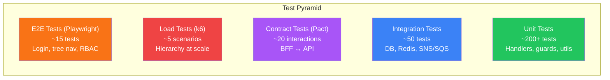

# Phase 7: Testing

## Goal

Comprehensive test coverage across all layers: unit, integration, contract, E2E, and load testing, with CI integration and coverage enforcement.

## Success Criteria

- [ ] Unit test coverage ≥ 80% on Application and Domain layers
- [ ] Integration tests validate DB queries, caching, and event publishing
- [ ] Pact contracts enforce BFF↔API compatibility
- [ ] E2E tests cover login, search, tree navigation, RBAC enforcement
- [ ] Load tests confirm hierarchy queries handle 5000+ employees at target latency
- [ ] All tests run in CI pipeline

## Prerequisites

- **Phases 1–6** — All application code implemented

## Test Pyramid



## Task Breakdown

### 7.1 — Unit Tests (.NET)

**Test project: `apps/api/tests/Api.UnitTests/`**

**CQRS Handler Tests:**

`apps/api/tests/Api.UnitTests/Application/Commands/CreateEmployeeHandlerTests.cs`:
```csharp
public class CreateEmployeeHandlerTests
{
    private readonly AppDbContext _db;
    private readonly Mock<IOrgPathService> _orgPathService;
    private readonly CreateEmployeeHandler _handler;

    public CreateEmployeeHandlerTests()
    {
        _db = TestDbContextFactory.CreateInMemory();
        _orgPathService = new Mock<IOrgPathService>();
        _handler = new CreateEmployeeHandler(_db, _orgPathService.Object);
    }

    [Fact]
    public async Task Handle_ValidCommand_CreatesEmployee()
    {
        var dept = new Department { Name = "Engineering", Code = "ENG" };
        _db.Departments.Add(dept);
        await _db.SaveChangesAsync();

        var command = new CreateEmployeeCommand
        {
            FirstName = "Jane", LastName = "Doe",
            Email = "jane@example.com", EmployeeNumber = "EMP-00001",
            DepartmentId = dept.Id, Title = "Engineer",
            HireDate = DateOnly.FromDateTime(DateTime.Today),
        };

        var result = await _handler.Handle(command, CancellationToken.None);

        result.Should().NotBeNull();
        result.FirstName.Should().Be("Jane");
        _db.Employees.Should().HaveCount(1);
    }

    [Fact]
    public async Task Handle_DuplicateEmail_ThrowsConflict()
    {
        // Setup existing employee with same email
        var act = () => _handler.Handle(duplicateCommand, CancellationToken.None);
        await act.Should().ThrowAsync<ConflictException>();
    }

    [Fact]
    public async Task Handle_WithInitialSalary_CreatesCompRecord()
    {
        // Verify comp record created in same transaction
    }
}
```

**RBAC Logic Tests:**

`apps/api/tests/Api.UnitTests/Authorization/PolicyTests.cs`:
```csharp
public class PolicyTests
{
    [Theory]
    [InlineData("viewer", "ViewEmployees", true)]
    [InlineData("viewer", "ViewCompensation", false)]
    [InlineData("manager", "ViewCompensation", true)]
    [InlineData("manager", "EditCompensation", false)]
    [InlineData("hr_admin", "EditCompensation", true)]
    [InlineData("hr_admin", "AdminOnly", false)]
    [InlineData("super_admin", "AdminOnly", true)]
    public async Task Policy_EnforcesRoleHierarchy(string role, string policy, bool allowed)
    {
        var user = CreateClaimsPrincipal(role);
        var result = await _authorizationService.AuthorizeAsync(user, policy);
        result.Succeeded.Should().Be(allowed);
    }
}
```

**Tree Aggregation Tests:**

```csharp
public class GetOrgTreeHandlerTests
{
    [Fact]
    public async Task Handle_MaxDepth_LimitsTreeDepth()
    {
        // Seed 5-level deep tree
        var result = await _handler.Handle(
            new GetOrgTreeQuery(rootId, MaxDepth: 2), CancellationToken.None);
        result.MaxDepth().Should().BeLessOrEqualTo(2);
    }

    [Fact]
    public async Task Handle_LargeTree_ReturnsCorrectCounts()
    {
        // Seed 100-node tree
        var result = await _handler.Handle(
            new GetOrgTreeQuery(rootId, MaxDepth: 10), CancellationToken.None);
        result.TotalNodes.Should().Be(100);
    }
}
```

**Validation Tests:**
```csharp
public class CreateEmployeeValidatorTests
{
    private readonly CreateEmployeeValidator _validator = new();

    [Fact]
    public void Invalid_EmployeeNumber_Fails()
    {
        var cmd = new CreateEmployeeCommand { EmployeeNumber = "BAD" };
        var result = _validator.Validate(cmd);
        result.IsValid.Should().BeFalse();
        result.Errors.Should().Contain(e => e.PropertyName == "EmployeeNumber");
    }
}
```

### 7.2 — Unit Tests (NestJS)

`apps/bff/src/auth/rbac.guard.spec.ts`:
```typescript
describe('RbacGuard', () => {
  let guard: RbacGuard;

  it('allows super_admin for any role requirement', () => {
    const context = mockContext({ roles: ['super_admin'] }, ['viewer']);
    expect(guard.canActivate(context)).toBe(true);
  });

  it('blocks viewer from manager-required endpoint', () => {
    const context = mockContext({ roles: ['viewer'] }, ['manager']);
    expect(guard.canActivate(context)).toBe(false);
  });

  it('allows access when no roles specified', () => {
    const context = mockContext({ roles: ['viewer'] }, undefined);
    expect(guard.canActivate(context)).toBe(true);
  });
});
```

`apps/bff/src/filters/field-filter.service.spec.ts`:
```typescript
describe('FieldFilterService', () => {
  it('removes compensation fields for viewer', () => {
    const result = service.filterOne(employeeWithComp, viewerUser);
    expect(result.compensation).toBeUndefined();
    expect(result.salary).toBeUndefined();
    expect(result.firstName).toBe('Jane');
  });

  it('keeps compensation fields for manager', () => {
    const result = service.filterOne(employeeWithComp, managerUser);
    expect(result.compensation).toBeDefined();
  });
});
```

### 7.3 — Integration Tests

**`apps/api/tests/Api.IntegrationTests/` using Testcontainers:**

```csharp
public class IntegrationTestBase : IAsyncLifetime
{
    protected PostgreSqlContainer _postgres = new PostgreSqlBuilder()
        .WithImage("postgres:16-alpine")
        .WithDatabase("eba_test")
        .Build();

    protected RedisContainer _redis = new RedisBuilder()
        .WithImage("redis:7-alpine")
        .Build();

    protected AppDbContext Db { get; private set; } = default!;
    protected ICacheService Cache { get; private set; } = default!;

    public async Task InitializeAsync()
    {
        await Task.WhenAll(_postgres.StartAsync(), _redis.StartAsync());
        Db = CreateDbContext(_postgres.GetConnectionString());
        await Db.Database.MigrateAsync();
        Cache = CreateCacheService(_redis.GetConnectionString());
    }

    public async Task DisposeAsync()
    {
        await Task.WhenAll(_postgres.DisposeAsync().AsTask(), _redis.DisposeAsync().AsTask());
    }
}
```

**Database integration tests:**
```csharp
public class EmployeeQueryTests : IntegrationTestBase
{
    [Fact]
    public async Task LtreeQuery_ReturnsSubtree()
    {
        await SeedHierarchy(); // CEO -> VP -> Director -> Managers -> ICs

        var handler = new GetOrgTreeHandler(Db);
        var result = await handler.Handle(new GetOrgTreeQuery(vpId, 10), CancellationToken.None);

        result.Children.Should().NotBeEmpty();
        result.TotalNodes.Should().BeGreaterThan(10);
    }

    [Fact]
    public async Task RlsPolicies_FilterByRole()
    {
        await SeedEmployees();
        await SetRlsContext(managerId, "manager", deptId);

        var employees = await Db.Employees.ToListAsync();
        employees.Should().OnlyContain(e => e.OrgPath.IsDescendantOf(managerPath));
    }

    [Fact]
    public async Task MaterializedViewRefresh_UpdatesBudgetRollup()
    {
        await SeedWithCompensation();
        await new MaterializedViewRefreshService(Db, _logger).RefreshAllAsync(CancellationToken.None);

        var rollup = await Db.Database.SqlQueryRaw<BudgetRollupRow>(
            "SELECT * FROM mv_department_budget_rollup WHERE department_id = @p0", deptId)
            .FirstAsync();

        rollup.RolledUpTotal.Should().BeGreaterThan(0);
    }
}
```

**Redis integration tests:**
```csharp
public class CacheIntegrationTests : IntegrationTestBase
{
    [Fact]
    public async Task GetOrSet_CachesMissAndReturnsOnHit()
    {
        var callCount = 0;
        var factory = () => { callCount++; return Task.FromResult(new EmployeeDto { Id = Guid.NewGuid() }); };

        await Cache.GetOrSetAsync("test:emp", factory);
        await Cache.GetOrSetAsync("test:emp", factory);

        callCount.Should().Be(1);
    }

    [Fact]
    public async Task Invalidate_RemovesEntry()
    {
        await Cache.GetOrSetAsync("test:emp", factory);
        await Cache.InvalidateAsync("test:emp");
        var result = await Cache.GetOrSetAsync("test:emp", factory);
        callCount.Should().Be(2);
    }
}
```

### 7.4 — Contract Tests (Pact)

**Consumer side (NestJS BFF) — `apps/bff/test/pact/employee.consumer.pact.ts`:**
```typescript
import { PactV4, MatchersV3 } from '@pact-foundation/pact';

const { like, eachLike, uuid, string, integer, iso8601DateTimeWithMillis } = MatchersV3;

const provider = new PactV4({
  consumer: 'eba-bff',
  provider: 'eba-api',
  dir: '../../libs/contracts/pacts',
});

describe('Employee API Contract', () => {
  it('returns employee by ID', async () => {
    await provider
      .addInteraction()
      .given('employee EMP-00001 exists')
      .uponReceiving('a request for employee by ID')
      .withRequest('GET', '/v1/employees/123e4567-e89b-12d3-a456-426614174000', (builder) => {
        builder.headers({
          'X-HMAC-Signature': string(),
          'X-HMAC-Timestamp': string(),
          'X-User-Id': string(),
          'X-User-Role': string(),
        });
      })
      .willRespondWith(200, (builder) => {
        builder.jsonBody({
          id: uuid(),
          employeeNumber: like('EMP-00001'),
          firstName: like('Jane'),
          lastName: like('Doe'),
          email: like('jane@example.com'),
          title: like('Software Engineer'),
          departmentId: uuid(),
          managerId: uuid(),
          level: integer(2),
          isActive: true,
        });
      })
      .executeTest(async (mockServer) => {
        const client = createApiClient(mockServer.url);
        const result = await client.getEmployee('123e4567-e89b-12d3-a456-426614174000');
        expect(result.employeeNumber).toBe('EMP-00001');
      });
  });

  it('returns paginated employee search', async () => {
    await provider
      .addInteraction()
      .given('employees exist')
      .uponReceiving('a search request')
      .withRequest('GET', '/v1/employees', (builder) => {
        builder.query({ search: 'Jane', limit: '25' });
      })
      .willRespondWith(200, (builder) => {
        builder.jsonBody({
          items: eachLike({ id: uuid(), firstName: like('Jane') }),
          nextCursor: like('abc123'),
          totalCount: integer(50),
          hasMore: true,
        });
      })
      .executeTest(async (mockServer) => {
        const client = createApiClient(mockServer.url);
        const result = await client.searchEmployees({ search: 'Jane' });
        expect(result.items.length).toBeGreaterThan(0);
      });
  });
});
```

**Provider side (.NET) — `apps/api/tests/Api.ContractTests/PactProviderTests.cs`:**
```csharp
public class PactProviderTests : IClassFixture<WebApplicationFactory<Program>>
{
    [Fact]
    public void Verify_BffContracts()
    {
        var config = new PactVerifierConfig { LogLevel = PactLogLevel.Information };
        var pactPath = Path.Combine("..", "..", "..", "..", "..",
            "libs", "contracts", "pacts", "eba-bff-eba-api.json");

        new PactVerifier("eba-api", config)
            .WithHttpEndpoint(_factory.CreateClient().BaseAddress!)
            .WithPactFile(pactPath)
            .WithProviderStateUrl(new Uri(_factory.CreateClient().BaseAddress!, "/pact-states"))
            .Verify();
    }
}
```

### 7.5 — E2E Tests (Playwright)

**`apps/web/e2e/auth.spec.ts`:**
```typescript
import { test, expect } from '@playwright/test';

test.describe('Authentication', () => {
  test('redirects unauthenticated user to Auth0', async ({ page }) => {
    await page.goto('/');
    await expect(page).toHaveURL(/.*auth0.com/);
  });

  test('logs in successfully and shows dashboard', async ({ page }) => {
    await loginAs(page, 'hr_admin');
    await expect(page.getByRole('heading', { name: 'Dashboard' })).toBeVisible();
  });

  test('logs out and redirects to login', async ({ page }) => {
    await loginAs(page, 'viewer');
    await page.getByRole('button', { name: 'Logout' }).click();
    await expect(page).toHaveURL(/.*login/);
  });
});
```

**`apps/web/e2e/rbac.spec.ts`:**
```typescript
test.describe('RBAC Enforcement', () => {
  test('viewer cannot see compensation tab', async ({ page }) => {
    await loginAs(page, 'viewer');
    await page.goto('/employees/some-id');
    await expect(page.getByText('Compensation')).not.toBeVisible();
  });

  test('manager can see compensation for direct reports', async ({ page }) => {
    await loginAs(page, 'manager');
    await page.goto(`/employees/${directReportId}`);
    await expect(page.getByText('Compensation')).toBeVisible();
    await expect(page.getByText('Base Salary')).toBeVisible();
  });

  test('hr_admin can add compensation', async ({ page }) => {
    await loginAs(page, 'hr_admin');
    await page.goto(`/employees/${anyEmployeeId}`);
    await page.getByRole('button', { name: 'Add Compensation' }).click();
    await page.getByLabel('Amount').fill('95000');
    await page.getByRole('button', { name: 'Submit' }).click();
    await expect(page.getByText('Compensation added')).toBeVisible();
  });
});
```

**`apps/web/e2e/org-tree.spec.ts`:**
```typescript
test.describe('Org Tree Navigation', () => {
  test('renders org tree and navigates on click', async ({ page }) => {
    await loginAs(page, 'viewer');
    await page.goto('/org-chart');
    await expect(page.locator('svg .node')).toHaveCount.greaterThan(0);

    await page.locator('svg .node').first().click();
    await expect(page.getByTestId('employee-detail-panel')).toBeVisible();
  });

  test('search from org chart navigates to employee', async ({ page }) => {
    await loginAs(page, 'viewer');
    await page.goto('/org-chart');
    await page.getByPlaceholder('Search employees').fill('Jane');
    await page.getByRole('option', { name: /Jane/ }).click();
    await expect(page.getByTestId('employee-detail-panel')).toContainText('Jane');
  });
});
```

### 7.6 — Load Tests (k6)

**`tests/load/hierarchy-query.js`:**
```javascript
import http from 'k6/http';
import { check, sleep } from 'k6';
import { Rate, Trend } from 'k6/metrics';

const errorRate = new Rate('errors');
const latency = new Trend('hierarchy_query_latency');

export const options = {
  scenarios: {
    hierarchy_browse: {
      executor: 'ramping-vus',
      startVUs: 0,
      stages: [
        { duration: '30s', target: 50 },
        { duration: '2m', target: 50 },
        { duration: '30s', target: 100 },
        { duration: '2m', target: 100 },
        { duration: '30s', target: 0 },
      ],
    },
  },
  thresholds: {
    http_req_duration: ['p(95)<500', 'p(99)<1000'],
    errors: ['rate<0.01'],
  },
};

const BASE_URL = __ENV.BASE_URL || 'http://localhost:3000';
const TOKEN = __ENV.AUTH_TOKEN;

export default function () {
  const headers = { Authorization: `Bearer ${TOKEN}` };

  // Scenario 1: Search employees
  const search = http.get(`${BASE_URL}/api/v1/employees?search=John&limit=25`, { headers });
  check(search, { 'search 200': (r) => r.status === 200 });
  errorRate.add(search.status !== 200);

  // Scenario 2: Get org tree (most expensive)
  const ceoId = 'ceo-uuid-here';
  const tree = http.get(`${BASE_URL}/api/v1/employees/${ceoId}/org-tree?maxDepth=3`, { headers });
  check(tree, { 'tree 200': (r) => r.status === 200 });
  latency.add(tree.timings.duration);

  // Scenario 3: Get department budget rollup
  const rollup = http.get(`${BASE_URL}/api/v1/reports/budget-rollup`, { headers });
  check(rollup, { 'rollup 200': (r) => r.status === 200 });

  sleep(1);
}
```

**`tests/load/concurrent-users.js`:**
```javascript
export const options = {
  scenarios: {
    sustained_load: {
      executor: 'constant-arrival-rate',
      rate: 100,           // 100 requests/second
      timeUnit: '1s',
      duration: '5m',
      preAllocatedVUs: 50,
      maxVUs: 200,
    },
  },
  thresholds: {
    http_req_duration: ['p(95)<300'],
    http_req_failed: ['rate<0.01'],
  },
};
```

### 7.7 — Coverage Configuration

**.NET — `apps/api/tests/coverlet.runsettings`:**
```xml
<RunSettings>
  <DataCollectionRunSettings>
    <DataCollectors>
      <DataCollector friendlyName="XPlat Code Coverage">
        <Configuration>
          <Format>cobertura</Format>
          <Include>[Application]*,[Domain]*</Include>
          <Exclude>[*.Tests]*,[Infrastructure]*</Exclude>
          <ThresholdType>line</ThresholdType>
          <ThresholdStat>total</ThresholdStat>
          <Threshold>80</Threshold>
        </Configuration>
      </DataCollector>
    </DataCollectors>
  </DataCollectionRunSettings>
</RunSettings>
```

**NestJS — `apps/bff/jest.config.ts`:**
```typescript
export default {
  coverageThreshold: {
    global: { branches: 75, functions: 80, lines: 80, statements: 80 },
  },
  collectCoverageFrom: ['src/**/*.ts', '!src/**/*.spec.ts', '!src/main.ts'],
};
```

**React — `apps/web/vitest.config.ts`:**
```typescript
export default defineConfig({
  test: {
    coverage: {
      provider: 'v8',
      reporter: ['text', 'lcov'],
      thresholds: { lines: 70, branches: 65, functions: 70 },
    },
  },
});
```

### 7.8 — CI Integration

**`.github/workflows/ci.yml` (test section):**
```yaml
jobs:
  test-api:
    runs-on: ubuntu-latest
    services:
      postgres:
        image: postgres:16-alpine
        env: { POSTGRES_DB: eba_test, POSTGRES_USER: test, POSTGRES_PASSWORD: test }
        ports: ['5432:5432']
      redis:
        image: redis:7-alpine
        ports: ['6379:6379']
    steps:
      - uses: actions/checkout@v4
      - uses: actions/setup-dotnet@v4
        with: { dotnet-version: '8.0' }
      - run: dotnet test --settings tests/coverlet.runsettings --collect:"XPlat Code Coverage"
        working-directory: apps/api
      - uses: codecov/codecov-action@v4

  test-bff:
    runs-on: ubuntu-latest
    steps:
      - uses: actions/checkout@v4
      - uses: actions/setup-node@v4
      - run: pnpm test --coverage
        working-directory: apps/bff

  test-web:
    runs-on: ubuntu-latest
    steps:
      - uses: actions/checkout@v4
      - uses: actions/setup-node@v4
      - run: pnpm vitest run --coverage
        working-directory: apps/web

  contract-tests:
    needs: [test-api, test-bff]
    runs-on: ubuntu-latest
    steps:
      - run: pnpm --filter bff test:pact
      - run: dotnet test --filter "Category=Contract"
        working-directory: apps/api

  e2e:
    needs: [test-api, test-bff, test-web]
    runs-on: ubuntu-latest
    steps:
      - run: docker compose -f docker/docker-compose.yml up -d
      - run: npx playwright test
        working-directory: apps/web

  load-test:
    needs: [e2e]
    runs-on: ubuntu-latest
    steps:
      - uses: grafana/k6-action@v0.3
        with:
          filename: tests/load/hierarchy-query.js
```

## Acceptance Tests

| # | Test | Verification |
|---|------|-------------|
| 1 | Unit tests pass | `dotnet test` and `pnpm test` pass |
| 2 | Coverage met | ≥ 80% line coverage on Application/Domain |
| 3 | Integration tests pass | Testcontainers spin up and tests pass |
| 4 | Pact contracts verified | Consumer and provider tests pass |
| 5 | E2E login works | Playwright login test passes |
| 6 | RBAC enforced E2E | Viewer blocked from comp, hr_admin can add |
| 7 | Load test passes | p95 < 500ms at 100 concurrent users |
| 8 | CI pipeline green | All jobs pass on push |

## Estimated Effort

| Task | Time |
|------|------|
| .NET unit tests (handlers, validators, RBAC) | 6h |
| NestJS unit tests (guards, filters) | 3h |
| React component tests | 3h |
| Integration tests (Testcontainers) | 5h |
| Pact contract tests | 4h |
| E2E tests (Playwright) | 5h |
| k6 load tests | 3h |
| Coverage config + CI integration | 3h |
| **Total** | **~32h** |
