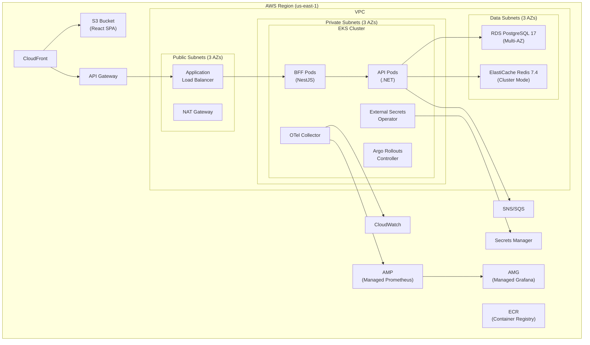

# Phase 8: Infrastructure & Deployment

## Goal

Provision production infrastructure on AWS with Terraform, deploy all services to EKS with Argo Rollouts canary strategy, configure CI/CD pipelines, set up observability, and implement DR strategies.

## Success Criteria

- [ ] `terraform apply` provisions full environment (VPC, EKS, RDS, Redis, S3, ECR)
- [ ] All 3 services deploy to EKS via Argo Rollouts canary
- [ ] React SPA served via CloudFront + S3
- [ ] API Gateway routes to EKS with rate limiting
- [ ] Secrets managed via AWS Secrets Manager + External Secrets Operator
- [ ] CI/CD: 3-environment pipeline (test → beta → prod) with progressive canary
- [ ] Observability: metrics, traces, logs, dashboards, alerts
- [ ] Multi-AZ with automated failover, RPO < 1h, RTO < 15min

## Prerequisites

- **Phases 1–7** — Application code complete and tested
- AWS account with admin access
- Domain name configured

## Infrastructure Architecture



## Task Breakdown

### 8.1 — Terraform Module Structure

```
infra/terraform/
├── main.tf
├── variables.tf
├── outputs.tf
├── providers.tf
├── backend.tf
├── environments/
│   ├── test/
│   │   ├── main.tf        # Backend config + module instantiation
│   │   ├── terraform.tfvars
│   │   └── backend.tf     # S3 state: eba-tfstate-test
│   ├── beta/
│   │   ├── main.tf
│   │   ├── terraform.tfvars
│   │   └── backend.tf     # S3 state: eba-tfstate-beta
│   └── prod/
│       ├── main.tf
│       ├── terraform.tfvars
│       └── backend.tf     # S3 state: eba-tfstate-prod
├── modules/
│   ├── vpc/
│   │   ├── main.tf          # VPC, subnets, route tables, NAT
│   │   ├── variables.tf
│   │   └── outputs.tf
│   ├── eks/
│   │   ├── main.tf          # EKS cluster, node groups, IRSA
│   │   ├── variables.tf
│   │   └── outputs.tf
│   ├── rds/
│   │   ├── main.tf          # RDS PostgreSQL, parameter groups, subnet groups
│   │   ├── variables.tf
│   │   └── outputs.tf
│   ├── redis/
│   │   ├── main.tf          # ElastiCache Redis cluster
│   │   ├── variables.tf
│   │   └── outputs.tf
│   ├── s3-cloudfront/
│   │   ├── main.tf          # S3 bucket, CloudFront distribution, OAI
│   │   ├── variables.tf
│   │   └── outputs.tf
│   ├── ecr/
│   │   ├── main.tf          # ECR repositories
│   │   ├── variables.tf
│   │   └── outputs.tf
│   ├── iam/
│   │   ├── main.tf          # IAM roles, policies, IRSA
│   │   ├── variables.tf
│   │   └── outputs.tf
│   ├── secrets/
│   │   ├── main.tf          # Secrets Manager secrets
│   │   ├── variables.tf
│   │   └── outputs.tf
│   ├── messaging/
│   │   ├── main.tf          # SNS topics, SQS queues, subscriptions, DLQ
│   │   ├── variables.tf
│   │   └── outputs.tf
│   └── observability/
│       ├── main.tf          # AMP workspace, AMG, CloudWatch log groups
│       ├── variables.tf
│       └── outputs.tf
```

### 8.2 — VPC Module

**`infra/terraform/modules/vpc/main.tf`:**
```hcl
module "vpc" {
  source  = "terraform-aws-modules/vpc/aws"
  version = "~> 5.0"

  name = "${var.project}-${var.environment}"
  cidr = var.vpc_cidr  # 10.0.0.0/16

  azs             = ["us-east-1a", "us-east-1b", "us-east-1c"]
  public_subnets  = ["10.0.1.0/24", "10.0.2.0/24", "10.0.3.0/24"]
  private_subnets = ["10.0.11.0/24", "10.0.12.0/24", "10.0.13.0/24"]
  database_subnets = ["10.0.21.0/24", "10.0.22.0/24", "10.0.23.0/24"]

  enable_nat_gateway   = true
  single_nat_gateway   = var.environment == "test"
  enable_dns_hostnames = true
  enable_dns_support   = true

  create_database_subnet_group = true

  public_subnet_tags = {
    "kubernetes.io/role/elb" = 1
  }
  private_subnet_tags = {
    "kubernetes.io/role/internal-elb" = 1
  }
}
```

### 8.3 — EKS Module

**`infra/terraform/modules/eks/main.tf`:**
```hcl
module "eks" {
  source  = "terraform-aws-modules/eks/aws"
  version = "~> 20.0"

  cluster_name    = "${var.project}-${var.environment}"
  cluster_version = "1.31"

  vpc_id     = var.vpc_id
  subnet_ids = var.private_subnet_ids

  cluster_endpoint_public_access  = true
  cluster_endpoint_private_access = true

  eks_managed_node_groups = {
    general = {
      instance_types = ["m6i.large"]
      min_size       = var.environment == "prod" ? 6 : (var.environment == "beta" ? 3 : 2)
      max_size       = var.environment == "prod" ? 15 : (var.environment == "beta" ? 6 : 3)
      desired_size   = var.environment == "prod" ? 6 : (var.environment == "beta" ? 3 : 2)

      labels = { workload = "general" }
    }
  }

  # IRSA for service accounts
  enable_irsa = true

  cluster_addons = {
    coredns    = { most_recent = true }
    kube-proxy = { most_recent = true }
    vpc-cni    = { most_recent = true }
  }
}

# IRSA role for API pods (RDS, Redis, SNS/SQS, Secrets Manager access)
module "api_irsa" {
  source = "terraform-aws-modules/iam/aws//modules/iam-role-for-service-accounts-eks"

  role_name = "${var.project}-api-${var.environment}"
  oidc_providers = {
    main = {
      provider_arn = module.eks.oidc_provider_arn
      namespace_service_accounts = ["default:eba-api"]
    }
  }

  role_policy_arns = {
    rds     = aws_iam_policy.rds_access.arn
    redis   = aws_iam_policy.redis_access.arn
    sns_sqs = aws_iam_policy.sns_sqs_access.arn
    secrets = aws_iam_policy.secrets_access.arn
  }
}
```

### 8.4 — RDS Module

```hcl
module "rds" {
  source  = "terraform-aws-modules/rds/aws"
  version = "~> 6.0"

  identifier = "${var.project}-${var.environment}"

  engine               = "postgres"
  engine_version       = "17.2"
  family               = "postgres17"
  major_engine_version = "17"
  instance_class       = var.environment == "prod" ? "db.r6g.xlarge" : (var.environment == "beta" ? "db.r6g.large" : "db.t4g.medium")

  allocated_storage     = 100
  max_allocated_storage = 500

  db_name  = "eba"
  username = "eba_admin"
  port     = 5432

  multi_az               = var.environment != "test"
  db_subnet_group_name   = var.database_subnet_group
  vpc_security_group_ids = [var.rds_sg_id]

  backup_retention_period = var.environment == "prod" ? 30 : (var.environment == "beta" ? 14 : 7)
  backup_window           = "03:00-04:00"
  maintenance_window      = "sun:04:00-sun:05:00"

  performance_insights_enabled = true
  monitoring_interval          = 60

  parameters = [
    { name = "shared_preload_libraries", value = "pg_stat_statements" },
    { name = "log_min_duration_statement", value = "1000" },
    { name = "rds.force_ssl", value = "1" },
  ]

  create_db_parameter_group = true
  deletion_protection       = var.environment == "prod"
}

# RDS Proxy for connection pooling
resource "aws_db_proxy" "main" {
  name                   = "${var.project}-${var.environment}"
  debug_logging          = var.environment == "test"
  engine_family          = "POSTGRESQL"
  idle_client_timeout    = 1800
  require_tls            = true
  role_arn               = aws_iam_role.rds_proxy.arn
  vpc_security_group_ids = [var.rds_proxy_sg_id]
  vpc_subnet_ids         = var.private_subnet_ids

  auth {
    auth_scheme = "SECRETS"
    iam_auth    = "REQUIRED"
    secret_arn  = var.db_secret_arn
  }
}
```

### 8.5 — Kubernetes Manifests

Kustomize overlays per environment:

```
k8s/
├── base/                    # Shared manifests (rollouts, services, network policies)
└── overlays/
    ├── test/                # Direct deploy, no canary, reduced replicas
    │   └── kustomization.yaml
    ├── beta/                # Canary 50%→100%, 3 replicas
    │   └── kustomization.yaml
    └── prod/                # Canary 20%→40%→80%→100% + analysis, 6+ replicas
        └── kustomization.yaml
```

**`k8s/base/api-rollout.yaml`:**
```yaml
apiVersion: argoproj.io/v1alpha1
kind: Rollout
metadata:
  name: eba-api
spec:
  replicas: 3
  revisionHistoryLimit: 3
  selector:
    matchLabels:
      app: eba-api
  template:
    metadata:
      labels:
        app: eba-api
      annotations:
        prometheus.io/scrape: "true"
        prometheus.io/port: "5050"
        prometheus.io/path: "/metrics"
    spec:
      serviceAccountName: eba-api
      containers:
        - name: api
          image: ACCOUNT.dkr.ecr.REGION.amazonaws.com/eba-api:latest
          ports:
            - containerPort: 5050
          env:
            - name: ASPNETCORE_ENVIRONMENT
              value: Production
          envFrom:
            - secretRef:
                name: eba-api-secrets
          resources:
            requests: { cpu: 250m, memory: 512Mi }
            limits: { cpu: 1000m, memory: 1Gi }
          readinessProbe:
            httpGet: { path: /healthz, port: 5050 }
            initialDelaySeconds: 10
            periodSeconds: 5
          livenessProbe:
            httpGet: { path: /healthz, port: 5050 }
            initialDelaySeconds: 30
            periodSeconds: 10
  strategy:
    canary:
      steps:
        - setWeight: 10
        - pause: { duration: 2m }
        - analysis:
            templates:
              - templateName: success-rate
            args:
              - name: service-name
                value: eba-api
        - setWeight: 30
        - pause: { duration: 3m }
        - setWeight: 60
        - pause: { duration: 3m }
        - setWeight: 100
      canaryService: eba-api-canary
      stableService: eba-api-stable
      trafficRouting:
        alb:
          ingress: eba-api-ingress
          servicePort: 80
```

**`k8s/base/analysis-template.yaml`:**
```yaml
apiVersion: argoproj.io/v1alpha1
kind: AnalysisTemplate
metadata:
  name: success-rate
spec:
  args:
    - name: service-name
  metrics:
    - name: success-rate
      interval: 30s
      successCondition: result[0] >= 0.99
      provider:
        prometheus:
          address: http://prometheus:9090
          query: |
            sum(rate(http_requests_total{service="{{args.service-name}}",status=~"2.."}[2m]))
            /
            sum(rate(http_requests_total{service="{{args.service-name}}"}[2m]))
    - name: error-rate
      interval: 30s
      failureCondition: result[0] > 0.01
      provider:
        prometheus:
          address: http://prometheus:9090
          query: |
            sum(rate(http_requests_total{service="{{args.service-name}}",status=~"5.."}[2m]))
            /
            sum(rate(http_requests_total{service="{{args.service-name}}"}[2m]))
    - name: split-io-metric
      interval: 60s
      successCondition: result == "true"
      provider:
        web:
          url: "https://sdk.split.io/api/metrics/{{args.service-name}}"
          headers:
            - key: Authorization
              value: "Bearer {{args.split-api-key}}"
          jsonPath: "{$.healthy}"
```

**`k8s/base/network-policy.yaml`:**
```yaml
apiVersion: networking.k8s.io/v1
kind: NetworkPolicy
metadata:
  name: eba-api-network-policy
spec:
  podSelector:
    matchLabels:
      app: eba-api
  policyTypes: [Ingress, Egress]
  ingress:
    - from:
        - podSelector:
            matchLabels:
              app: eba-bff
      ports:
        - port: 5050
  egress:
    - to:
        - namespaceSelector: {}
      ports:
        - port: 5432  # PostgreSQL
        - port: 6379  # Redis
        - port: 443   # AWS services (SNS/SQS/Secrets Manager)
    - to:
        - namespaceSelector: {}
          podSelector:
            matchLabels:
              k8s-app: kube-dns
      ports:
        - port: 53
          protocol: UDP
```

**`k8s/base/hpa.yaml`:**
```yaml
apiVersion: autoscaling/v2
kind: HorizontalPodAutoscaler
metadata:
  name: eba-api-hpa
spec:
  scaleTargetRef:
    apiVersion: argoproj.io/v1alpha1
    kind: Rollout
    name: eba-api
  minReplicas: 3
  maxReplicas: 15
  metrics:
    - type: Resource
      resource:
        name: cpu
        target: { type: Utilization, averageUtilization: 70 }
    - type: Resource
      resource:
        name: memory
        target: { type: Utilization, averageUtilization: 80 }
  behavior:
    scaleUp:
      stabilizationWindowSeconds: 60
      policies: [{ type: Pods, value: 2, periodSeconds: 60 }]
    scaleDown:
      stabilizationWindowSeconds: 300
      policies: [{ type: Pods, value: 1, periodSeconds: 120 }]
```

### 8.6 — External Secrets Operator

**`k8s/base/external-secret.yaml`:**
```yaml
apiVersion: external-secrets.io/v1beta1
kind: ExternalSecret
metadata:
  name: eba-api-secrets
spec:
  refreshInterval: 1h
  secretStoreRef:
    name: aws-secrets-manager
    kind: ClusterSecretStore
  target:
    name: eba-api-secrets
    creationPolicy: Owner
  data:
    - secretKey: ConnectionStrings__DefaultConnection
      remoteRef:
        key: eba/${ENVIRONMENT}/database    # test, beta, or prod
        property: connection_string
    - secretKey: Redis__ConnectionString
      remoteRef:
        key: eba/${ENVIRONMENT}/redis
        property: connection_string
    - secretKey: HMAC_SECRET
      remoteRef:
        key: eba/${ENVIRONMENT}/hmac
        property: secret
    - secretKey: Auth0__Domain
      remoteRef:
        key: eba/${ENVIRONMENT}/auth0
        property: domain
```

### 8.7 — GitHub Actions CI/CD

The platform uses a 3-environment promotion strategy: **test** (from `develop`), **beta** (from `release/*`), and **prod** (from `main`).

**`.github/workflows/ci.yml`:**
```yaml
name: CI
on:
  push:
    branches: [develop, main, 'release/**']
  pull_request:
    branches: [develop]

jobs:
  lint:
    runs-on: ubuntu-latest
    steps:
      - uses: actions/checkout@v4
      - uses: pnpm/action-setup@v3
      - run: pnpm install --frozen-lockfile
      - run: pnpm nx run-many -t lint
      - run: cd apps/api && dotnet format --verify-no-changes

  test:
    needs: lint
    strategy:
      matrix:
        service: [web, bff, api]
    runs-on: ubuntu-latest
    steps:
      - uses: actions/checkout@v4
      - run: make test-${{ matrix.service }}

  build:
    needs: test
    strategy:
      matrix:
        service: [web, bff, api]
    runs-on: ubuntu-latest
    steps:
      - uses: actions/checkout@v4
      - uses: aws-actions/configure-aws-credentials@v4
        with:
          role-to-assume: ${{ secrets.AWS_ROLE_ARN }}
          aws-region: us-east-1
      - uses: aws-actions/amazon-ecr-login@v2
        id: ecr
      - name: Build and push
        run: |
          IMAGE=${{ steps.ecr.outputs.registry }}/eba-${{ matrix.service }}:${{ github.sha }}
          docker build -t $IMAGE -f docker/Dockerfile.${{ matrix.service }} .
          docker push $IMAGE
```

**`.github/workflows/deploy-test.yml`:**
```yaml
name: Deploy to Test
on:
  workflow_run:
    workflows: [CI]
    types: [completed]
    branches: [develop]

jobs:
  deploy:
    if: ${{ github.event.workflow_run.conclusion == 'success' }}
    runs-on: ubuntu-latest
    environment: test
    steps:
      - uses: actions/checkout@v4
      - uses: aws-actions/configure-aws-credentials@v4
        with:
          role-to-assume: ${{ secrets.AWS_DEPLOY_ROLE_ARN }}
          aws-region: us-east-1

      - name: Update kubeconfig
        run: aws eks update-kubeconfig --name eba-test --region us-east-1

      - name: Deploy SPA to S3
        run: |
          aws s3 sync apps/web/dist/ s3://eba-test-spa --delete
          aws cloudfront create-invalidation --distribution-id ${{ secrets.CF_DIST_ID }} --paths "/*"

      - name: Deploy BFF (direct rollout)
        run: |
          kubectl set image deployment/eba-bff \
            bff=${{ secrets.ECR_REGISTRY }}/eba-bff:test-${{ github.sha }}

      - name: Deploy API (direct rollout)
        run: |
          kubectl set image deployment/eba-api \
            api=${{ secrets.ECR_REGISTRY }}/eba-api:test-${{ github.sha }}

      - name: Tag images
        run: |
          for svc in bff api; do
            docker tag ${{ secrets.ECR_REGISTRY }}/eba-$svc:${{ github.sha }} \
              ${{ secrets.ECR_REGISTRY }}/eba-$svc:test-latest
            docker push ${{ secrets.ECR_REGISTRY }}/eba-$svc:test-latest
          done
```

**`.github/workflows/deploy-beta.yml`:**
```yaml
name: Deploy to Beta
on:
  workflow_run:
    workflows: [CI]
    types: [completed]
    branches: ['release/**']

jobs:
  deploy:
    if: ${{ github.event.workflow_run.conclusion == 'success' }}
    runs-on: ubuntu-latest
    environment: beta
    steps:
      - uses: actions/checkout@v4
      - uses: aws-actions/configure-aws-credentials@v4
        with:
          role-to-assume: ${{ secrets.AWS_DEPLOY_ROLE_ARN }}
          aws-region: us-east-1

      - name: Update kubeconfig
        run: aws eks update-kubeconfig --name eba-beta --region us-east-1

      - name: Deploy SPA to S3
        run: |
          aws s3 sync apps/web/dist/ s3://eba-beta-spa --delete
          aws cloudfront create-invalidation --distribution-id ${{ secrets.CF_DIST_ID }} --paths "/*"

      - name: Deploy BFF (Argo Canary 50%→100%)
        run: |
          kubectl argo rollouts set image eba-bff \
            bff=${{ secrets.ECR_REGISTRY }}/eba-bff:beta-${{ github.sha }}

      - name: Deploy API (Argo Canary 50%→100%)
        run: |
          kubectl argo rollouts set image eba-api \
            api=${{ secrets.ECR_REGISTRY }}/eba-api:beta-${{ github.sha }}

      - name: Wait for rollouts
        run: |
          kubectl argo rollouts status eba-bff --timeout 600
          kubectl argo rollouts status eba-api --timeout 600
```

**`.github/workflows/deploy-prod.yml`:**
```yaml
name: Deploy to Prod
on:
  workflow_run:
    workflows: [CI]
    types: [completed]
    branches: [main]

jobs:
  deploy:
    if: ${{ github.event.workflow_run.conclusion == 'success' }}
    runs-on: ubuntu-latest
    environment: production    # Requires 2-reviewer manual approval
    steps:
      - uses: actions/checkout@v4
      - uses: aws-actions/configure-aws-credentials@v4
        with:
          role-to-assume: ${{ secrets.AWS_DEPLOY_ROLE_ARN }}
          aws-region: us-east-1

      - name: Update kubeconfig
        run: aws eks update-kubeconfig --name eba-prod --region us-east-1

      - name: Deploy SPA to S3
        run: |
          aws s3 sync apps/web/dist/ s3://eba-prod-spa --delete
          aws cloudfront create-invalidation --distribution-id ${{ secrets.CF_DIST_ID }} --paths "/*"

      - name: Deploy BFF (Argo Canary 20%→40%→80%→100% + analysis)
        run: |
          kubectl argo rollouts set image eba-bff \
            bff=${{ secrets.ECR_REGISTRY }}/eba-bff:prod-${{ github.sha }}

      - name: Deploy API (Argo Canary 20%→40%→80%→100% + analysis)
        run: |
          kubectl argo rollouts set image eba-api \
            api=${{ secrets.ECR_REGISTRY }}/eba-api:prod-${{ github.sha }}

      - name: Wait for rollouts
        run: |
          kubectl argo rollouts status eba-bff --timeout 600
          kubectl argo rollouts status eba-api --timeout 600

      - name: Tag release images
        run: |
          VERSION=$(git describe --tags --abbrev=0 2>/dev/null || echo "0.0.0")
          for svc in bff api; do
            docker tag ${{ secrets.ECR_REGISTRY }}/eba-$svc:${{ github.sha }} \
              ${{ secrets.ECR_REGISTRY }}/eba-$svc:prod-latest
            docker tag ${{ secrets.ECR_REGISTRY }}/eba-$svc:${{ github.sha }} \
              ${{ secrets.ECR_REGISTRY }}/eba-$svc:v$VERSION
            docker push ${{ secrets.ECR_REGISTRY }}/eba-$svc:prod-latest
            docker push ${{ secrets.ECR_REGISTRY }}/eba-$svc:v$VERSION
          done
```

**`.github/workflows/db-migrate.yml`:**
```yaml
name: Database Migration
on:
  workflow_dispatch:
    inputs:
      environment:
        type: choice
        options: [test, beta, prod]

jobs:
  migrate:
    runs-on: ubuntu-latest
    environment: ${{ inputs.environment }}
    steps:
      - uses: actions/checkout@v4
      - uses: aws-actions/configure-aws-credentials@v4
        with:
          role-to-assume: ${{ secrets.AWS_ROLE_ARN }}
          aws-region: us-east-1
      - name: Run migrations
        run: |
          CONNECTION=$(aws secretsmanager get-secret-value \
            --secret-id eba/${{ inputs.environment }}/database \
            --query SecretString --output text | jq -r .connection_string)
          cd apps/api/src/Infrastructure
          dotnet ef database update --connection "$CONNECTION" --startup-project ../Api
```

### 8.8 — Observability

**OpenTelemetry Collector config — `k8s/base/otel-collector-config.yaml`:**
```yaml
apiVersion: v1
kind: ConfigMap
metadata:
  name: otel-collector-config
data:
  config.yaml: |
    receivers:
      otlp:
        protocols:
          grpc: { endpoint: 0.0.0.0:4317 }
          http: { endpoint: 0.0.0.0:4318 }
    processors:
      batch:
        timeout: 5s
        send_batch_size: 1024
      resource:
        attributes:
          - key: environment
            value: "${ENVIRONMENT}"   # test, beta, or prod
            action: upsert
    exporters:
      awsxray: { region: us-east-1 }
      awscloudwatchlogs:
        log_group_name: /eba/${ENVIRONMENT}
        region: us-east-1
      prometheusremotewrite:
        endpoint: "${AMP_REMOTE_WRITE_ENDPOINT}"
        auth:
          authenticator: sigv4auth
    extensions:
      sigv4auth:
        region: us-east-1
    service:
      extensions: [sigv4auth]
      pipelines:
        traces:
          receivers: [otlp]
          processors: [batch, resource]
          exporters: [awsxray]
        metrics:
          receivers: [otlp]
          processors: [batch, resource]
          exporters: [prometheusremotewrite]
        logs:
          receivers: [otlp]
          processors: [batch, resource]
          exporters: [awscloudwatchlogs]
```

**.NET OTel setup in `Program.cs`:**
```csharp
builder.Services.AddOpenTelemetry()
    .ConfigureResource(r => r.AddService("eba-api"))
    .WithTracing(t => t
        .AddAspNetCoreInstrumentation()
        .AddHttpClientInstrumentation()
        .AddNpgsql()
        .AddRedisInstrumentation()
        .AddOtlpExporter())
    .WithMetrics(m => m
        .AddAspNetCoreInstrumentation()
        .AddHttpClientInstrumentation()
        .AddRuntimeInstrumentation()
        .AddProcessInstrumentation()
        .AddOtlpExporter());
```

**Key Grafana dashboards to create:**
- Application Overview: request rate, error rate, latency p50/p95/p99
- Database: connection pool, query duration, cache hit ratio
- Infrastructure: CPU/memory per pod, HPA scaling events
- Business: active users, compensation changes, search queries

**CloudWatch alarms:**
```hcl
resource "aws_cloudwatch_metric_alarm" "api_5xx_rate" {
  alarm_name          = "eba-api-5xx-rate"
  comparison_operator = "GreaterThanThreshold"
  evaluation_periods  = 2
  metric_name         = "5XXError"
  namespace           = "AWS/ApiGateway"
  period              = 60
  statistic           = "Sum"
  threshold           = 10
  alarm_actions       = [var.sns_alert_topic_arn]
}
```

### 8.9 — DR Strategy

| Component | Strategy | RPO | RTO |
|-----------|----------|-----|-----|
| RDS PostgreSQL | Multi-AZ + automated backups (30 days) | < 5 min | < 15 min (auto-failover) |
| ElastiCache Redis | Multi-AZ replicas, auto-failover | < 1 min | < 1 min |
| S3 (SPA) | Versioning enabled, cross-region replication | 0 | 0 |
| EKS | Multi-AZ node groups, PDB | N/A | < 5 min (pod rescheduling) |
| Secrets Manager | Multi-region replication | 0 | 0 |

**Pod Disruption Budget:**
```yaml
apiVersion: policy/v1
kind: PodDisruptionBudget
metadata:
  name: eba-api-pdb
spec:
  minAvailable: 2
  selector:
    matchLabels:
      app: eba-api
```

## Acceptance Tests

| # | Test | Verification |
|---|------|-------------|
| 1 | Terraform plan clean | `terraform plan` shows no errors |
| 2 | Infra provisions | `terraform apply` creates all resources |
| 3 | EKS accessible | `kubectl get nodes` returns healthy nodes |
| 4 | Services deploy | All rollouts complete successfully |
| 5 | SPA accessible | CloudFront URL serves React app |
| 6 | API accessible | API Gateway routes to BFF correctly |
| 7 | Canary works | Bad deploy auto-rolls back |
| 8 | Secrets injected | Pods have correct env vars from Secrets Manager |
| 9 | Metrics flowing | Grafana dashboards show data |
| 10 | Alerts fire | Simulate 5xx → CloudWatch alarm triggers |
| 11 | Failover works | Kill primary RDS → standby takes over |

## Estimated Effort

| Task | Time |
|------|------|
| Terraform VPC + networking | 3h |
| Terraform EKS + IRSA | 4h |
| Terraform RDS + Proxy | 3h |
| Terraform Redis | 1h |
| Terraform S3 + CloudFront | 2h |
| Terraform ECR + IAM + Secrets | 2h |
| Terraform SNS/SQS | 1h |
| Terraform observability | 2h |
| K8s manifests (rollouts, services, ingress) | 4h |
| External Secrets Operator | 2h |
| Network policies + PDB + HPA | 2h |
| GitHub Actions CI | 3h |
| GitHub Actions CD | 3h |
| DB migration workflow | 1h |
| OTel + Grafana dashboards | 4h |
| CloudWatch alarms | 2h |
| DR testing | 3h |
| **Total** | **~42h** |
