# Employee Budget Allocation Platform -- Architecture Design

> **Workday-like employee hierarchy app** with salary/budget tree visualization, RBAC, and SSO.
> Designed as a production-grade enterprise system for interview demonstration.

## Table of Contents

1. [Overview](#1-overview)
2. [Tech Stack](#2-tech-stack)
3. [High-Level Architecture](#3-high-level-architecture)
4. [Data Model](#4-data-model)
5. [RBAC & Auth Deep-Dive](#5-rbac--auth-deep-dive)
6. [API Design](#6-api-design)
7. [Hierarchy Tree Query Strategy](#7-hierarchy-tree-query-strategy)
8. [Caching Strategy](#8-caching-strategy)
9. [Event-Driven Architecture](#9-event-driven-architecture)
10. [Error Handling & Resilience](#10-error-handling--resilience)
11. [Observability Stack](#11-observability-stack)
12. [Testing Strategy](#12-testing-strategy)
13. [Infrastructure as Code](#13-infrastructure-as-code)
14. [Security Hardening](#14-security-hardening)
15. [DR & Availability](#15-dr--availability)
16. [Developer Experience](#16-developer-experience)

---

## 1. Overview

An employee hierarchy and budget allocation platform serving 5,000+ employees. Core capabilities:

- **Tree visualization** -- Select any manager and see the full reporting chain with aggregated total compensation rolling up to CEO level.
- **RBAC** -- Logged-in employee can only view compensation data for their direct and indirect reports.
- **SSO** -- Auth0-based single sign-on with PKCE flow.
- **Budget tracking** -- Department-level budget allocation vs. actual compensation spend.
- **Data ingestion** -- Seed data (5,000+ synthetic employees) for dev, CSV import for production.

---

## 2. Tech Stack

| Layer | Technology | Rationale |
|-------|-----------|-----------|
| Frontend | React (Vite + TypeScript) | Component-driven SPA, strong ecosystem |
| Middleware / BFF | NestJS (TypeScript) | Auth0 guard, RBAC filtering, aggregation |
| Backend API | .NET 8 (C#) | Domain logic, CQRS handlers, high performance |
| Database | PostgreSQL 16 | Relational hierarchy, ltree extension, RLS |
| Cache | ElastiCache (Redis) | Tree cache, session store, RBAC visibility sets |
| Auth / SSO | Auth0 | OIDC/PKCE, role management, MFA |
| Feature Flags | Split.io | Canary gating, kill switches, A/B |
| Container Orchestration | AWS EKS | Production-grade Kubernetes |
| Progressive Delivery | Argo Rollouts | Canary deployments with automated analysis |
| CI/CD | GitHub Actions | Build, test, scan, deploy pipelines |
| IaC | Terraform | AWS infrastructure provisioning |
| Observability | CloudWatch, X-Ray, Prometheus, Grafana | Logs, traces, metrics, dashboards |

---

## 3. High-Level Architecture

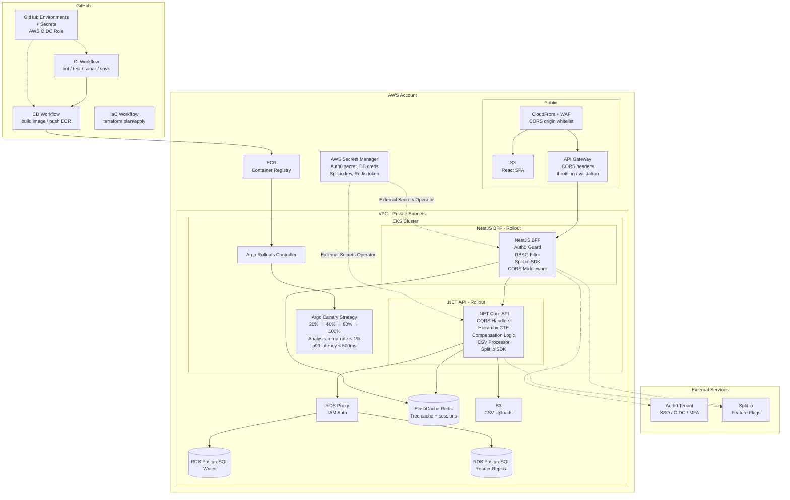

### CORS -- 3 Layers

| Layer | Mechanism | Purpose |
|-------|-----------|---------|
| CloudFront | Origin whitelist (`app.yourdomain.com`) | Block unknown origins at CDN edge |
| API Gateway | `Access-Control-Allow-Origin`, `Allow-Methods`, `Allow-Headers` per stage | AWS-level enforcement |
| NestJS | `@nestjs/cors` middleware with origin validation | App-level defense-in-depth |

### Secrets Strategy

| Secret | Storage | Access Method |
|--------|---------|---------------|
| Auth0 client ID/secret | AWS Secrets Manager | External Secrets Operator → K8s Secret |
| DB credentials | AWS Secrets Manager | RDS Proxy IAM auth (no password in app) |
| Split.io server key | AWS Secrets Manager | External Secrets Operator |
| Redis auth token | AWS Secrets Manager | External Secrets Operator |
| Terraform state encryption | AWS KMS | IAM role |
| GitHub → AWS auth | GitHub OIDC provider | Assume IAM role via OIDC (no static keys) |
| Signing keys, JWTs | Auth0 managed | Never stored by us |

### GitHub Workflows

| Workflow | Trigger | Steps |
|----------|---------|-------|
| `ci.yml` | PR to `main` | lint, unit test, integration test, SonarQube scan, Snyk security scan |
| `cd-deploy.yml` | merge to `main` | build Docker images, push to ECR, update Argo Rollout image tag |
| `infra.yml` | changes to `terraform/` | `terraform plan` on PR, `terraform apply` on merge |
| `db-migrate.yml` | manual dispatch | run EF Core migrations against RDS |

### Argo Rollouts + Split.io Integration

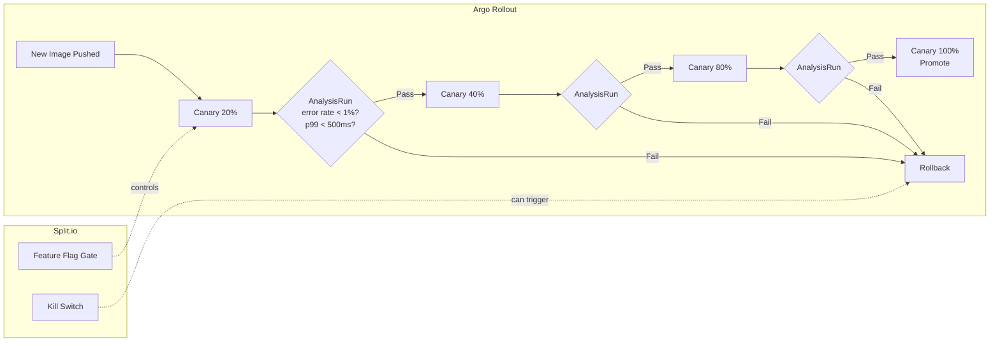

---

## 4. Data Model

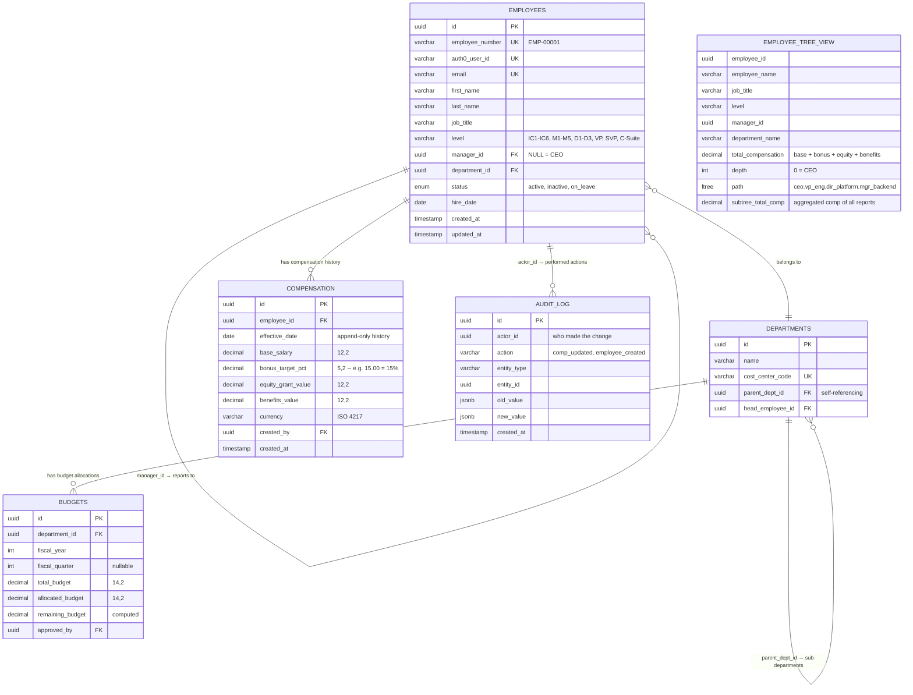

### Key Design Decisions

- **`LTREE` extension** -- PostgreSQL ltree enables queries like "give me everyone under this manager at any depth" with O(1) index lookup instead of recursive CTE traversal.
- **Materialized view `employee_tree_view`** -- CQRS read model. `subtree_total_comp` is pre-aggregated. Refreshed asynchronously on org changes.
- **Compensation is append-only** -- `effective_date` creates history. Current comp = latest `effective_date <= NOW()`. No updates, no deletes. Audit-friendly and SOX-compliant.
- **Audit log with JSONB diff** -- Every compensation or hierarchy change logged with before/after values.
- **Unique constraint** on `(employee_id, effective_date)` prevents duplicate comp entries for the same date.

---

## 5. RBAC & Auth Deep-Dive

### Auth0 Token Flow

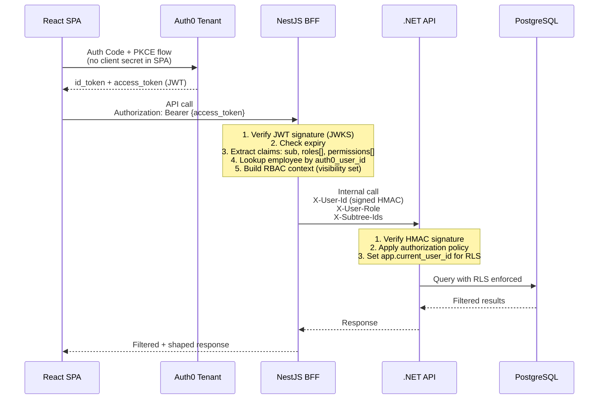

### Role Hierarchy

| Auth0 Role | Visibility Scope |
|------------|-----------------|
| `CEO` | Entire organization tree |
| `C_SUITE` | Their division + all reports recursively |
| `VP` | Their org + all reports recursively |
| `DIRECTOR` | Their department + all reports |
| `MANAGER` | Direct and indirect reports only |
| `IC` | Own compensation only |
| `HR_ADMIN` | Everyone (read-only, for HR operations) |
| `FINANCE_ADMIN` | Budget data only, no individual compensation |

### RBAC Enforcement -- 3 Layers (Defense in Depth)

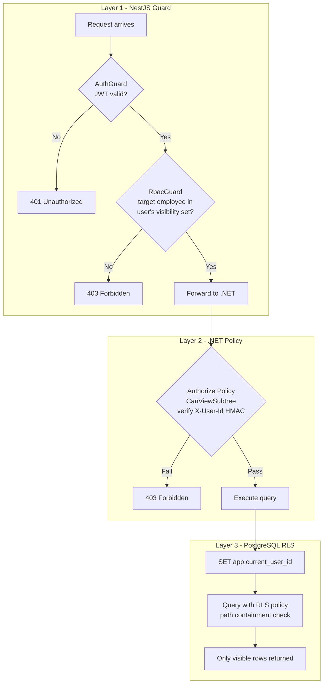

**Layer 1: NestJS Guard (gateway-level)**

```typescript
// Pseudocode
@UseGuards(AuthGuard, RbacGuard)
@Get('/hierarchy/:employeeId')
getSubtree(@CurrentUser() user: UserContext) {
  // RbacGuard checks: is targetEmployeeId within user's subtree?
  // If not, 403 before .NET is ever called
}
```

The NestJS BFF computes the user's "visibility set" on login -- the list of employee IDs this user is allowed to see. For a manager, this is their recursive subtree. Cached in Redis keyed by `rbac:{employee_id}`.

**Layer 2: .NET API (service-level)**

```csharp
// Pseudocode
[Authorize(Policy = "CanViewSubtree")]
public async Task<HierarchyResponse> GetSubtree(Guid rootId)
{
    // Policy handler verifies X-User-Id HMAC signature
    // Even if NestJS is compromised, .NET blocks unauthorized access
}
```

**Layer 3: PostgreSQL RLS (data-level)**

```sql
ALTER TABLE employee_tree_view ENABLE ROW LEVEL SECURITY;

CREATE POLICY subtree_visibility ON employee_tree_view
  FOR SELECT
  USING (
    path <@ (
      SELECT path FROM employee_tree_view
      WHERE employee_id = current_setting('app.current_user_id')::UUID
    )
  );
```

### Interview Talking Points

- **3-layer RBAC is not redundant** -- defense-in-depth. If NestJS is compromised (SSRF), .NET blocks. If .NET has a bug, RLS prevents data leakage at DB level.
- **PKCE flow** -- SPA cannot store client secrets. Auth Code + PKCE is the only correct choice. Implicit flow is deprecated per OAuth 2.1.
- **Internal header signing** -- NestJS signs `X-User-Id` and `X-Subtree-Ids` with HMAC. .NET verifies. Prevents header injection if someone bypasses NestJS.
- **Visibility set caching** -- Computing recursive subtree on every request is expensive. Cache in Redis with TTL, invalidate on org structure changes.

---


## 6. API Design

### 6.1 Versioning Strategy

All APIs use URI-path versioning (`/v1/`). The BFF and backend API are versioned independently — the BFF may advance to `/v2/` while the backend remains on `/v1/` if only the frontend contract changes.

**Deprecation policy:** A deprecated version receives 90 days of support with a `Sunset` header on every response. Clients receive a `Deprecation: true` header once a successor version is stable.

### 6.2 API Layers

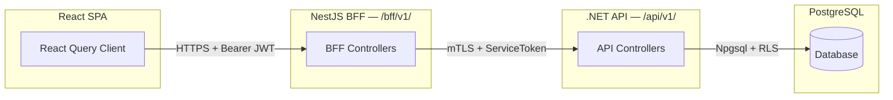

### 6.3 Standard Error Contract (RFC 7807)

All error responses conform to RFC 7807 Problem Details:

```json
{
  "type": "https://api.budgetalloc.internal/errors/insufficient-budget",
  "title": "Insufficient Budget",
  "status": 422,
  "detail": "Department Engineering has $12,000 remaining but allocation requires $15,000.",
  "instance": "/api/v1/budgets/dept-42/allocations",
  "traceId": "00-abcdef1234567890-abcdef12-01",
  "errors": {
    "amount": ["Exceeds remaining departmental budget by $3,000"]
  }
}
```

The `traceId` field carries the W3C Trace Context identifier, enabling correlation from the SPA through BFF and backend to the database.

### 6.4 Rate Limiting Tiers

| Tier | Applies To | Window | Limit | Scope |
|------|-----------|--------|-------|-------|
| **Standard** | Authenticated users | 1 min | 120 req | Per user |
| **Elevated** | HR Admins / Finance | 1 min | 300 req | Per user |
| **Service** | BFF → .NET internal | 1 min | 2000 req | Per service identity |
| **Burst** | CSV import endpoint | 1 hour | 10 req | Per user |
| **Anonymous** | Health/readiness probes | 1 min | 60 req | Per IP |

Rate limit state is stored in Redis using a sliding-window counter (`RATELIMIT:{tier}:{identity}:{window}`). Responses include `X-RateLimit-Limit`, `X-RateLimit-Remaining`, and `X-RateLimit-Reset` headers.

### 6.5 Pagination Strategy

All list endpoints use **cursor-based pagination** to maintain stable ordering across concurrent writes:

```
GET /bff/v1/employees?cursor=eyJpZCI6MTUwMH0&limit=50
```

**Cursor structure:** Base64-encoded JSON containing the sort key(s). For employee listing, this is `{"id": 1500}`. For compensation history (time-ordered), it is `{"effectiveDate": "2024-01-15", "id": 9832}`.

**Response envelope:**

```json
{
  "data": [ /* items */ ],
  "pagination": {
    "cursor": "eyJpZCI6MTU1MH0",
    "hasMore": true,
    "totalCount": 5342
  }
}
```

`totalCount` is returned from a cached approximate count (updated every 60s via `pg_stat_user_tables.n_live_tup`) to avoid expensive `COUNT(*)` on every request.

### 6.6 NestJS BFF Endpoint Table

| Method | Path | Auth | Description | Cache TTL |
|--------|------|------|-------------|-----------|
| `GET` | `/bff/v1/hierarchy/tree` | RBAC: any | Full visible hierarchy tree (RLS-filtered) | 5 min |
| `GET` | `/bff/v1/hierarchy/subtree/:nodeId` | RBAC: any | Subtree rooted at `nodeId` with rollup | 5 min |
| `GET` | `/bff/v1/employees` | RBAC: any | Paginated employee list (cursor) | 2 min |
| `GET` | `/bff/v1/employees/:id` | RBAC: any | Single employee with compensation summary | 2 min |
| `GET` | `/bff/v1/employees/:id/compensation/history` | RBAC: manager+ | Append-only compensation history (cursor) | none |
| `POST` | `/bff/v1/employees` | RBAC: hr_admin | Create employee | — |
| `PUT` | `/bff/v1/employees/:id` | RBAC: hr_admin | Update employee profile | — |
| `POST` | `/bff/v1/employees/:id/compensation` | RBAC: hr_admin | Append compensation record | — |
| `GET` | `/bff/v1/budgets/:deptId` | RBAC: finance, manager | Department budget with rollup | 5 min |
| `POST` | `/bff/v1/budgets/:deptId/allocations` | RBAC: finance | Allocate budget to employee/sub-dept | — |
| `POST` | `/bff/v1/imports/csv` | RBAC: hr_admin | Upload CSV for bulk employee import | — |
| `GET` | `/bff/v1/imports/:jobId/status` | RBAC: hr_admin | Poll import job status | none |

### 6.7 .NET Backend API Endpoint Table

| Method | Path | Auth | Description |
|--------|------|------|-------------|
| `GET` | `/api/v1/hierarchy/subtree/{nodeId}` | Service token + RLS context | Subtree query via ltree read model |
| `GET` | `/api/v1/employees` | Service token + RLS context | Filtered employee list |
| `GET` | `/api/v1/employees/{id}` | Service token + RLS context | Employee detail with compensation |
| `GET` | `/api/v1/employees/{id}/compensation` | Service token + RLS context | Compensation history (append-only) |
| `POST` | `/api/v1/employees` | Service token | Create employee (write model) |
| `PUT` | `/api/v1/employees/{id}` | Service token | Update employee |
| `POST` | `/api/v1/employees/{id}/compensation` | Service token | Append compensation event |
| `POST` | `/api/v1/employees/{id}/transfer` | Service token | Transfer employee (triggers OrgStructureChanged) |
| `GET` | `/api/v1/budgets/{deptId}` | Service token + RLS context | Budget with aggregated allocations |
| `POST` | `/api/v1/budgets/{deptId}/allocations` | Service token | Create budget allocation |
| `POST` | `/api/v1/imports/csv` | Service token | Process parsed CSV payload |

### 6.8 Request/Response Examples

**Get Hierarchy Subtree**

```
GET /bff/v1/hierarchy/subtree/dept-engineering?depth=3&includeBudget=true
Authorization: Bearer eyJhbGciOi...
```

```json
{
  "data": {
    "id": "dept-engineering",
    "name": "Engineering",
    "type": "department",
    "path": "org.engineering",
    "totalCompensation": 4250000,
    "headcount": 87,
    "budgetAllocated": 5000000,
    "budgetRemaining": 750000,
    "children": [
      {
        "id": "dept-platform",
        "name": "Platform",
        "type": "department",
        "path": "org.engineering.platform",
        "totalCompensation": 1800000,
        "headcount": 32,
        "budgetAllocated": 2100000,
        "budgetRemaining": 300000,
        "children": [
          {
            "id": "emp-1042",
            "name": "Jane Chen",
            "type": "employee",
            "path": "org.engineering.platform",
            "title": "Staff Engineer",
            "totalCompensation": 285000,
            "children": []
          }
        ]
      }
    ]
  },
  "meta": {
    "depth": 3,
    "generatedAt": "2024-06-15T10:23:45Z",
    "cacheHit": true,
    "cacheAge": 142
  }
}
```

**Append Compensation Record**

```
POST /bff/v1/employees/emp-1042/compensation
Authorization: Bearer eyJhbGciOi...
Content-Type: application/json

{
  "effectiveDate": "2024-07-01",
  "baseSalary": 195000,
  "bonus": 40000,
  "equity": 50000,
  "reason": "annual_review",
  "notes": "Promoted to Staff Engineer"
}
```

```json
{
  "data": {
    "id": "comp-88431",
    "employeeId": "emp-1042",
    "effectiveDate": "2024-07-01",
    "baseSalary": 195000,
    "bonus": 40000,
    "equity": 50000,
    "totalCompensation": 285000,
    "reason": "annual_review",
    "createdAt": "2024-06-15T10:30:00Z",
    "createdBy": "user-admin-7"
  }
}
```

**Allocate Budget**

```
POST /bff/v1/budgets/dept-platform/allocations
Authorization: Bearer eyJhbGciOi...
Content-Type: application/json

{
  "targetType": "employee",
  "targetId": "emp-1042",
  "amount": 15000,
  "category": "equity_refresh",
  "fiscalYear": 2025
}
```

```json
{
  "data": {
    "id": "alloc-5521",
    "departmentId": "dept-platform",
    "targetType": "employee",
    "targetId": "emp-1042",
    "amount": 15000,
    "category": "equity_refresh",
    "fiscalYear": 2025,
    "departmentBudgetRemaining": 285000,
    "createdAt": "2024-06-15T10:35:00Z"
  }
}
```

### 6.9 Sequence Diagram: Get Hierarchy Subtree

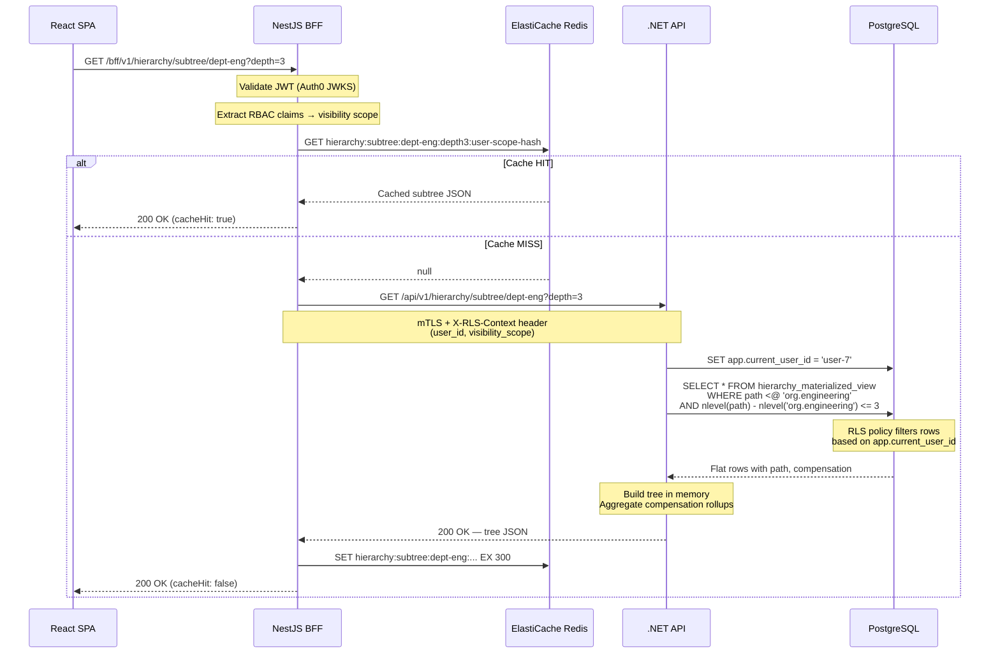

---

## 7. Hierarchy Tree Query Strategy

### 7.1 Approach Comparison

The platform must query a tree of 5000+ employee/department nodes with aggregated compensation rollups. Three strategies were evaluated:

| Criterion | Recursive CTE | ltree | Closure Table |
|-----------|--------------|-------|---------------|
| **Read: subtree query** | O(n) — recurse from root | O(log n) — `path <@ 'prefix'` GiST index | O(1) lookup, O(n) join |
| **Read: ancestor query** | O(depth) recursion | O(1) — `path @> 'prefix'` | O(1) lookup |
| **Write: insert node** | O(1) | O(1) — compute path from parent | O(depth) — insert ancestor rows |
| **Write: move subtree** | O(1) — update parent_id | O(n) — update all descendant paths | O(n²) worst case — delete+reinsert |
| **Storage overhead** | None (self-referential FK) | Path column (~100 bytes/row) | O(n × depth) rows in closure |
| **Index support** | B-tree on parent_id | GiST on ltree column | B-tree on (ancestor, descendant) |
| **Aggregation** | Requires recursive scan | Single query with `GROUP BY` on path prefix | Join-heavy aggregation |
| **PostgreSQL native** | Yes | Extension (`CREATE EXTENSION ltree`) | Yes (table design pattern) |

### 7.2 Decision: CQRS with Dual Strategy

**Write model (normalized):** Recursive CTE on the canonical `employees` table with `parent_id` foreign key. This is the source of truth. Writes are simple O(1) parent pointer updates.

**Read model (materialized):** `ltree`-based materialized view pre-computed from the recursive CTE. All read queries hit this view. The GiST index on the `path` column makes subtree queries sub-millisecond even at 50,000 nodes.

**Why not closure table:** At 5000 nodes with average depth 6, the closure table would require ~30,000 rows. More critically, subtree moves (employee transfers between departments) require deleting and reinserting O(n × depth) rows — unacceptable for a platform where org restructuring is a first-class operation.

### 7.3 Write Model: Canonical Table

```sql
CREATE TABLE employees (
    id UUID PRIMARY KEY DEFAULT gen_random_uuid(),
    parent_id UUID REFERENCES employees(id),
    employee_number VARCHAR(20) UNIQUE NOT NULL,
    name TEXT NOT NULL,
    title TEXT,
    department_id UUID REFERENCES departments(id),
    node_type VARCHAR(20) NOT NULL CHECK (node_type IN ('employee', 'department', 'team')),
    created_at TIMESTAMPTZ DEFAULT now(),
    updated_at TIMESTAMPTZ DEFAULT now()
);

CREATE INDEX idx_employees_parent ON employees(parent_id);

-- Append-only compensation (write model)
CREATE TABLE compensation_history (
    id UUID PRIMARY KEY DEFAULT gen_random_uuid(),
    employee_id UUID NOT NULL REFERENCES employees(id),
    effective_date DATE NOT NULL,
    base_salary NUMERIC(12,2) NOT NULL,
    bonus NUMERIC(12,2) DEFAULT 0,
    equity NUMERIC(12,2) DEFAULT 0,
    total_compensation NUMERIC(12,2) GENERATED ALWAYS AS (base_salary + bonus + equity) STORED,
    reason VARCHAR(50) NOT NULL,
    notes TEXT,
    created_at TIMESTAMPTZ DEFAULT now(),
    created_by UUID NOT NULL
);

CREATE INDEX idx_comp_history_employee_date
    ON compensation_history(employee_id, effective_date DESC);
```

### 7.4 Recursive CTE (Write Path — Used for Materialized View Refresh)

```sql
-- This CTE is the source query for the materialized view.
-- It runs on refresh, not on every read.

WITH RECURSIVE org_tree AS (
    -- Anchor: root nodes (no parent)
    SELECT
        e.id,
        e.parent_id,
        e.name,
        e.node_type,
        e.department_id,
        e.id::TEXT::ltree AS path,
        0 AS depth
    FROM employees e
    WHERE e.parent_id IS NULL

    UNION ALL

    -- Recursive: children
    SELECT
        child.id,
        child.parent_id,
        child.name,
        child.node_type,
        child.department_id,
        (parent.path || child.id::TEXT)::ltree AS path,
        parent.depth + 1
    FROM employees child
    INNER JOIN org_tree parent ON child.parent_id = parent.id
),
latest_compensation AS (
    SELECT DISTINCT ON (employee_id)
        employee_id,
        total_compensation,
        effective_date
    FROM compensation_history
    ORDER BY employee_id, effective_date DESC, created_at DESC
)
SELECT
    t.id,
    t.parent_id,
    t.name,
    t.node_type,
    t.department_id,
    t.path,
    t.depth,
    COALESCE(c.total_compensation, 0) AS individual_compensation
FROM org_tree t
LEFT JOIN latest_compensation c ON c.employee_id = t.id;
```

### 7.5 Materialized View (Read Model)

```sql
CREATE MATERIALIZED VIEW hierarchy_mv AS
    -- (the CTE above)
    WITH RECURSIVE org_tree AS ( ... )
    SELECT ... ;

-- GiST index is what makes ltree queries fast
CREATE INDEX idx_hierarchy_mv_path_gist ON hierarchy_mv USING GIST (path);
CREATE INDEX idx_hierarchy_mv_path_btree ON hierarchy_mv USING BTREE (path);
CREATE UNIQUE INDEX idx_hierarchy_mv_id ON hierarchy_mv (id);
```

**Read query (subtree with rollup):**

```sql
-- Get subtree rooted at a node with compensation rollup
SELECT
    h.*,
    (
        SELECT COALESCE(SUM(sub.individual_compensation), 0)
        FROM hierarchy_mv sub
        WHERE sub.path <@ h.path
    ) AS subtree_total_compensation,
    (
        SELECT COUNT(*)
        FROM hierarchy_mv sub
        WHERE sub.path <@ h.path AND sub.node_type = 'employee'
    ) AS subtree_headcount
FROM hierarchy_mv h
WHERE h.path <@ (SELECT path FROM hierarchy_mv WHERE id = $1)
  AND nlevel(h.path) - nlevel((SELECT path FROM hierarchy_mv WHERE id = $1)) <= $2
ORDER BY h.path;
```

### 7.6 Materialized View Refresh Strategy

The materialized view is refreshed **asynchronously via domain events**, not on a fixed schedule:

| Trigger Event | Refresh Type | Latency Target |
|--------------|--------------|----------------|
| `OrgStructureChanged` (transfer, new hire, termination) | `REFRESH MATERIALIZED VIEW CONCURRENTLY` | < 5 seconds |
| `CompensationUpdated` | `REFRESH MATERIALIZED VIEW CONCURRENTLY` | < 10 seconds |
| `CSVImportCompleted` | Full refresh (non-concurrent OK for bulk) | < 30 seconds |
| Scheduled fallback | Concurrent refresh | Every 15 minutes |

`CONCURRENTLY` requires the unique index on `id` and allows reads during refresh. The 15-minute fallback catches any missed events.

**Debouncing:** During bulk operations (CSV import of 500 employees), the event consumer debounces refresh requests — it waits 2 seconds after the last event before triggering a single refresh.

### 7.7 Query Plan Analysis

For the subtree query `WHERE path <@ 'org.engineering'` on 5000 rows:

```
Bitmap Heap Scan on hierarchy_mv  (cost=4.28..52.15 rows=87 width=312)
  Recheck Cond: (path <@ 'org.engineering'::ltree)
  ->  Bitmap Index Scan on idx_hierarchy_mv_path_gist  (cost=0.00..4.26 rows=87 width=0)
        Index Cond: (path <@ 'org.engineering'::ltree)
Planning Time: 0.12 ms
Execution Time: 0.45 ms
```

The GiST index on `ltree` turns a recursive tree walk into a flat index scan. At 5000 nodes, this query returns in under 1ms. At 50,000 nodes, benchmarks show < 5ms.

### 7.8 Tree Query System Flow

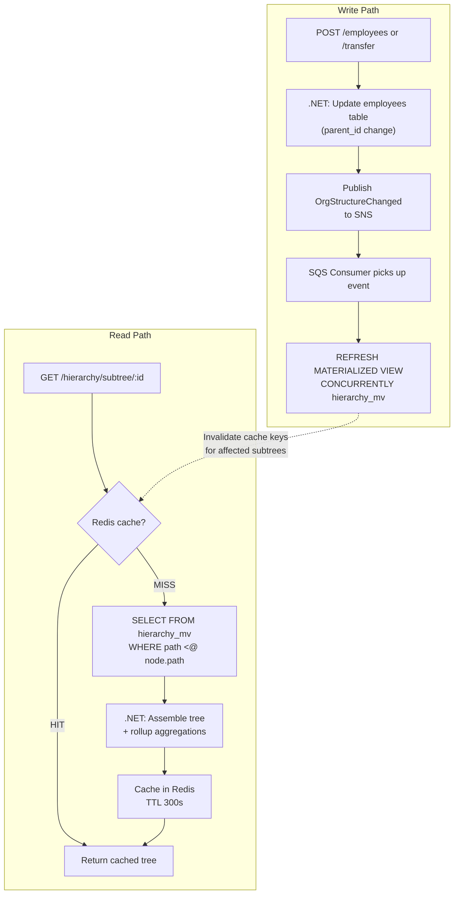

---

## 8. Caching Strategy

### 8.1 Redis Key Design

All keys follow the pattern `{namespace}:{entity}:{identifier}:{qualifier}`:

| Key Pattern | Example | Value Type | TTL |
|------------|---------|------------|-----|
| `hierarchy:subtree:{nodeId}:{depth}:{scopeHash}` | `hierarchy:subtree:dept-eng:3:a1b2c3` | JSON string | 300s |
| `hierarchy:tree:full:{scopeHash}` | `hierarchy:tree:full:x9y8z7` | JSON string | 300s |
| `rbac:visibility:{userId}` | `rbac:visibility:user-42` | Set of node IDs | 600s |
| `comp:aggregate:{nodeId}` | `comp:aggregate:dept-eng` | JSON (total, headcount) | 300s |
| `comp:history:{employeeId}:page:{cursor}` | `comp:history:emp-1042:page:eyJpZCI6MX0` | JSON string | 120s |
| `employee:detail:{id}` | `employee:detail:emp-1042` | JSON string | 120s |
| `budget:dept:{deptId}:{fiscalYear}` | `budget:dept:dept-eng:2025` | JSON string | 300s |
| `ratelimit:{tier}:{identity}:{window}` | `ratelimit:standard:user-42:1718450400` | Counter | 120s |
| `import:status:{jobId}` | `import:status:job-991` | JSON (progress) | 3600s |

**`scopeHash`** is a SHA-256 truncation of the user's RBAC visibility scope, ensuring that two users with different visibility get independent cache entries rather than leaking data through shared cache keys.

### 8.2 Cache-Aside Pattern (Reads)

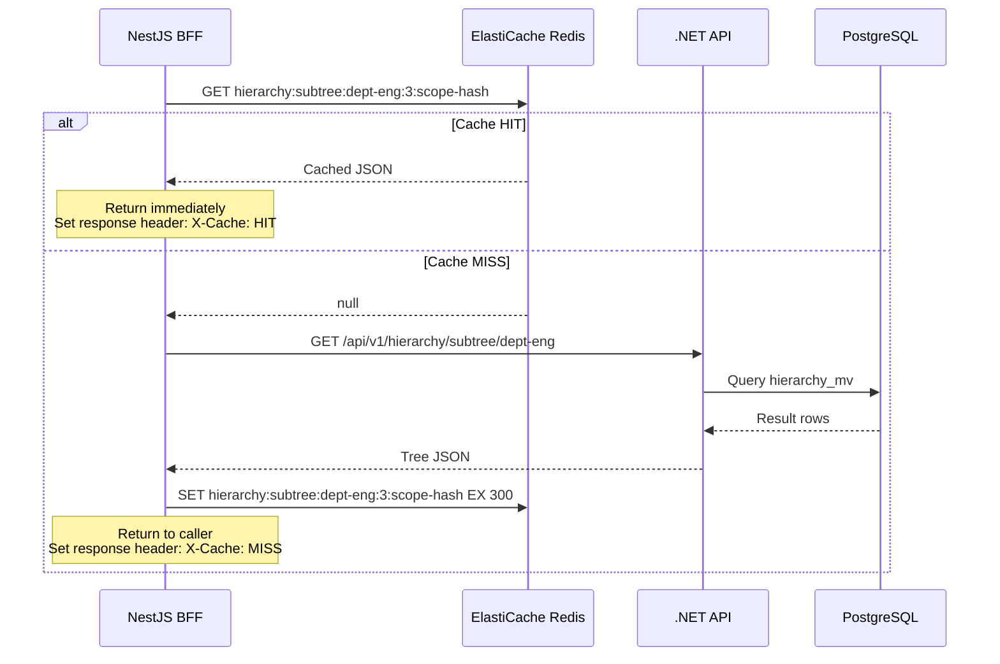

### 8.3 Write-Through Invalidation

When the org structure or compensation data changes, the .NET API publishes a domain event. The cache invalidation consumer uses **pattern-based deletion** to clear all affected keys:

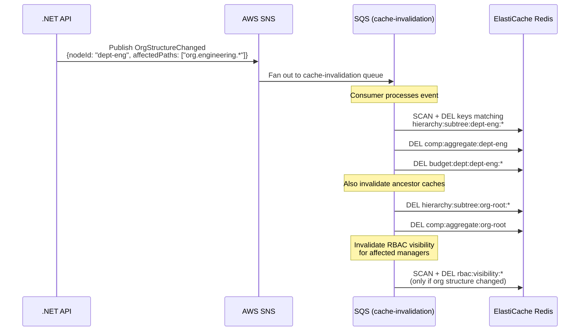

**Why SCAN + DEL instead of key tags:** ElastiCache in cluster mode doesn't support `KEYS` glob across shards. We use `SCAN` with a match pattern in the invalidation consumer (background, non-blocking). For hot paths, we maintain a Redis Set of related cache keys per subtree root to enable O(1) batch invalidation:

```
SADD hierarchy:keys:dept-eng "hierarchy:subtree:dept-eng:3:a1b2" "hierarchy:subtree:dept-eng:5:c3d4"
```

On invalidation, `SMEMBERS` + pipeline `DEL` clears all entries in a single round-trip.

### 8.4 TTL Strategy

| Cache Type | TTL | Rationale |
|-----------|-----|-----------|
| Hierarchy subtree | 300s (5 min) | Org changes are infrequent; event-driven invalidation handles freshness |
| RBAC visibility set | 600s (10 min) | Role changes are rare; longer TTL reduces Auth0/DB lookups |
| Compensation aggregates | 300s (5 min) | Aligned with hierarchy cache; invalidated together |
| Employee detail | 120s (2 min) | Individual records change more frequently |
| Compensation history pages | 120s (2 min) | Append-only but cursor-paginated; short TTL avoids stale pages |
| Budget data | 300s (5 min) | Budget allocations are batched operations |
| Import job status | 3600s (1 hour) | Polling endpoint; cleaned up after job completes |

### 8.5 Cache Warming on Deployment

During a rolling deployment (Argo Rollouts canary), the new pod version executes a cache warming routine in its startup lifecycle hook:

1. **Readiness probe blocks** until warming completes (max 30s timeout).
2. Warm the **top 3 levels of the hierarchy tree** — this covers the most common dashboard view.
3. Warm **RBAC visibility sets** for service accounts used by monitoring.
4. If Redis was flushed (e.g., cluster maintenance), the `/ready` endpoint returns 503 for up to 60 seconds while the warming completes, preventing Argo from routing traffic to a cold instance.

```typescript
// NestJS lifecycle hook — cache warming
@Injectable()
export class CacheWarmingService implements OnModuleInit {
  async onModuleInit() {
    const rootDepartments = await this.apiClient.getHierarchy({ depth: 3 });
    await this.redis.set(
      `hierarchy:tree:full:system`,
      JSON.stringify(rootDepartments),
      'EX', 300,
    );

    // Warm top departments individually
    for (const dept of rootDepartments.children) {
      await this.redis.set(
        `hierarchy:subtree:${dept.id}:3:system`,
        JSON.stringify(dept),
        'EX', 300,
      );
    }
  }
}
```

### 8.6 Graceful Degradation When Redis Is Down

See Section 10.3 for the full degradation matrix. In short: all cache reads fall through to the .NET API. The BFF sets a local in-memory flag (`redisAvailable = false`) and bypasses cache writes to avoid connection timeout overhead. A background health check polls Redis every 5 seconds to re-enable caching.

---

## 9. Event-Driven Architecture

### 9.1 Domain Events

| Event | Producer | Payload Key Fields | Consumers |
|-------|----------|-------------------|-----------|
| `OrgStructureChanged` | .NET API | `nodeId`, `changeType` (transfer, create, delete), `oldParentId`, `newParentId`, `affectedPaths[]` | MV refresh, cache invalidation, audit log |
| `CompensationUpdated` | .NET API | `employeeId`, `compensationId`, `oldTotal`, `newTotal`, `reason` | MV refresh, cache invalidation, audit log |
| `EmployeeCreated` | .NET API | `employeeId`, `parentId`, `departmentId`, `name` | MV refresh, cache invalidation, audit log |
| `BudgetAllocated` | .NET API | `departmentId`, `targetId`, `amount`, `category`, `fiscalYear`, `remainingBudget` | Cache invalidation, audit log, budget alerts |
| `CSVImportCompleted` | .NET API | `jobId`, `recordsProcessed`, `recordsFailed`, `errors[]` | MV refresh (full), notification service |

### 9.2 Event Schema & Versioning

All events use a versioned envelope schema:

```json
{
  "eventId": "evt-a1b2c3d4-e5f6-7890-abcd-ef1234567890",
  "eventType": "CompensationUpdated",
  "version": 2,
  "timestamp": "2024-06-15T10:30:00.000Z",
  "source": "budget-allocation-api",
  "correlationId": "req-xyz-789",
  "traceId": "00-abcdef1234567890-abcdef12-01",
  "actor": {
    "userId": "user-admin-7",
    "roles": ["hr_admin"]
  },
  "data": {
    "employeeId": "emp-1042",
    "compensationId": "comp-88431",
    "oldTotal": 240000,
    "newTotal": 285000,
    "reason": "annual_review",
    "effectiveDate": "2024-07-01"
  },
  "metadata": {
    "schemaVersion": "2.0",
    "producerVersion": "1.4.2"
  }
}
```

**Versioning strategy:** Consumers tolerate unknown fields (forward-compatible). Breaking changes increment the major `version` field and are published to a new SNS topic suffix (`-v2`). Consumers subscribe to both topics during migration windows.

### 9.3 Event Flow Architecture

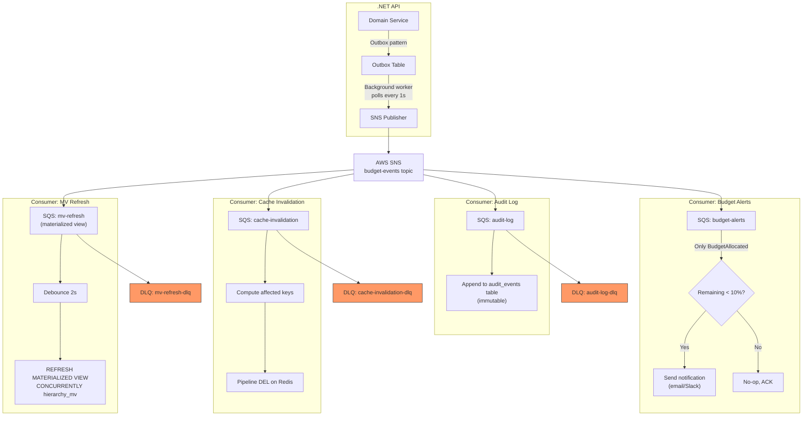

### 9.4 Outbox Pattern

To guarantee at-least-once delivery without distributed transactions, the .NET API uses the **transactional outbox pattern**:

1. The domain operation and the outbox insert happen in a **single database transaction**.
2. A background `OutboxPublisher` worker polls the `outbox_events` table every 1 second for unpublished events.
3. It publishes to SNS and marks the row as `published_at = now()`.
4. A cleanup job deletes published events older than 7 days.

```sql
CREATE TABLE outbox_events (
    id UUID PRIMARY KEY DEFAULT gen_random_uuid(),
    event_type VARCHAR(100) NOT NULL,
    event_payload JSONB NOT NULL,
    created_at TIMESTAMPTZ DEFAULT now(),
    published_at TIMESTAMPTZ,
    retry_count INT DEFAULT 0
);

CREATE INDEX idx_outbox_unpublished
    ON outbox_events(created_at)
    WHERE published_at IS NULL;
```

### 9.5 Dead Letter Queue Handling

Each SQS queue has an associated DLQ with the following configuration:

| Queue | Max Receives | DLQ Retention | Alert Threshold |
|-------|-------------|---------------|-----------------|
| `mv-refresh` | 3 | 14 days | > 1 message |
| `cache-invalidation` | 5 | 7 days | > 10 messages |
| `audit-log` | 3 | 14 days | > 1 message |
| `budget-alerts` | 3 | 7 days | > 5 messages |

**DLQ processing workflow:**

1. CloudWatch alarm fires when DLQ depth > threshold.
2. On-call engineer inspects messages via AWS Console or CLI.
3. Messages can be replayed to the source queue using the SQS DLQ redrive feature.
4. For `mv-refresh` DLQ messages, a manual `REFRESH MATERIALIZED VIEW CONCURRENTLY` is triggered as an immediate mitigation.

### 9.6 Idempotency

All consumers are idempotent. The `eventId` field is used as an idempotency key:

- **MV refresh consumer:** Debounce already handles duplicate events. A refresh is a full recomputation — running it twice is safe.
- **Cache invalidation consumer:** Deleting an already-deleted key is a no-op.
- **Audit log consumer:** Maintains an `audit_event_ids` unique index. Duplicate inserts fail gracefully with `ON CONFLICT DO NOTHING`.

---

## 10. Error Handling & Resilience

### 10.1 Circuit Breaker: NestJS ↔ .NET

The BFF implements a circuit breaker (using `opossum` or equivalent) for all calls to the .NET backend API:

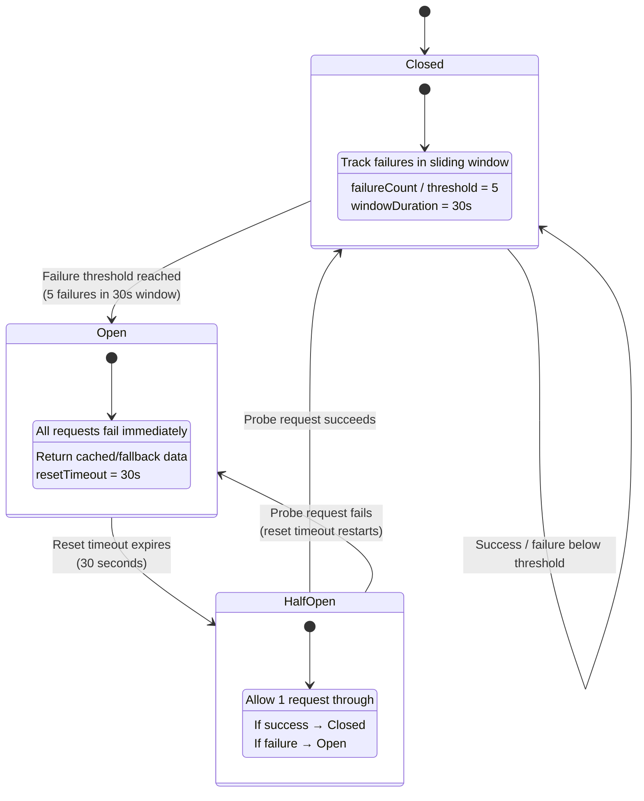

**Configuration:**

```typescript
// NestJS circuit breaker configuration
const circuitBreakerOptions = {
  timeout: 5000,           // 5s per request timeout
  errorThresholdPercentage: 50,  // Open if 50%+ fail
  resetTimeout: 30000,     // 30s before half-open probe
  rollingCountTimeout: 30000,    // 30s sliding window
  rollingCountBuckets: 6,  // 5s granularity buckets
  volumeThreshold: 5,      // Minimum 5 requests before tripping
};
```

### 10.2 Retry Policies

| Call Path | Strategy | Max Retries | Backoff | Jitter |
|-----------|----------|-------------|---------|--------|
| BFF → .NET API | Exponential backoff | 3 | 200ms, 400ms, 800ms | ±50ms |
| .NET → PostgreSQL | Exponential backoff | 3 | 100ms, 200ms, 400ms | ±25ms |
| .NET → SNS publish | Exponential backoff | 5 | 500ms, 1s, 2s, 4s, 8s | ±100ms |
| SQS consumer → handler | SQS native retry | 3 (via maxReceiveCount) | Visibility timeout: 30s | — |
| BFF → Redis | No retry (fail open) | 0 | — | — |

**Redis has no retries by design:** A failed cache read should fall through to the API, not add latency via retries. Redis failures are treated as cache misses.

### 10.3 Graceful Degradation Matrix

| Component Down | Impact | Mitigation |
|---------------|--------|------------|
| **Redis (ElastiCache)** | No caching; all reads hit .NET API | BFF detects via health check, sets `redisAvailable=false`, bypasses cache read/write to avoid timeout overhead. All requests served from API directly. Latency increases ~50ms. |
| **.NET API** | No data access | Circuit breaker opens after 5 failures. BFF returns **stale cached data** if available in Redis (ignoring TTL via `GET` without expiry check). If no cache: returns `503 Service Unavailable` with `Retry-After` header. |
| **PostgreSQL** | Full outage | .NET health check fails → pods marked unhealthy → EKS stops routing. BFF circuit breaker opens. Stale Redis cache serves reads. Writes return 503. |
| **SNS/SQS** | Events not published | Outbox table retains events. Background publisher retries with backoff. Materialized view serves stale data (max staleness = 15 min via scheduled refresh fallback). |
| **Auth0** | Cannot validate new JWTs | JWKS keys are cached locally with 24h TTL. Existing sessions continue. New logins fail. BFF returns `503` for unauthenticated requests with a user-friendly message. |
| **Split.io (Feature Flags)** | Cannot fetch flag state | SDK falls back to locally cached flag values. If no cache: defaults to `control` (off) treatment. Features gated behind flags degrade to disabled state. |

### 10.4 Dead Letter Queues for Failed Events

See Section 9.5 for DLQ configuration. Additional resilience considerations:

- **Poison message detection:** If a message reaches the DLQ, it is tagged with `ApproximateReceiveCount` and the original `eventType`. A Lambda function processes DLQ messages to extract correlation IDs and log them to CloudWatch with `SEVERITY=ERROR`.
- **Automated replay:** For `cache-invalidation` DLQ, an automated replay runs every 30 minutes. Cache invalidation is safe to replay because `DEL` is idempotent.
- **Manual replay with backpressure:** For `mv-refresh` DLQ, replay is manual and throttled to 1 message/second to prevent database overload from concurrent `REFRESH MATERIALIZED VIEW` operations.

### 10.5 Health Check Endpoints

All services expose three Kubernetes probe endpoints:

| Endpoint | Probe Type | Check | Failure Action |
|----------|-----------|-------|----------------|
| `/health` | General | Application is running | Informational only |
| `/ready` | Readiness | DB connected, cache warmed, dependencies reachable | Remove pod from Service endpoints; stop receiving traffic |
| `/live` | Liveness | Process not deadlocked, event loop responsive | Restart pod |

**NestJS BFF readiness checks:**

```typescript
@Controller('ready')
export class ReadinessController {
  @Get()
  async check(): Promise<HealthCheckResult> {
    return this.health.check([
      // .NET API reachable (circuit breaker not open)
      () => this.apiHealth.isHealthy('dotnet-api'),
      // Redis connected (degraded OK, not critical)
      () => this.redisHealth.isHealthy('redis', { optional: true }),
      // Cache warming complete
      () => this.cacheWarm.isHealthy('cache-warmed'),
    ]);
  }
}
```

**.NET API readiness checks:**

```csharp
builder.Services.AddHealthChecks()
    .AddNpgSql(connectionString, name: "postgresql",
        failureStatus: HealthStatus.Unhealthy,
        timeout: TimeSpan.FromSeconds(3))
    .AddSnsTopicHealth("budget-events", name: "sns",
        failureStatus: HealthStatus.Degraded)
    .AddCheck<MigrationHealthCheck>("migrations");
```

**Key distinction:** Redis is an `optional` dependency for the BFF readiness check. If Redis is down, the BFF is still ready (it serves uncached requests). But if the .NET API is unreachable *and* the circuit breaker is open, the BFF readiness check fails to prevent routing traffic to a pod that can only serve stale cache or errors.

### 10.6 Observability Integration

All resilience mechanisms emit structured telemetry:

| Event | Metric | Alert |
|-------|--------|-------|
| Circuit breaker state change | `circuit_breaker.state{service="dotnet-api"}` | PagerDuty on `OPEN` state |
| Cache miss rate | `cache.miss_rate{entity="hierarchy"}` | Warn if > 80% for 5 min |
| DLQ depth | `dlq.depth{queue="mv-refresh"}` | Page if > 0 for `mv-refresh` |
| Retry exhausted | `retry.exhausted{path="bff-to-api"}` | Error log with trace ID |
| Redis connection failure | `redis.connection.failure` | Warn after 3 consecutive failures |
| Outbox lag | `outbox.unpublished_count` | Page if > 100 messages |

---

## 11. Observability Stack

### 11.1 Guiding Principles

Observability is structured around three pillars — **logs**, **traces**, and **metrics** — unified by a **correlation ID** that originates at the React SPA and propagates through every layer. Every request is traceable from button click to database query.

### 11.2 Correlation ID Propagation

Every HTTP request entering the NestJS BFF generates (or forwards) a `X-Correlation-ID` header. This ID is:

1. Injected into all structured log entries as `correlationId`
2. Propagated as a W3C `traceparent` header to the .NET API
3. Included as a SQL comment via `pg_stat_activity` for database-level tracing
4. Attached to all SNS/SQS message attributes for async tracing

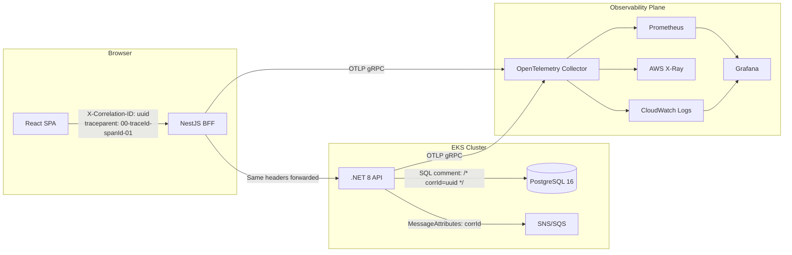

### 11.3 Structured Logging

All services emit **JSON-structured logs** to stdout, collected by Fluent Bit DaemonSets and forwarded to CloudWatch Logs.

**Log Schema (all services):**

```json
{
  "timestamp": "2025-01-15T10:23:45.123Z",
  "level": "info",
  "service": "budget-api",
  "correlationId": "550e8400-e29b-41d4-a716-446655440000",
  "traceId": "abc123def456",
  "spanId": "span789",
  "userId": "auth0|user123",
  "tenantId": "org_abc",
  "message": "Budget allocation completed",
  "context": {
    "handler": "AllocateBudgetCommandHandler",
    "nodeId": "eng.platform.team-alpha",
    "amount": 15000,
    "durationMs": 45
  }
}
```

**Per-Service Configuration:**

| Service | Library | Log Destination | Extras |
|---------|---------|-----------------|--------|
| React SPA | `pino` (browser build) | CloudWatch RUM / console | Client errors, performance entries |
| NestJS BFF | `nestjs-pino` | stdout → Fluent Bit → CloudWatch | Request/response logging (body redacted), Auth0 token claims |
| .NET 8 API | `Serilog` + `Serilog.Formatting.Compact` | stdout → Fluent Bit → CloudWatch | CQRS handler names, EF Core query tags |
| PostgreSQL | `pgAudit` extension | CloudWatch via RDS log export | DDL/DML audit, slow query log (>100ms) |

**Sensitive Data Handling:**
- PII fields (`email`, `salary`, `ssn`) are **never logged** — middleware strips them before serialization
- Auth tokens are logged as `[REDACTED]`; only `sub` and `org_id` claims are included
- Request/response bodies are logged at `debug` level only, with configurable field redaction

### 11.4 Distributed Tracing

**OpenTelemetry** is the instrumentation standard, with **AWS X-Ray** as the backend.

**Instrumentation per layer:**

| Layer | SDK | Auto-Instrumentation | Manual Spans |
|-------|-----|----------------------|--------------|
| React SPA | `@opentelemetry/sdk-trace-web` | `fetch`, `XMLHttpRequest` | Route transitions, Auth0 redirect |
| NestJS BFF | `@opentelemetry/sdk-node` | Express, HTTP, Redis, pg | RBAC evaluation, cache operations |
| .NET 8 API | `OpenTelemetry.Extensions.Hosting` | ASP.NET Core, EF Core, HttpClient | CQRS handlers, ltree queries, materialized view refresh |

**Trace context propagation chain:**

```
Browser (W3C traceparent)
  → ALB (X-Amzn-Trace-Id preserved)
    → NestJS (OpenTelemetry context extracted, new child span)
      → .NET API (traceparent forwarded, new child span)
        → PostgreSQL (trace ID in SQL comment)
      → Redis (span for cache get/set)
    → SNS (trace ID in MessageAttributes)
      → SQS → Lambda/Worker (trace continued)
```

### 11.5 Custom Metrics

All custom metrics are exposed via **Prometheus** format from each service, scraped by Prometheus server running in-cluster.

| Metric | Type | Labels | Source | Purpose |
|--------|------|--------|--------|---------|
| `tree_query_duration_seconds` | Histogram (buckets: 10ms, 50ms, 100ms, 250ms, 500ms, 1s) | `query_type` (ancestors, descendants, subtree), `depth` | .NET API | Track ltree query performance degradation |
| `cache_operations_total` | Counter | `operation` (hit, miss, set, evict), `cache_layer` (L1_memory, L2_redis) | NestJS + .NET | Cache effectiveness monitoring |
| `rbac_evaluation_duration_seconds` | Histogram | `policy_type` (tree_scope, role_check, delegation), `result` (allow, deny) | .NET API | Detect RBAC rule complexity issues |
| `auth0_token_validation_duration_seconds` | Histogram | `validation_type` (jwks_cached, jwks_fetch), `result` (valid, expired, invalid) | NestJS BFF | Detect JWKS endpoint latency |
| `budget_allocation_total` | Counter | `status` (success, insufficient_funds, validation_error, conflict), `org_level` | .NET API | Business KPI tracking |
| `materialized_view_refresh_duration_seconds` | Gauge | `view_name`, `refresh_type` (concurrent, full) | .NET API / pg_cron | Track MV staleness risk |
| `outbox_messages_pending` | Gauge | — | .NET API | Detect outbox processing lag |
| `sqs_message_age_seconds` | Histogram | `queue_name`, `event_type` | SQS Consumer | Detect async processing delays |

### 11.6 Grafana Dashboards

**Dashboard 1: System Health Overview**

| Panel | Visualization | Query Source |
|-------|--------------|-------------|
| Request rate by service | Time series | `rate(http_requests_total[5m])` grouped by `service` |
| Error rate % | Stat + threshold | `rate(http_requests_total{status=~"5.."}[5m]) / rate(http_requests_total[5m])` |
| p50 / p95 / p99 latency | Heatmap | `histogram_quantile(0.99, rate(http_request_duration_seconds_bucket[5m]))` |
| Pod restarts | Table | `kube_pod_container_status_restarts_total` |
| Node CPU/Memory | Gauge | `node_cpu_seconds_total`, `node_memory_MemAvailable_bytes` |

**Dashboard 2: Business Metrics**

| Panel | Visualization | Query Source |
|-------|--------------|-------------|
| Allocations per hour | Bar chart | `increase(budget_allocation_total[1h])` |
| Allocation failure rate | Pie chart | `budget_allocation_total` by `status` |
| Active users (DAU) | Stat | CloudWatch RUM or custom `active_sessions` gauge |
| Top 10 departments by spend | Table | PostgreSQL direct query (refreshed every 5m) |
| Budget utilization % | Gauge | Aggregated from materialized view |

**Dashboard 3: SLA & Performance**

| Panel | Visualization | Query Source |
|-------|--------------|-------------|
| SLA compliance (99.9% target) | Stat | `1 - (sum(http_requests_total{status=~"5.."})/sum(http_requests_total))` over 30d |
| Error budget remaining | Gauge | `(allowed_errors - actual_errors) / allowed_errors * 100` |
| Cache hit ratio | Time series | `cache_operations_total{operation="hit"} / (hit+miss)` |
| Tree query p99 | Time series | `histogram_quantile(0.99, tree_query_duration_seconds_bucket)` |
| Database connection pool utilization | Gauge | RDS Proxy metrics via CloudWatch |

**Dashboard 4: Security & Auth**

| Panel | Visualization | Query Source |
|-------|--------------|-------------|
| Auth failures per minute | Time series | `rate(auth0_token_validation_duration_seconds_count{result="invalid"}[1m])` |
| RBAC denials | Table (with user/resource) | `rbac_evaluation_duration_seconds_count{result="deny"}` |
| Failed login geo-map | Worldmap | CloudWatch Logs → Auth0 events |
| API rate limit hits | Counter | `rate_limit_exceeded_total` |
| Suspicious activity alerts | Alert list | Composite of auth + rate limit rules |

**Dashboard 5: Infrastructure**

| Panel | Visualization | Query Source |
|-------|--------------|-------------|
| EKS node count by AZ | Stat | `kube_node_info` |
| RDS CPU / IOPS / connections | Time series | CloudWatch RDS metrics |
| ElastiCache memory / evictions | Time series | CloudWatch ElastiCache metrics |
| SQS queue depth | Time series | CloudWatch SQS metrics |
| Outbox lag | Gauge | `outbox_messages_pending` |

### 11.7 Alerting Rules

| Alert | Condition | Severity | Action |
|-------|-----------|----------|--------|
| HighErrorRate | `error_rate > 1%` for 5m | P1 — Critical | PagerDuty → on-call |
| HighLatency | `p99 > 500ms` for 5m | P2 — Warning | Slack #alerts |
| LowCacheHitRate | `cache_hit_ratio < 80%` for 15m | P2 — Warning | Investigate eviction policy |
| AuthFailureSpike | `failed_auth > 10/min` for 2m | P1 — Critical | PagerDuty + auto-block IP (WAF) |
| OutboxLag | `outbox_messages_pending > 100` for 5m | P2 — Warning | Check consumer health |
| PodCrashLoop | `restarts > 3` in 10m | P1 — Critical | PagerDuty |
| DatabaseConnectionSaturation | `active_connections / max_connections > 85%` for 5m | P1 — Critical | Scale RDS Proxy, investigate leaks |
| MVRefreshStale | `mv_last_refresh_age > 10m` | P3 — Info | Check pg_cron job |

### 11.8 Observability Data Flow

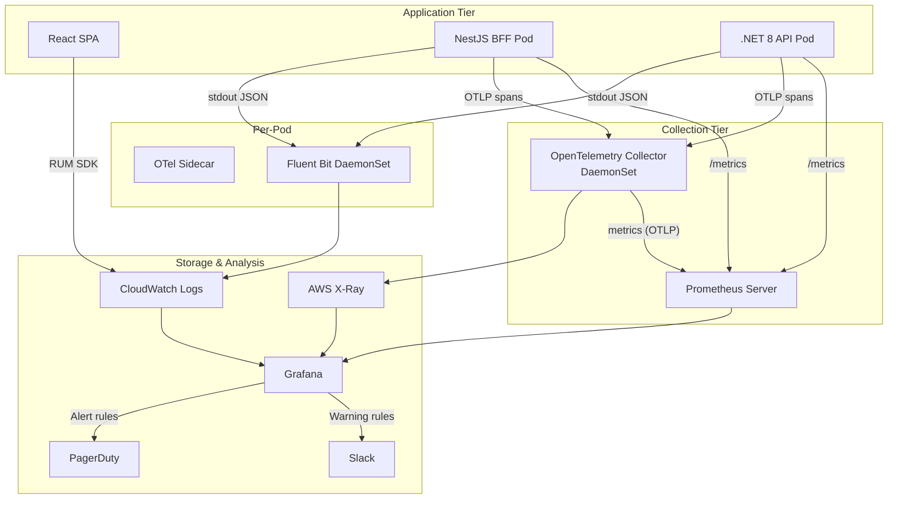

---

## 12. Testing Strategy

### 12.1 Test Pyramid

The project follows a strict test pyramid with **coverage gates enforced in CI**. Each layer serves a distinct verification purpose and the ratio is designed to maximize confidence per execution second.

```mermaid
graph TB
    subgraph Pyramid["Test Pyramid"]
        direction TB
        E2E["E2E Tests (Playwright)<br/>~30 scenarios<br/>Target: Critical paths only"]
        CONTRACT["Contract Tests (Pact)<br/>~50 interactions<br/>Target: All BFF↔API contracts"]
        INTEGRATION["Integration Tests<br/>~200 tests<br/>Target: 80% of API surface"]
        UNIT["Unit Tests<br/>~800+ tests<br/>Target: 90% line coverage"]
    end

    subgraph CI["CI Pipeline Integration"]
        direction LR
        PR[PR Opened] --> LINT[Lint + Format]
        LINT --> U[Unit Tests<br/>parallel per service]
        U --> I[Integration Tests<br/>Docker Compose]
        I --> C[Contract Tests<br/>Pact Broker verify]
        C --> BUILD[Build Images]
        BUILD --> E[E2E Tests<br/>against ephemeral env]
        E --> GATE{Coverage<br/>Gate}
        GATE -->|Pass| MERGE[Merge to main]
        GATE -->|Fail| BLOCK[Block PR]
    end

    style E2E fill:#ff6b6b,color:#fff
    style CONTRACT fill:#ffa94d,color:#fff
    style INTEGRATION fill:#69db7c,color:#fff
    style UNIT fill:#4dabf7,color:#fff
```

### 12.2 Unit Tests

**Coverage Targets:**

| Service | Framework | Target | Enforced |
|---------|-----------|--------|----------|
| React SPA | Vitest + React Testing Library | 80% lines | CI gate |
| NestJS BFF | Jest | 85% lines | CI gate |
| .NET 8 API | xUnit + FluentAssertions + NSubstitute | 90% lines | CI gate |

**What to Unit Test — .NET API (highest value):**

| Component | What to Test | Example |
|-----------|-------------|---------|
| CQRS Command Handlers | Business rules in isolation, all validation branches | `AllocateBudgetCommandHandler`: insufficient funds, exceeds tree-level cap, concurrent allocation conflict |
| CQRS Query Handlers | Correct projection assembly, pagination, sorting | `GetSubtreeBudgetQueryHandler`: returns aggregated totals for ltree subtree |
| RBAC Policy Evaluator | Every role/scope combination, delegation chains, edge cases | Manager can see direct reports but not sibling subtrees; delegated approver inherits scoped permissions |
| Tree Aggregation Logic | Roll-up calculations, rounding, overflow | Aggregating 500 leaf nodes, ensuring parent totals = sum of children to the cent |
| Compensation Calculators | Proration, currency conversion, multi-component budgets | Mid-year hire proration, multi-currency team with exchange rate snapshots |
| Domain Events | Correct event emission from aggregate roots | `BudgetAllocatedEvent` contains correct `nodeId`, `amount`, `allocatedBy`, `timestamp` |
| Outbox Publisher | Serialization, idempotency key generation | Event serialized to JSON, idempotency key is deterministic `hash(aggregateId + version)` |

**What to Unit Test — NestJS BFF:**

| Component | What to Test |
|-----------|-------------|
| Auth Guard | Token extraction, claim validation, role mapping |
| Request Transformers | DTO mapping from frontend schema to API schema |
| Cache Interceptor | Cache key generation, TTL logic, invalidation triggers |
| Error Mapper | Maps .NET API error codes to user-friendly frontend errors |

**What to Unit Test — React SPA:**

| Component | What to Test |
|-----------|-------------|
| Tree Visualization | Renders correct hierarchy, expand/collapse, lazy loading |
| Budget Forms | Validation rules, decimal precision, disabled states per RBAC |
| Auth State Machine | Login redirect, token refresh, session expiry handling |
| RBAC-Gated UI | Components hidden/shown based on role claims |

### 12.3 Integration Tests

Integration tests run against **real infrastructure** via Docker Compose (PostgreSQL, Redis, LocalStack for SNS/SQS).

**NestJS BFF Integration Tests:**

```
- Auth0 mock (mock JWKS endpoint via WireMock)
  → Verify token validation against mock JWKS
  → Verify expired token rejection
  → Verify missing scope denial

- API proxy behavior
  → Request transformation and forwarding
  → Error response mapping
  → Timeout handling (circuit breaker triggers)

- Cache behavior
  → Cache population on first request
  → Cache hit on second request
  → Cache invalidation on write-through
```

**.NET API Integration Tests:**

```
- Full CQRS flow against test PostgreSQL
  → Command → Event stored in outbox → Query reflects state
  → Concurrent commands → optimistic concurrency handled

- ltree queries with seeded hierarchy
  → 3-level tree: org → department → team
  → Ancestor/descendant queries return correct nodes
  → Materialized view refresh reflects changes

- RBAC with seeded roles
  → Admin sees all, manager sees subtree, IC sees self
  → Cross-tree access denied

- RDS Proxy simulation (connection pooling behavior)
  → 50 concurrent requests, all succeed within pool limits
```

### 12.4 Contract Tests (Pact)

Contract testing ensures the NestJS BFF and .NET API stay compatible independently.

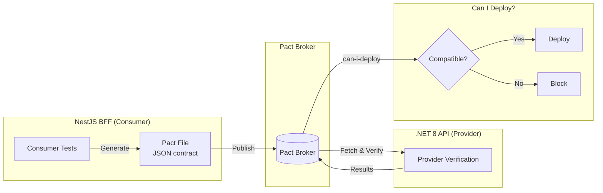

**Key Contract Interactions:**

| Consumer Request | Provider State | Expected Response |
|------------------|---------------|-------------------|
| `GET /api/budgets/tree/{nodeId}` | Node exists with 3 children | 200 with `{ node, children[], totalBudget }` |
| `POST /api/budgets/allocate` | Valid node, sufficient funds | 201 with `{ allocationId, remainingBudget }` |
| `POST /api/budgets/allocate` | Insufficient funds | 422 with `{ error: "INSUFFICIENT_FUNDS", available }` |
| `GET /api/employees/{id}/reports` | Manager with 5 reports | 200 with array of 5 employee summaries |
| `GET /api/budgets/tree/{nodeId}` | Unauthorized (wrong scope) | 403 with `{ error: "FORBIDDEN" }` |

**Pact workflow in CI:**
1. Consumer tests generate Pact JSON during NestJS CI
2. Pact published to broker with git SHA tag
3. Provider verification runs during .NET CI, fetching latest consumer pacts
4. `can-i-deploy` gate checks compatibility before merge

### 12.5 E2E Tests (Playwright)

E2E tests run against an **ephemeral environment** spun up per PR via Argo CD preview environments.

**Critical Path Scenarios:**

| Scenario | Steps | Assertions |
|----------|-------|------------|
| Login Flow | Auth0 Universal Login → callback → dashboard | User sees org tree, correct role badge |
| Tree Navigation | Expand root → click department → click team | Breadcrumb updates, budget totals correct |
| Budget Allocation | Select team → enter amount → submit | Success toast, tree totals updated, audit log entry |
| RBAC: Manager View | Login as manager → navigate tree | Sees direct reports subtree, sibling trees hidden |
| RBAC: IC View | Login as IC → navigate | Sees only own profile, no tree navigation |
| Concurrent Edit | Two sessions, same node → both submit | First succeeds, second gets conflict error with retry option |

**Auth0 in E2E:** Tests use Auth0's Resource Owner Password Grant (test tenant only) to acquire tokens programmatically, avoiding UI-based login in most tests. One dedicated test validates the full PKCE redirect flow.

### 12.6 Load Testing (k6)

**Test Scenarios:**

| Scenario | VUs | Duration | Target |
|----------|-----|----------|--------|
| Tree query — 5000 nodes | 50 concurrent | 10m | p99 < 500ms |
| Budget allocation burst | 100 concurrent | 5m | 0 errors, p95 < 300ms |
| Mixed workload (80% read, 20% write) | 200 concurrent | 30m | p99 < 1s, error rate < 0.1% |
| Cache stampede | 500 concurrent, cold cache | 1m | Redis CPU < 70%, no OOM |
| Auth token validation | 300 concurrent | 5m | p99 < 50ms (JWKS cached) |

**k6 Script Structure:**

```
k6/
  scenarios/
    tree-query.js          # GET /api/budgets/tree/{nodeId} with random depth
    allocation-burst.js    # POST /api/budgets/allocate concurrent
    mixed-workload.js      # 80/20 read/write realistic simulation
    cache-stampede.js       # Simultaneous requests after cache flush
    auth-validation.js     # Rapid token validation
  lib/
    auth.js                # Token acquisition helper
    data.js                # Test data generators (random nodeIds)
  thresholds.json          # Pass/fail criteria
```

**CI Integration:** Load tests run nightly against staging, not on every PR. Results are pushed to Grafana k6 Cloud for trend analysis.

### 12.7 Coverage Targets Summary

| Layer | .NET API | NestJS BFF | React SPA |
|-------|----------|------------|-----------|
| Unit | 90% line | 85% line | 80% line |
| Integration | 80% of endpoints | 70% of routes | N/A |
| Contract | All BFF→API interactions | All BFF→API interactions | N/A |
| E2E | N/A | N/A | Critical paths (6 scenarios) |
| Load | p99 < 500ms @ 200 VUs | — | — |

---

## 13. Infrastructure as Code

### 13.1 Terraform Module Structure

```
infra/
  terraform/
    modules/
      vpc/                  # VPC, subnets, NAT GW, flow logs
        main.tf
        variables.tf
        outputs.tf
      eks/                  # EKS cluster, node groups, IRSA, add-ons
        main.tf
        variables.tf
        outputs.tf
        iam.tf
      rds/                  # RDS PostgreSQL, subnet group, parameter group, RDS Proxy
        main.tf
        variables.tf
        outputs.tf
      redis/                # ElastiCache Redis cluster, subnet group, parameter group
        main.tf
        variables.tf
        outputs.tf
      s3/                   # State bucket, log bucket, asset bucket
        main.tf
        variables.tf
        outputs.tf
      ecr/                  # ECR repositories, lifecycle policies, scanning config
        main.tf
        variables.tf
        outputs.tf
      iam/                  # IRSA roles, GitHub OIDC provider, service-linked roles
        main.tf
        variables.tf
        outputs.tf
        oidc.tf
      secrets/              # Secrets Manager secrets, External Secrets Operator
        main.tf
        variables.tf
        outputs.tf
      monitoring/           # CloudWatch log groups, Prometheus workspace, Grafana
        main.tf
        variables.tf
        outputs.tf
      sns-sqs/              # SNS topics, SQS queues, DLQs, subscriptions
        main.tf
        variables.tf
        outputs.tf
    environments/
      dev/
        main.tf             # Module composition with dev-sized params
        terraform.tfvars
        backend.tf           # S3 backend config for dev state
      staging/
        main.tf
        terraform.tfvars
        backend.tf
      prod/
        main.tf
        terraform.tfvars
        backend.tf
    global/
      state-bootstrap/      # S3 bucket + DynamoDB for TF state (chicken-and-egg)
        main.tf
```

### 13.2 Module Dependency Graph

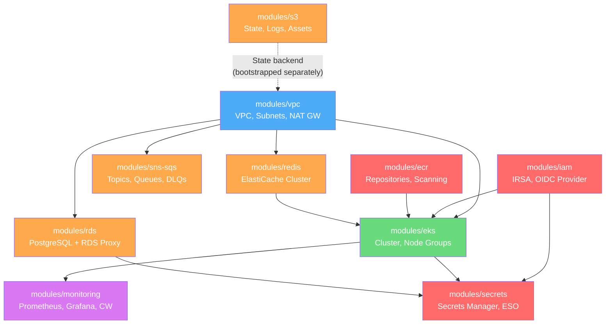

### 13.3 Environment Promotion Strategy

Environments use **separate state files** (not workspaces) for full isolation. Each environment directory composes the same modules with different parameters.

| Parameter | Dev | Staging | Prod |
|-----------|-----|---------|------|
| EKS node group size | 2 (t3.medium) | 3 (t3.large) | 6 (m5.xlarge), 3 AZs |
| RDS instance | db.t3.medium, single-AZ | db.r6g.large, multi-AZ | db.r6g.xlarge, multi-AZ |
| Redis | cache.t3.micro, 1 node | cache.r6g.large, 2 nodes | cache.r6g.xlarge, 3 nodes, multi-AZ |
| RDS Proxy | Disabled | Enabled | Enabled, max 200 connections |
| SNS/SQS DLQ | Alarm disabled | Alarm enabled | Alarm + auto-redrive |
| Backups | 1-day retention | 3-day retention | 7-day retention, cross-region |

**Promotion Flow:**

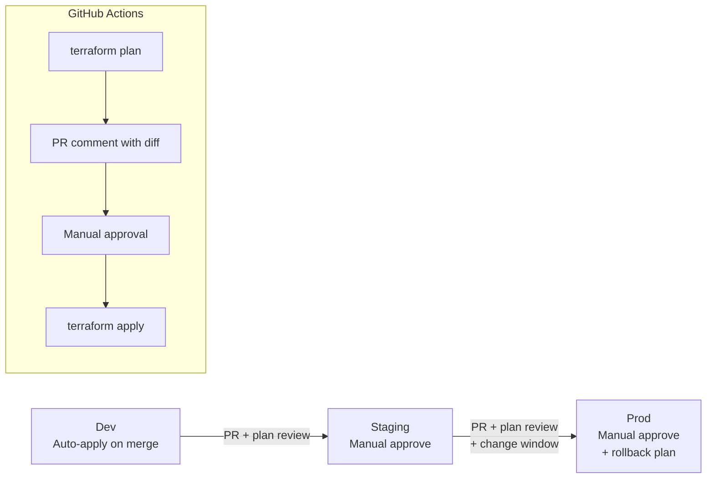

### 13.4 State Management

| Component | Configuration |
|-----------|--------------|
| Backend | S3 bucket: `budgetalloc-tfstate-{account_id}` |
| Locking | DynamoDB table: `budgetalloc-tfstate-lock` |
| Encryption | S3 SSE-KMS with dedicated CMK |
| Versioning | S3 versioning enabled (state rollback) |
| Access | IAM policy restricting to CI/CD role + platform team |

**State bootstrap** is a separate Terraform root (`global/state-bootstrap/`) applied once manually, producing the S3 bucket and DynamoDB table that all other state files reference.

### 13.5 Drift Detection

- **Scheduled:** GitHub Actions runs `terraform plan` nightly against prod. Non-empty plan triggers Slack notification.
- **On-demand:** Engineers can trigger plan against any environment via workflow dispatch.
- **Prevention:** All AWS accounts have SCPs denying console-based modifications to Terraform-managed resource types. Tags `ManagedBy=terraform` are enforced.
- **Reconciliation:** Drift is reviewed weekly during platform sync. Manual changes are either imported or reverted.

### 13.6 Key Resource Relationships

```hcl
# Simplified example showing cross-module references

module "vpc" {
  source = "./modules/vpc"
  cidr   = "10.0.0.0/16"
  azs    = ["us-east-1a", "us-east-1b", "us-east-1c"]
}

module "eks" {
  source          = "./modules/eks"
  vpc_id          = module.vpc.vpc_id
  private_subnets = module.vpc.private_subnet_ids
  node_role_arn   = module.iam.eks_node_role_arn
}

module "rds" {
  source          = "./modules/rds"
  vpc_id          = module.vpc.vpc_id
  db_subnets      = module.vpc.database_subnet_ids
  allowed_sg_ids  = [module.eks.node_security_group_id]
}

module "iam" {
  source               = "./modules/iam"
  eks_oidc_provider_arn = module.eks.oidc_provider_arn
  github_org            = "myorg"
  github_repo           = "employee-budget-allocation"
}
```

---

## 14. Security Hardening

### 14.1 EKS Network Policies

Default-deny posture with explicit allow rules using **Calico** network policies.

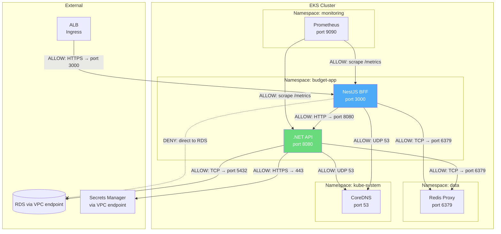

**Policy summary:**

| Source | Destination | Port | Allow/Deny |
|--------|------------|------|------------|
| ALB Ingress | NestJS BFF | 3000 | Allow |
| NestJS BFF | .NET API | 8080 | Allow |
| .NET API | RDS (VPC endpoint) | 5432 | Allow |
| .NET API | ElastiCache | 6379 | Allow |
| NestJS BFF | ElastiCache | 6379 | Allow |
| Prometheus | All app pods `/metrics` | 9090 | Allow |
| All pods | CoreDNS | 53 | Allow |
| All other | All other | * | **Deny** |

### 14.2 Pod Security Standards

All namespaces enforce the **restricted** Pod Security Standard:

| Control | Setting |
|---------|---------|
| `runAsNonRoot` | `true` |
| `readOnlyRootFilesystem` | `true` (writable tmpfs for `/tmp` only) |
| `allowPrivilegeEscalation` | `false` |
| `capabilities.drop` | `["ALL"]` |
| `seccompProfile.type` | `RuntimeDefault` |
| Service account token automount | `false` (explicit opt-in) |

### 14.3 Image Security

| Stage | Tool | Action |
|-------|------|--------|
| CI Build | **Trivy** | Scan image for CVEs; fail build on HIGH/CRITICAL |
| ECR Push | **ECR Enhanced Scanning** | Continuous scanning; SNS notification on new CVE |
| Admission | **Kyverno** | Reject images not from org ECR, reject images with CRITICAL CVEs |
| Runtime | **Falco** | Detect anomalous process execution, file access |

### 14.4 OWASP Top 10 Coverage

| # | Risk | Mitigation |
|---|------|-----------|
| A01 | Broken Access Control | 3-layer RBAC (Auth0 roles → NestJS guard → .NET policy), ltree scope enforcement, unit + E2E tests |
| A02 | Cryptographic Failures | TLS 1.3 everywhere, AES-256 encryption at rest (RDS, S3, Redis), no secrets in code |
| A03 | Injection | Parameterized queries (EF Core), input validation (FluentValidation), ltree path sanitization |
| A04 | Insecure Design | Threat modeling per feature, CQRS separation, principle of least privilege |
| A05 | Security Misconfiguration | Terraform-managed infra, pod security standards, no default credentials, CSP headers |
| A06 | Vulnerable Components | Dependabot (daily), Snyk (CI gate), Trivy (image scan), ECR continuous scan |
| A07 | Auth Failures | Auth0 managed, PKCE (no implicit), token rotation, brute-force protection, MFA for admins |
| A08 | Data Integrity Failures | Signed container images (cosign), Pact contract verification, CI pipeline immutability |
| A09 | Logging Failures | Structured JSON logs, audit trail for all mutations, tamper-evident CloudWatch Logs |
| A10 | SSRF | No user-supplied URLs processed server-side; egress restricted via network policies |

### 14.5 Input Sanitization & SQL Injection Prevention

- **EF Core parameterized queries**: All database access through Entity Framework Core — raw SQL is prohibited by code review policy and enforced via Roslyn analyzer
- **ltree path validation**: Custom `LtreePathAttribute` validates format `^[a-z][a-z0-9_]*(\.[a-z][a-z0-9_]*)*$` — rejects traversal attempts
- **FluentValidation**: All command DTOs validated before reaching handlers; validation errors return 422 with structured error response
- **NestJS pipes**: `ValidationPipe` with `whitelist: true` strips unknown properties; `transform: true` coerces types

### 14.6 Rate Limiting

| Layer | Implementation | Limits |
|-------|---------------|--------|
| AWS WAF (ALB) | Rate-based rules | 2000 req/5min per IP |
| NestJS BFF | `@nestjs/throttler` | 100 req/min per user (token-based) |
| .NET API | `AspNetCoreRateLimit` | 50 write req/min per user |
| Auth0 | Built-in | 300 login attempts/min per IP, lockout after 10 failures |

### 14.7 Dependency Scanning

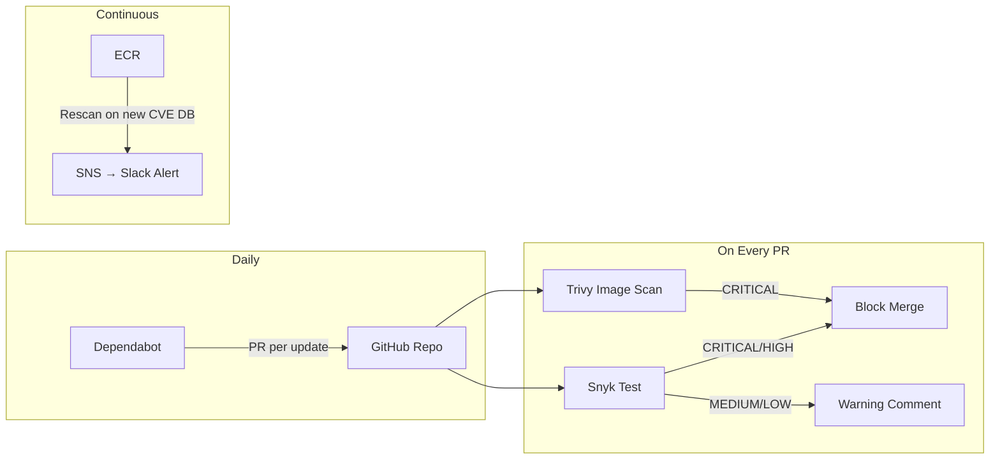

---

## 15. DR & Availability

### 15.1 Multi-AZ Architecture

```mermaid
flowchart TB
    subgraph Region["us-east-1"]
        R53[Route 53<br/>Health Check] --> ALB[Application Load Balancer<br/>Cross-AZ]

        subgraph AZ1["Availability Zone 1 (us-east-1a)"]
            EKS1[EKS Node Group<br/>2 nodes]
            RDS_PRIMARY[(RDS Primary<br/>PostgreSQL 16)]
            REDIS1[ElastiCache<br/>Primary Node]
        end

        subgraph AZ2["Availability Zone 2 (us-east-1b)"]
            EKS2[EKS Node Group<br/>2 nodes]
            RDS_STANDBY[(RDS Standby<br/>Synchronous Replica)]
            REDIS2[ElastiCache<br/>Replica Node]
        end

        subgraph AZ3["Availability Zone 3 (us-east-1c)"]
            EKS3[EKS Node Group<br/>2 nodes]
            REDIS3[ElastiCache<br/>Replica Node]
        end

        PROXY[RDS Proxy<br/>Connection Pooling]

        ALB --> EKS1
        ALB --> EKS2
        ALB --> EKS3

        EKS1 --> PROXY
        EKS2 --> PROXY
        EKS3 --> PROXY
        PROXY --> RDS_PRIMARY
        RDS_PRIMARY -.->|"Sync replication"| RDS_STANDBY

        EKS1 --> REDIS1
        EKS2 --> REDIS2
        EKS3 --> REDIS3
        REDIS1 -.->|"Async replication"| REDIS2
        REDIS1 -.->|"Async replication"| REDIS3
    end

    subgraph DR["Cross-Region DR (us-west-2)"]
        S3_BACKUP[S3 Cross-Region<br/>RDS Snapshots]
        RDS_READONLY[(RDS Read Replica<br/>Async, promotable)]
    end

    RDS_PRIMARY -.->|"Automated snapshots<br/>Cross-region copy"| S3_BACKUP
    RDS_PRIMARY -.->|"Async replication"| RDS_READONLY
```

### 15.2 Availability Targets

| Component | Target | Mechanism |
|-----------|--------|-----------|
| Overall Platform | 99.9% (8.77h downtime/year) | Multi-AZ, canary deploys, auto-scaling |
| API Latency (p99) | < 500ms | ElastiCache, RDS Proxy, connection pooling |
| Data Durability | 99.999999999% (11 9s) | RDS Multi-AZ, S3 cross-region backups |

### 15.3 RTO/RPO Targets

| Scenario | RTO | RPO | Justification |
|----------|-----|-----|---------------|
| Single AZ failure | 0 (automatic) | 0 | Multi-AZ with synchronous replication; ALB routes around unhealthy AZ |
| RDS primary failure | < 2 min | 0 | Multi-AZ synchronous standby auto-promotes; RDS Proxy handles reconnection |
| ElastiCache primary failure | < 30s | ~1s | Automatic failover to replica; minor async replication lag acceptable for cache |
| Full region failure | < 4 hours | < 5 min | Promote cross-region read replica; update Route 53; redeploy EKS to DR region |
| Accidental data deletion | < 1 hour | < 5 min | Point-in-time recovery from continuous RDS backups |
| Corrupt deployment | < 5 min | 0 | Argo Rollouts automatic rollback on failed canary analysis |

### 15.4 Backup Strategy

| Resource | Backup Method | Retention | Recovery |
|----------|--------------|-----------|----------|
| RDS PostgreSQL | Automated snapshots + continuous WAL | 7 days (prod) | Point-in-time recovery to any second |
| RDS PostgreSQL | Manual snapshots before migrations | 90 days | Restore to new instance |
| RDS PostgreSQL | Cross-region snapshot copy | 7 days | Restore in DR region |
| ElastiCache Redis | Daily snapshots | 3 days | Restore to new cluster |
| S3 (assets, exports) | Versioning + cross-region replication | 30 days (versions) | Restore specific version |
| EKS configs | GitOps (Argo CD) — cluster state is code | Git history | Re-apply from Git |
| Secrets | Secrets Manager versioning | 30 days | Restore previous version |

### 15.5 Failover Scenarios

**Scenario 1: Single AZ Outage**

1. ALB health checks detect unhealthy targets in affected AZ (10s)
2. Traffic routed to remaining 2 AZs automatically
3. EKS Cluster Autoscaler provisions replacement nodes in healthy AZs (2-5 min)
4. If RDS primary is in affected AZ, Multi-AZ standby auto-promotes (< 2 min)
5. RDS Proxy reconnects application transparently
6. **Impact: Zero downtime for end users**

**Scenario 2: Region-Level Outage**

1. Route 53 health check detects region failure (30s)
2. **Manual decision** to failover (pager alert to platform team)
3. Promote RDS cross-region read replica to standalone primary (10-15 min)
4. Deploy EKS workloads to DR region via Argo CD (20-30 min)
5. Update Route 53 to point to DR region ALB
6. Update Auth0 callback URLs for DR domain
7. **Impact: 2-4 hours downtime; < 5 min data loss**

**Scenario 3: Corrupted Deployment**

1. Argo Rollouts canary detects error rate > 1% or p99 > 500ms
2. Automatic rollback to previous ReplicaSet (< 30s)
3. Alert sent to team with canary analysis summary
4. **Impact: < 5% traffic affected during canary window**

### 15.6 Runbook References

| Incident | Runbook | Owner |
|----------|---------|-------|
| RDS failover triggered | `runbooks/rds-failover.md` | Platform team |
| EKS node NotReady | `runbooks/eks-node-recovery.md` | Platform team |
| Cache stampede / Redis OOM | `runbooks/redis-recovery.md` | Platform team |
| Outbox processing stalled | `runbooks/outbox-recovery.md` | Backend team |
| Auth0 outage | `runbooks/auth0-outage.md` | Platform + Security |
| Data corruption / accidental delete | `runbooks/rds-pitr.md` | DBA + Platform |
| Region failover | `runbooks/region-failover.md` | Platform team (requires VP approval) |

---

## 16. Developer Experience

### 16.1 Local Development Architecture

```mermaid
flowchart TB
    subgraph Host["Developer Machine"]
        IDE[VS Code / JetBrains<br/>+ Extensions]
        MAKE[Makefile / Taskfile<br/>Unified Commands]
    end

    subgraph DockerCompose["Docker Compose Stack"]
        subgraph Services["Application Services (hot-reload)"]
            SPA["React SPA<br/>Vite dev server<br/>:5173<br/>Volume mount: ./apps/web/src"]
            BFF["NestJS BFF<br/>ts-node-dev --respawn<br/>:3000<br/>Volume mount: ./apps/bff/src"]
            DOTNET[".NET 8 API<br/>dotnet watch<br/>:8080<br/>Volume mount: ./apps/api"]
        end

        subgraph Infra["Infrastructure Services"]
            PG[(PostgreSQL 16<br/>:5432<br/>Init: seed.sql)]
            REDIS_LOCAL[(Redis 7<br/>:6379)]
            LOCALSTACK[LocalStack<br/>:4566<br/>SNS, SQS, S3,<br/>Secrets Manager]
            WIREMOCK[WireMock<br/>:8081<br/>Auth0 JWKS mock]
        end

        SPA -->|"Proxy API calls"| BFF
        BFF --> DOTNET
        DOTNET --> PG
        DOTNET --> REDIS_LOCAL
        BFF --> REDIS_LOCAL
        DOTNET --> LOCALSTACK
        BFF --> WIREMOCK
    end

    IDE -->|"Code changes"| Services
    MAKE -->|"docker compose up"| DockerCompose
```

### 16.2 Hot Reload Configuration

| Service | Tool | Mechanism | Restart Time |
|---------|------|-----------|-------------|
| React SPA | Vite HMR | Volume mount `./apps/web/src`, Vite detects changes | < 100ms |
| NestJS BFF | `ts-node-dev --respawn` | Volume mount `./apps/bff/src`, process restart on change | < 2s |
| .NET 8 API | `dotnet watch` | Volume mount `./apps/api`, incremental rebuild | < 3s |

### 16.3 Seed Data CLI

A custom CLI generates a realistic 5000+ employee hierarchy:

```bash
# Generate full hierarchy
make seed                          # 5000 employees, 8 levels deep

# Custom sizes
make seed EMPLOYEES=500 DEPTH=4    # Smaller for quick iteration
make seed EMPLOYEES=20000 DEPTH=12 # Stress testing

# Targeted seeding
make seed-budgets                  # Budget allocations for existing hierarchy
make seed-audit                    # Audit log entries for demo
```

**Generated data characteristics:**
- Realistic names, titles, departments (Faker.js)
- Proper org hierarchy: CEO → VPs → Directors → Managers → ICs
- Budget allocations that sum correctly up the tree
- ltree paths generated from org structure (`eng.platform.team_alpha.john_doe`)
- Deterministic seed (same `--seed` value = same data) for reproducible tests
- Auth0 test users created via Management API (10 users across all roles)

### 16.4 Makefile Commands

```makefile
# ── Lifecycle ──────────────────────────────
make up                    # Start all services (docker compose up -d)
make down                  # Stop all services
make restart               # Restart all services
make logs                  # Tail all logs (color-coded)
make logs service=api      # Tail specific service

# ── Database ───────────────────────────────
make db-migrate            # Run EF Core migrations
make db-rollback           # Rollback last migration
make db-reset              # Drop + recreate + migrate + seed
make db-shell              # psql into local PostgreSQL
make seed                  # Generate 5000 employee hierarchy

# ── Testing ────────────────────────────────
make test                  # Run all unit tests (parallel)
make test-api              # .NET unit tests
make test-bff              # NestJS unit tests
make test-web              # React unit tests
make test-integration      # Integration tests (requires Docker stack)
make test-contract         # Pact contract tests
make test-e2e              # Playwright E2E (requires running stack)
make test-load             # k6 load tests against local
make test-coverage         # Generate coverage reports for all services

# ── Code Quality ───────────────────────────
make lint                  # Lint all services
make format                # Format all services
make typecheck             # TypeScript + C# type checking

# ── Infrastructure (local) ────────────────
make infra-plan env=dev    # terraform plan for dev
make infra-apply env=dev   # terraform apply for dev (with approval)

# ── Utilities ──────────────────────────────
make openapi               # Generate OpenAPI spec from .NET API
make pact-publish          # Publish Pact contracts to broker
make docs                  # Serve architecture docs locally
```

### 16.5 ADR (Architecture Decision Records)

**Template: `docs/adr/TEMPLATE.md`**

```markdown
# ADR-NNN: Title

## Status
Proposed | Accepted | Deprecated | Superseded by ADR-XXX

## Context
What is the issue that we're seeing that is motivating this decision?

## Decision
What is the change that we're proposing and/or doing?

## Consequences
What becomes easier or more difficult because of this change?

## Alternatives Considered
What other options were evaluated and why were they rejected?
```

**Example ADRs:**

| ADR | Title | Decision |
|-----|-------|----------|
| ADR-001 | Use ltree for org hierarchy | ltree over adjacency list or nested sets — O(1) ancestor queries, native PostgreSQL support |
| ADR-002 | CQRS without Event Sourcing | Separate read/write models with materialized views, but standard state storage — ES complexity not justified for this domain |
| ADR-003 | NestJS BFF over direct API calls | BFF aggregates Auth0 context, caches per-user tree views, shields .NET API from frontend concerns |
| ADR-004 | Transactional outbox over direct SNS publish | Guarantees at-least-once delivery without distributed transactions; avoids dual-write problem |
| ADR-005 | Argo Rollouts over native K8s deployments | Canary analysis with automated rollback; integrates with Prometheus metrics for deployment safety |
| ADR-006 | RDS Proxy over direct connections | Connection pooling for serverless-like burst patterns; transparent failover during Multi-AZ promotion |

### 16.6 Monorepo Structure

```
employee-budget-allocation/
├── apps/
│   ├── web/                    # React SPA (Vite)
│   │   ├── src/
│   │   ├── package.json
│   │   └── vite.config.ts
│   ├── bff/                    # NestJS BFF
│   │   ├── src/
│   │   ├── package.json
│   │   └── nest-cli.json
│   └── api/                    # .NET 8 API
│       ├── src/
│       │   ├── Api/            # Host, controllers, middleware
│       │   ├── Application/    # CQRS handlers, DTOs, validators
│       │   ├── Domain/         # Entities, aggregates, value objects
│       │   └── Infrastructure/ # EF Core, repositories, outbox
│       ├── tests/
│       │   ├── Unit/
│       │   └── Integration/
│       └── Api.sln
├── packages/
│   └── shared-types/           # TypeScript types shared between web & bff
│       ├── src/
│       └── package.json
├── infra/
│   └── terraform/              # (see Section 13)
├── k8s/
│   ├── base/                   # Kustomize base manifests
│   ├── overlays/
│   │   ├── dev/
│   │   ├── staging/
│   │   └── prod/
│   └── argo-rollouts/          # Rollout + AnalysisTemplate manifests
├── k6/                         # Load test scripts
├── docs/
│   ├── adr/                    # Architecture Decision Records
│   ├── runbooks/               # Incident runbooks
│   └── superpowers/specs/      # This document
├── scripts/
│   ├── seed.ts                 # Seed data generator
│   └── generate-openapi.sh
├── .github/
│   └── workflows/
│       ├── ci.yml              # PR pipeline (lint, test, build, scan)
│       ├── cd.yml              # Deploy pipeline (canary rollout)
│       └── nightly.yml         # Load tests, drift detection
├── docker-compose.yml          # Local development stack
├── docker-compose.test.yml     # CI integration test stack
├── Makefile                    # Unified task runner
├── nx.json                     # Nx workspace config
├── package.json                # Root package.json (workspaces)
└── turbo.json                  # Turborepo pipeline config (alternative to Nx)
```

**Nx/Turborepo Pipeline:**

```mermaid
flowchart LR
    subgraph Pipeline["Build Pipeline (Nx/Turborepo)"]
        TYPES[shared-types<br/>build] --> WEB[web<br/>build]
        TYPES --> BFF_BUILD[bff<br/>build]
        API_BUILD[api<br/>build]

        WEB --> WEB_TEST[web<br/>test]
        BFF_BUILD --> BFF_TEST[bff<br/>test]
        API_BUILD --> API_TEST[api<br/>test]

        WEB --> WEB_LINT[web<br/>lint]
        BFF_BUILD --> BFF_LINT[bff<br/>lint]
        API_BUILD --> API_LINT[api<br/>lint]
    end

    subgraph Cache["Nx Cloud / Turborepo Remote Cache"]
        RC[(Remote Cache<br/>S3-backed)]
    end

    Pipeline -.->|"Cache hits skip<br/>unchanged packages"| Cache
```

**Key Nx/Turborepo benefits:**
- **Affected-only CI:** `nx affected --target=test` runs tests only for packages changed in the PR
- **Remote caching:** Build artifacts cached in S3; teammates reuse cached builds
- **Task orchestration:** `shared-types` builds before `web` and `bff` automatically
- **Consistent tooling:** Same `lint`, `test`, `build` targets across JS/TS packages; .NET uses `dotnet` CLI wrapped in Nx executor
